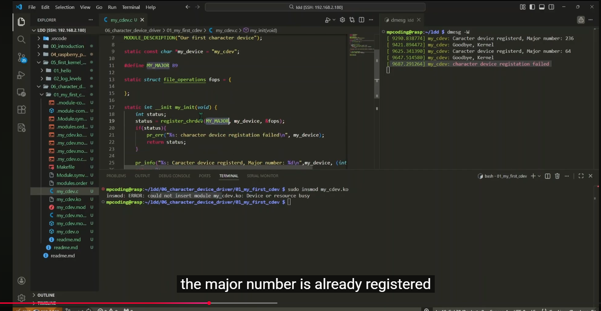
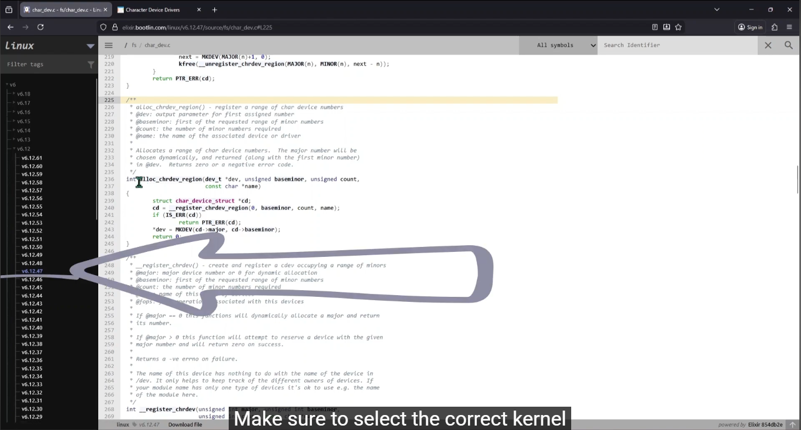

### Video :
[](https://www.youtube.com/watch?v=9B-jT8QIVy8)

# Old method
if choose the used Major number, We will get the error



==> use the new method
# New Method
==

https://elixir.bootlin.com/linux/v6.12.47/source/fs/char_dev.c



```c
/**
 * alloc_chrdev_region() - register a range of char device numbers
 * @dev: output parameter for first assigned number
 * @baseminor: first of the requested range of minor numbers
 * @count: the number of minor numbers required
 * @name: the name of the associated device or driver
 *
 * Allocates a range of char device numbers.  The major number will be
 * chosen dynamically, and returned (along with the first minor number)
 * in @dev.  Returns zero or a negative error code.
 */
int alloc_chrdev_region(dev_t *dev, unsigned baseminor, unsigned count,
			const char *name)
{
	struct char_device_struct *cd;
	cd = __register_chrdev_region(0, baseminor, count, name);
	if (IS_ERR(cd))
		return PTR_ERR(cd);
	*dev = MKDEV(cd->major, cd->baseminor);
	return 0;
}
```


Below is a **senior-level summary of the code and explanation**, focusing on **kernel architecture, device model integration, and the correct mental model for character devices** rather than tutorial steps.

---
# 1. What This Module Implements (High-Level Architecture)
This kernel module implements a **minimal Linux character device driver skeleton** using the **modern kernel device model**.

It performs four core tasks:
1. **Allocate device numbers** (major + minors)
2. **Register a character device with the kernel**
3. **Integrate with the Linux device model (`sysfs`, `udev`)**
4. **Automatically create `/dev` device nodes**

Even though **no file operations are implemented yet**, the driver is already **fully registered and visible to user space**.

---
# 2. Linux Character Device Architecture (Mental Model)
A character device driver participates in **three kernel subsystems simultaneously**:

| Layer                    | Kernel Component   | Purpose                                |
| ------------------------ | ------------------ | -------------------------------------- |
| Device number management | `dev_t`            | Identifies device via major/minor      |
| Character device layer   | `cdev`             | Links device numbers → file operations |
| Device model             | `class` + `device` | Exposes device to sysfs + udev         |

The flow is:
```
User space
    │
    │ open("/dev/my_cdev0")
    ▼
VFS
    │
    ▼
Character device layer
    │
    ▼
struct cdev
    │
    ▼
file_operations
    │
    ▼
driver implementation
```

This module implements the **first three layers** but leaves **file operations empty**.

---
# 3. Core Data Structures
### 3.1 Device Name
```c
static const char *my_device = "my_cdev";
```

Used for:
* `/proc/devices`
* sysfs registration
* kernel logs

---
### 3.2 Device Number
```c
static dev_t dev_nr;
```

`dev_t` encodes:
```
dev_t
 ├── Major number
 └── Minor number
```

Extracted using:
```
MAJOR(dev_nr)
MINOR(dev_nr)
```

Example:
```
236:0
```

---
### 3.3 Character Device Object
```c
static struct cdev my_cdev;
```

This object links:
```
device number  →  file operations
```

Internally stored in kernel:
```
kernel cdev map
   major
      └── minor
             └── struct cdev
```

---
### 3.4 Device Class
```c
static struct class *my_class;
```

Represents a **logical device category** in sysfs:
```
/sys/class/my_class/
```

This is what allows **udev to detect the device and create `/dev` nodes automatically**.

---
### 3.5 File Operations Table
```c
static struct file_operations fops = {};
```

This structure defines the **driver behavior**.
Examples normally include:
```
.open
.release
.read
.write
.ioctl
.poll
.mmap
```
In this example it is empty, meaning **no functionality yet**.

---

# 4. Module Initialization Flow
The `init` function builds the driver step-by-step.
```
my_init()
```

## Step 1 — Allocate Device Numbers
```c
alloc_chrdev_region(&dev_nr, 0, MINORMASK + 1, my_device);
```

Allocates:
```
major = dynamic
minor range = 0 → 255
```

Equivalent to:
```
major: assigned by kernel
minor: full range
```
Professional drivers often reserve **full minor ranges for scalability**.

---

## Step 2 — Initialize cdev
```c
cdev_init(&my_cdev, &fops);
my_cdev.owner = THIS_MODULE;
```

Purpose:
```
device numbers → file_operations
```
`THIS_MODULE` prevents module unloading while device is in use.
Without this:
```
open device
rmmod module
kernel crash
```

---
## Step 3 — Register cdev with Kernel
```c
cdev_add(&my_cdev, dev_nr, MINORMASK + 1);
```

Registers the character device inside kernel.
After this step:
```
kernel knows:
major → driver
```

Visible in:
```
cat /proc/devices
```

---
## Step 4 — Create Device Class
```c
my_class = class_create("my_class");
```

Creates sysfs entry:
```
/sys/class/my_class/
```

This is required for **udev integration**.

---
## Step 5 — Create Device Instance
```c
device_create(my_class, NULL, dev_nr, NULL, "my_cdev%d", 0);
```

Creates:
```
/sys/class/my_class/my_cdev0
```

This triggers **udev event**.
udev then creates:
```
/dev/my_cdev0
```

---
# 5. Resulting System State
After module load:
### `/proc/devices`
```
Character devices:
236 my_cdev
```

---
### `/dev`
```
/dev/my_cdev0
```

---
### `/sys`
```
/sys/class/my_class/my_cdev0
```

---
# 6. Module Cleanup
When module unloads:
```
my_exit()
```
Cleanup order is critical.

### Step 1 — Remove device node
```
device_destroy()
```

Removes:
```
/dev/my_cdev0
/sys/class/my_class/my_cdev0
```

---
### Step 2 — Destroy class
```
class_destroy()
```

Removes:
```
/sys/class/my_class
```

---
### Step 3 — Remove cdev
```
cdev_del()
```
Removes driver from char device layer.

---
### Step 4 — Release device numbers
```
unregister_chrdev_region()
```
Returns major/minor numbers to kernel pool.

---
# 7. Error Handling Design
The code uses **Linux kernel goto cleanup pattern**.
Example:

```
alloc resources
   ↓
failure
   ↓
goto cleanup_label
```

Example flow:
```
device_create fails
    ↓
goto delete_class
    ↓
class_destroy
    ↓
cdev_del
    ↓
unregister_chrdev_region
```
This guarantees **correct reverse-order cleanup**.

---
# 8. Why `alloc_chrdev_region()` Instead of `register_chrdev()`
Legacy:
```
register_chrdev()
```

Problems:

| Issue                       | Explanation         |
| --------------------------- | ------------------- |
| Deprecated                  | Old interface       |
| No device model integration | No sysfs            |
| Hard to manage minors       | Limited flexibility |

---
Modern:
```
alloc_chrdev_region()
cdev_add()
```

Advantages:

| Benefit                      | Reason              |
| ---------------------------- | ------------------- |
| supports multiple minors     | scalable            |
| integrates with device model | sysfs               |
| cleaner separation           | better architecture |

---
# 9. Complete Kernel Flow (Driver Load)
```
insmod my_cdev.ko
       │
       ▼
   module_init()
       │
       ▼
alloc_chrdev_region
       │
       ▼
   cdev_init
       │
       ▼
   cdev_add
       │
       ▼
   class_create
       │
       ▼
    device_create
       │
       ▼
    sysfs event
       │
       ▼
     udev
       │
       ▼
   /dev/my_cdev0 created
```

---

# 10. What Is Missing (Next Step in Real Drivers)
Currently the driver **does nothing**.
Next steps normally implement:
```
open()
release()
read()
write()
ioctl()
```

Example:
```c
static int my_open(struct inode *inode, struct file *file)
{
    pr_info("device opened\n");
    return 0;
}
```

Then add:
```
.open = my_open
```

to `file_operations`.

---
# 11. Key Takeaway (Senior View)
This module demonstrates the **modern Linux char driver skeleton**:
```
Device numbers
       │
       ▼
cdev (driver binding)
       │
       ▼
Linux device model
       │
       ▼
     sysfs
       │
       ▼
     udev
       │
       ▼
    /dev node
```

In real systems (UART, I2C, SPI, FPGA drivers), the same structure is used — only **file operations and hardware interaction change**.

---

If you'd like, I can also show the **professional production-grade template used in real drivers (UART/SPI/I2C)** — it’s about **2× cleaner and safer than this tutorial version** and what senior kernel engineers typically write.
