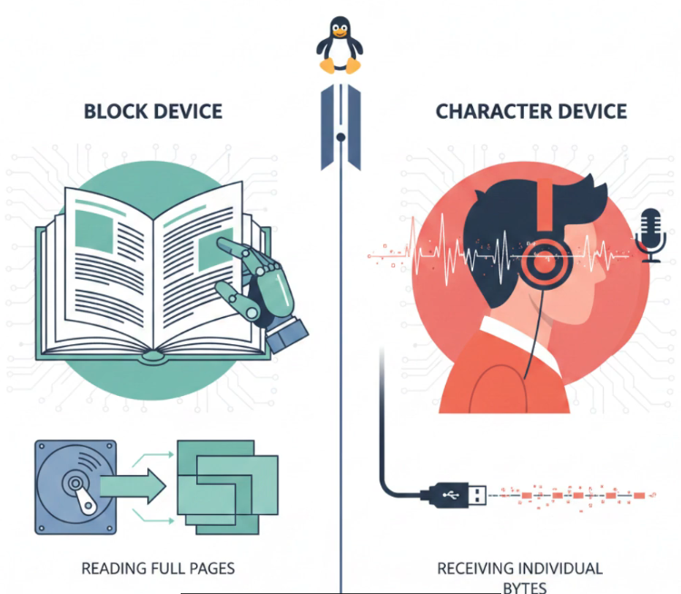
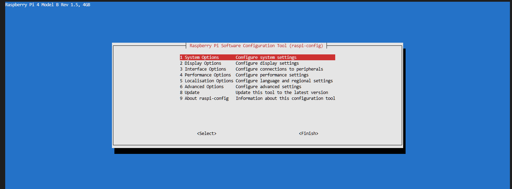
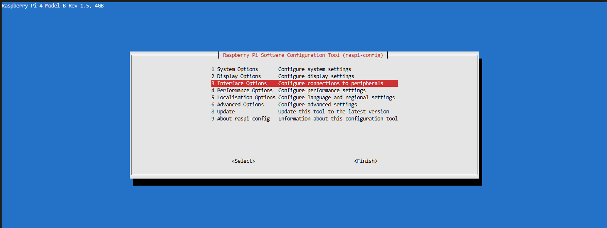
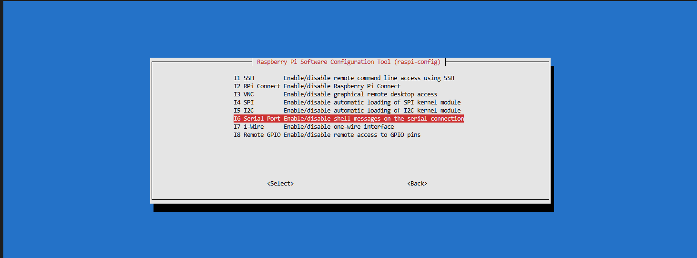
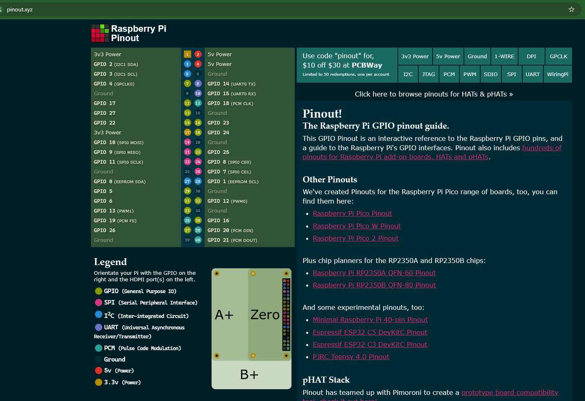
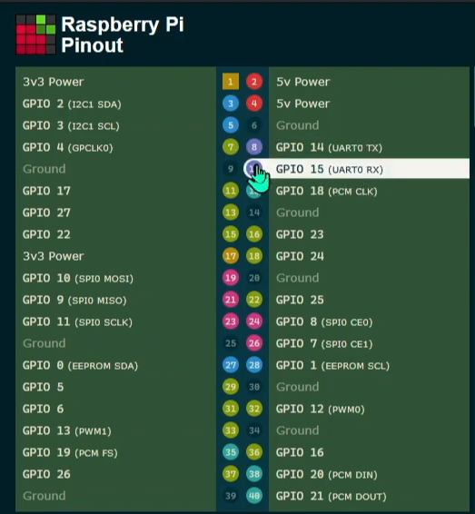

# Understanding Linux Device Files
## Video :
[](https://www.youtube.com/watch?v=MZDzAPh2DhA) 

## Block and Character Devices

## Major & Minor 

### Where do device files live and why are they “virtual”?

* The `/dev` directory contains special files called device nodes.
```
ls /dev
ls /dev | wc -l
```

unusual files: tty1, mmcblk0, gpiochip0
not regular files
special files
device nodes
interface to hardware or kernel feature

mounted as a temporary file system == tmpfs inside RAM

kernel and udev is created dynamically at boot time, not in SD card


```
$ ls -lh /dev/mmcblk0 /dev/tty0 /dev/gpiochip0
crw-rw----+ 1 root gpio 254, 0 Mar  7 21:17 /dev/gpiochip0
brw-rw----  1 root disk 179, 0 Mar  7 21:17 /dev/mmcblk0 <---- 179: MMC block driver, 0: the whole card>
crw--w----  1 root tty    4, 0 Mar  7 21:17 /dev/tty0 <------- 4: Serial console, 0: first serial console>

$ ls -lh /dev/mmcblk0p1
brw-rw---- 1 root disk 179, 1 Mar  7 21:17 /dev/mmcblk0p1 <---- First partition>
```
* b = block, : SD cards, SSD, USB drives
    - data moved in fixed size block, normally 4kb, ras pi 5 is 16kb
* c = character
    - serial ports, keyboard, GPIO pins, sound cards
    - raw stream of bytes
    - no block buffering involved


* major numbers: get registerd major numbers
    - tell the kernel which driver to use
```
# show all list major number corresponding to list of device driver
$ cat /proc/devices

    Character devices:
    1 mem
    4 /dev/vc/0
    4 tty
    5 /dev/tty
    5 /dev/console
    5 /dev/ptmx
    5 ttyprintk
    7 vcs
    10 misc
    13 input
    14 sound
    29 fb
    81 video4linux
    89 i2c
    116 alsa
    128 ptm
    136 pts
    180 usb
    189 usb_device
    204 ttyAMA
    216 rfcomm
    226 drm
    237 media
    238 gpiomem
    239 uio
    240 cec
    241 binder
    242 hidraw
    243 rpmb
    244 nvme-generic
    245 nvme
    246 vc-mem
    247 bsg
    248 watchdog
    249 ptp
    250 pps
    251 lirc
    252 rtc
    253 dma_heap
    254 gpiochip

    Block devices:
    1 ramdisk
    7 loop
    8 sd
    65 sd
    66 sd
    67 sd
    68 sd
    69 sd
    70 sd
    71 sd
    128 sd
    129 sd
    130 sd
    131 sd
    132 sd
    133 sd
    134 sd
    135 sd
    179 mmc
    254 device-mapper
    259 blkext
```

* minor number
    - after knowing the driver to use, each instance should have unique number to identify
```
ls -lh /dev/tty{1,2,3,4,5}
```

NOTE: the file name of the device node doesn't matter at all

### filename doesn’t matter
**Character Device: Serial Port example**
* Enable Serial port
```
sudo raspi-config
```



need to reboot the system

https://pinout.xyz/


==> we will have /dev/tty0 ****
$ ls -lah /dev/ttyS0
    crw--w---- 1 root tty 4, 64 Mar  8 11:46 /dev/ttyS0
-----
# setup the tty0 loopback for /dev/tty0 :)
* install screen
```
$ sudo apt install screen -y
```

use wire and connect 2 pin below:

* screen serial port (short the UART TX and RX pins)
```
$ sudo screen /dev/ttyS0 9600
or 
$ sudo picocom -b 115200 /dev/ttyS0
```

*Whatever we type anyting it will echo back, showing that the serial interface works.*   
<small>exit form screen: `Ctrl + A` , Then, `press D`.</small>

* Create `my_serial` device node
```
$ sudo mknod my_serial c 4 64
```
==> new file my_serial is created

$ ls -lah my_serial
    crw-r--r-- 1 root root 4, 64 Mar  8 12:21 my_serial

* again screen serail bus using new node `my_serial` rather than use /dev/ttyS0:
```
$ sudo screen my_serial 9600
or 
$ sudo picocom -b 115200 my_serial
```
<small>This works exact same. like `ttyS0`</small>

**The filename doesn’t matter – only major+minor do.**

---------- 
# Block Device
**Block Device: SD Card Memeory block example**
* dump the `mmcblk0` 4kb memory,
```
$ sudo hexdump -C /dev/mmcblk0 -n 512 | head
```
    00000000  fa b8 00 10 8e d0 bc 00  b0 b8 00 00 8e d8 8e c0  |................|
    00000010  fb be 00 7c bf 00 06 b9  00 02 f3 a4 ea 21 06 00  |...|.........!..|
    00000020  00 be be 07 38 04 75 0b  83 c6 10 81 fe fe 07 75  |....8.u........u|
    00000030  f3 eb 16 b4 02 b0 01 bb  00 7c b2 80 8a 74 01 8b  |.........|...t..|
    00000040  4c 02 cd 13 ea 00 7c 00  00 eb fe 00 00 00 00 00  |L.....|.........|
    00000050  00 00 00 00 00 00 00 00  00 00 00 00 00 00 00 00  |................|
    *
    000001b0  00 00 00 00 00 00 00 00  17 87 64 7a 00 00 00 00  |..........dz....|
    000001c0  01 80 0c 03 e0 ff 00 40  00 00 00 00 10 00 00 03  |.......@........|
    000001d0  e0 ff 83 fe ff ff 00 40  10 00 00 e4 a6 03 00 00  |.......@........|

* create our own device node:
$ ls -lah /dev/mmcblk0
    brw-rw---- 1 root disk 179, 0 Mar  8 11:43 /dev/mmcblk0

```shell
$ sudo mknod my_mblk b 179 0 # 179,0 is the same major and minor number of the mmcblk0
```
==> create new file
```
$ ls -lh my_mblk
```
    brw-r--r-- 1 root root 179, 0 Mar  8 12:23 my_mblk

* Read 1st 4kb of data of new device node `my_mblk`
```
$ sudo hexdump -C my_mblk -n 512 | head
```
Output:
```
    00000000  fa b8 00 10 8e d0 bc 00  b0 b8 00 00 8e d8 8e c0  |................|
    00000010  fb be 00 7c bf 00 06 b9  00 02 f3 a4 ea 21 06 00  |...|.........!..|
    00000020  00 be be 07 38 04 75 0b  83 c6 10 81 fe fe 07 75  |....8.u........u|
    00000030  f3 eb 16 b4 02 b0 01 bb  00 7c b2 80 8a 74 01 8b  |.........|...t..|
    00000040  4c 02 cd 13 ea 00 7c 00  00 eb fe 00 00 00 00 00  |L.....|.........|
    00000050  00 00 00 00 00 00 00 00  00 00 00 00 00 00 00 00  |................|
    *
    000001b0  00 00 00 00 00 00 00 00  17 87 64 7a 00 00 00 00  |..........dz....|
    000001c0  01 80 0c 03 e0 ff 00 40  00 00 00 00 10 00 00 03  |.......@........|
    000001d0  e0 ff 83 fe ff ff 00 40  10 00 00 e4 a6 03 00 00  |.......@........|
```
==> exact same output