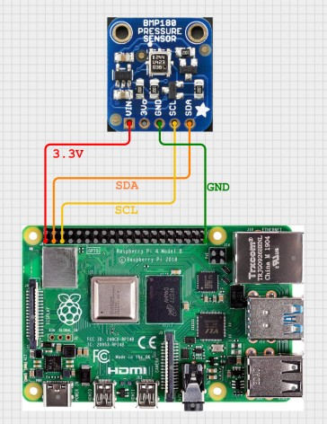

# Linux I2C Client Driver with BMP180 Sensor

### Video :
[](https://www.youtube.com/watch?v=PO8QOPt3g10)

## Introduction
- In the previous video of this series, we discussed the **Linux I2C subsystem basics**.  
We covered the following concepts:
* User-space I2C access
* I2C adapters (controllers)
* I2C clients (devices)
* Basic usage of `i2c-tools`

In this repository, we take the **next step** and implement a **custom Linux kernel I2C client driver**, built on top of the **Linux I2C core**.

This project gradually evolves from:
1. Manual I2C device creation using sysfs
2. Automatic device creation using kernel APIs
3. A complete **BMP180 sensor driver**, exposing temperature and pressure to user space via **sysfs**.

--------------------------------

### Listing Available I2C Adapters
- Use the following command to list all I2C adapters registered with the kernel:
```bash
i2cdetect -l
```
This command displays all available I2C buses.
* On Raspberry Pi, i2c-1 is typically the primary I2C bus connected to external peripherals.
* Other adapters (for example HDMI-related buses) are internal and not used here.
* If you do not see i2c-1, the I2C interface is not enabled.

Enabling I2C on Raspberry Pi:
1. Open the configuration tool:
```bash
sudo raspi-config
```
2. Select Interface Options
3. Select **I2C**
4. Enable the I2C interface
5. Exit and reboot the system
---------------------------------

### Hardware Used: BMP180 Sensor
- In this example, we use the **BMP180** pressure and temperature sensor.

- However, you do not need a **BMP180** sensor for the initial parts of this tutorial.
- Any I2C-compatible device—or even a microcontroller such as an **Arduino** or **ESP32** configured as an I2C slave—can be used.

- Later videos will also demonstrate **Device Tree–based device creation**, including examples using an **ESP32**.

**BMP180 Overview**

The BMP180 sensor consists of:
*   A piezo-resistive pressure sensor
*   An analog-to-digital converter (ADC)
*   An internal control unit with EEPROM
*   A serial I2C interface

BMP180 sensor connection with Pi4:



-------------------------------
### Scanning the I2C Bus
- Scan the I2C bus for connected devices:

```bash
i2cdetect -y 1
```
You should see:
* The address `0x77` on the bus
* `0x77` is the default I2C address of the BMP180 sensor


---------------------------------
---------------------------------
## Part 1: Manual I2C Device Creation (Using sysfs)
### Driver Overview
**The following driver demonstrates:**
* i2c_device_id matching
* Use of driver_data
* Manual device creation using sysfs

**Key Concepts Demonstrated**
* i2c_device_id table matching
* Passing private data using driver_data
* `probe()` and `remove()` callbacks
* Manual binding using new_device and delete_device

### Building and Loading the Module
- Build the module:
```bash
make
```
- Switch to superuser:
```bash
sudo su
```
- Before loading the module, inspect existing drivers and deices:
```bash
ls /sys/bus/i2c/drivers
ls /sys/bus/i2c/devices
```
- Load the module:
```
insmod bmp180_i2c_driver.ko
```
- Verify that the driver is registerd:
```bash
ls /sys/bus/i2c/drivers
```
- You should now see:
```
bmp180-i2c-driver
```
<h4>Manually Creating an I2C Device</h4>
Create an I2C device using sysfs:

```bash
echo bmp180-a 0x77 > /sys/bus/i2c/devices/i2c-1/new_device
```
- Results:
* The kernel matches bmp180-a with the driver’s i2c_device_id table
* The driver’s probe() function is invoked
* The private data associated with the device ID is printed
* The BMP180 chip ID register (0xD0) is read and returns 0x55, confirming correct communication

- Verify device creation:
```bash
ls /sys/bus/i2c/devices
```
- You should see:
```bash
1-0077
```
--------------------------------------------------------------------------
--------------------------------------------------------------------------
***Note:*** 

*Now why `i2cdetect` Shows `UU`*                                  
```bash
i2cdetect -y 1
```
* *You will now see `UU` instead of `77`*.
* *This indicates*:
    * *The I2C address `0x77` is **in use by a kernel driver.***
    * *User-Space tools can no longer access it directly.*
--------------------------------------
--------------------------------------

### Removing the Device
```bash
echo 0x77 > /sys/bus/i2c/devices/i2c-1/delete_device
```
* The driver’s `remove()` function is called
* The device is detached
* The address becomes visible again in `i2cdetect`


### Device ID Matching Behavior
- Creating a device **not present** in the ID table:
```bash
echo test-dev 0x77 > /sys/bus/i2c/devices/i2c-1/new_device
```
* probe() is not called
* The driver does not bind

This demonstrates that only devices listed in `i2c_device_id` are matched.

-----------------------------------------------------
-----------------------------------------------------
## Part 2: Automatic I2C Device Creation (Kernel API)
- Manually using `new_device` is useful for learning, but not suitable for production systems.    
- In this section, we create and remove the I2C device `automatically from inside the kernel module`, using the Linux I2C API.

**APIs Used:**
* i2c_get_adapter()
* i2c_new_client_device()
* i2c_unregister_device()
These replace:
```bash
echo bmp180-a 0x77 > new_device
echo 0x77 > delete_device
```

**Result:**
* Device is created when the module is loaded
* `probe()` and is called automatically
* Device is removed cleanly when the module is unloaded
* No manual sysfs interaction is required

------------------------
-------------------------

## Part 3: Complete BMP180 Sensor Driver
- This section contains a full BMP180 sensor driver implementation.
### Testing With BMP180 Sensor
**The code reads register 0xD0, which on BMP180 should return 0x55.**
```bash
i2ctransfer -y 1 w1@0x77 0xD0 r1@0x77
```
should return `0x55`

**Read calibration data (22 bytes starting from register 0xAA)**
```bash
i2ctransfer -y 1 w1@0x77 0xAA r22@0x77
```
return the calibaration data from the BMP180 sensor.

**Read raw temperature value**
1. Tell sensor to perform temperature measurement:
```bash
i2ctransfer -y 1 w2@0x77 0xF4 0x2E
```
2. Wait 5 ms (temperature conversion time):
```bash
sleep 0.005
```
3. Read raw temperature result (2 bytes):
```bash
i2ctransfer -y 1 w1@0x77 0xF6 r2@0x77
```

- All in one line:
```bash
i2ctransfer -y 1 w2@0x77 0xF4 0x2E; sleep 0.005; i2ctransfer -y 1 w1@0x77 0xF6 r2@0x77
```

- Code :
**Features**
* Reads calibration data from EEPROM
* Performs temperature and pressure compensation (as per datasheet)
* Exposes sensor values to user space via sysfs
* Uses kernel I2C APIs (`i2c_smbus_*`)
* Supports oversampling

**sysfs interfaces**

After loading the module, the following sysfs files are created:
```bash
/sys/bus/i2c/devices/1-0077/temp_input
/sys/bus/i2c/devices/1-0077/pressure_input
```

**Reading Sensor Data**
#### Read pressure (in Pascals):
```bash
cat /sys/bus/i2c/devices/1-0077/pressure_input
```
- Example output:  
101119 -> This corresponds to: `1011.19 hPa`    


#### Read temperature (in tenths of degrees Celsius):
```bash
cat /sys/bus/i2c/devices/1-0077/temp_input
```
- Example output:  
204 -> This corresponds to: `20.4 °C`.


--------------------------------------------
### Test Program
build
```
gcc test_bmp180.c
```

run
```
./a.out /sys/bus/i2c/devices/1-0077
```

--------------------------------------------
--------------------------------------------
*Notes:*

*Automatic device creation is used here for demonstration purposes.*    
*In real embedded Linux systems, I2C devices are typically instantiated using:*
* *Device Tree*
* *ACPI (on x86 systems)*

*These topics are covered in later videos in this series.*

---------------------------
---------------------------

