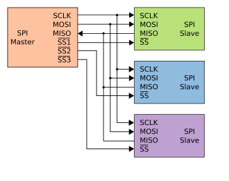
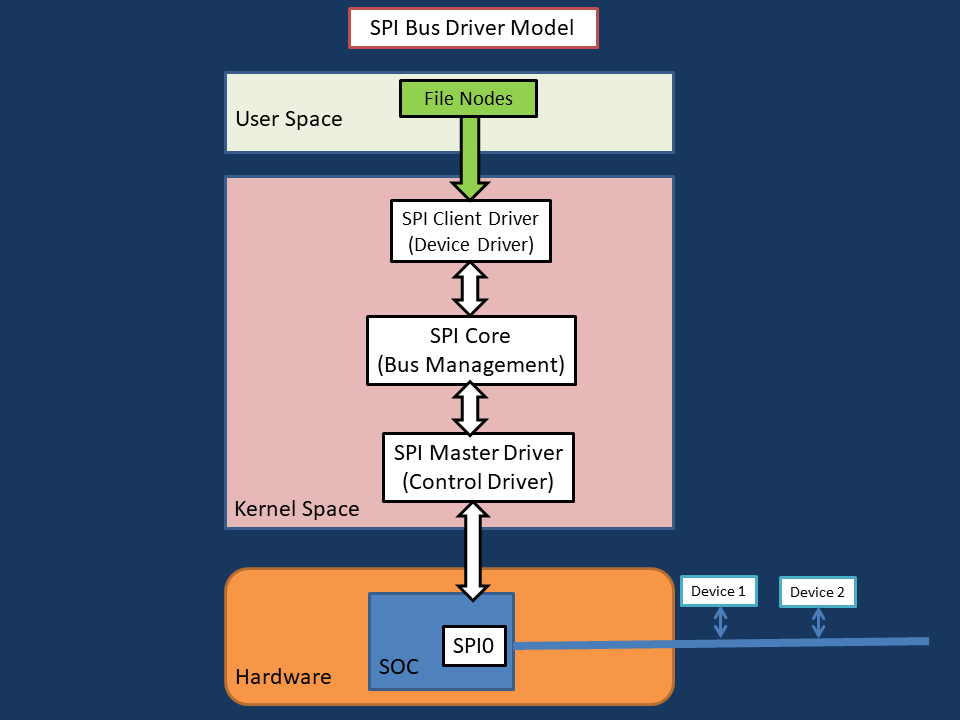
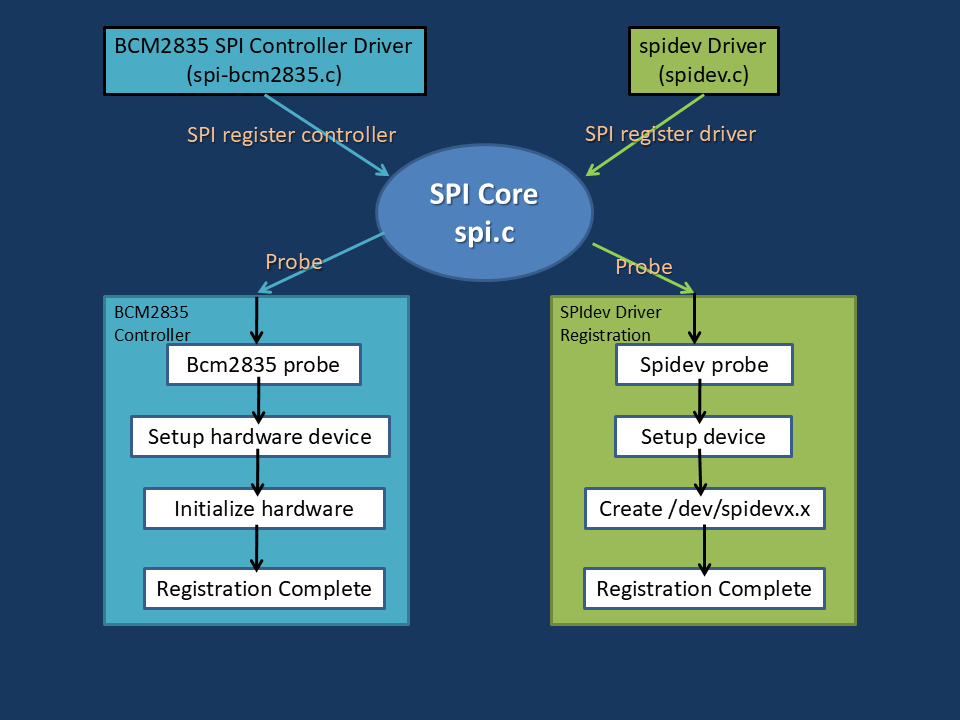
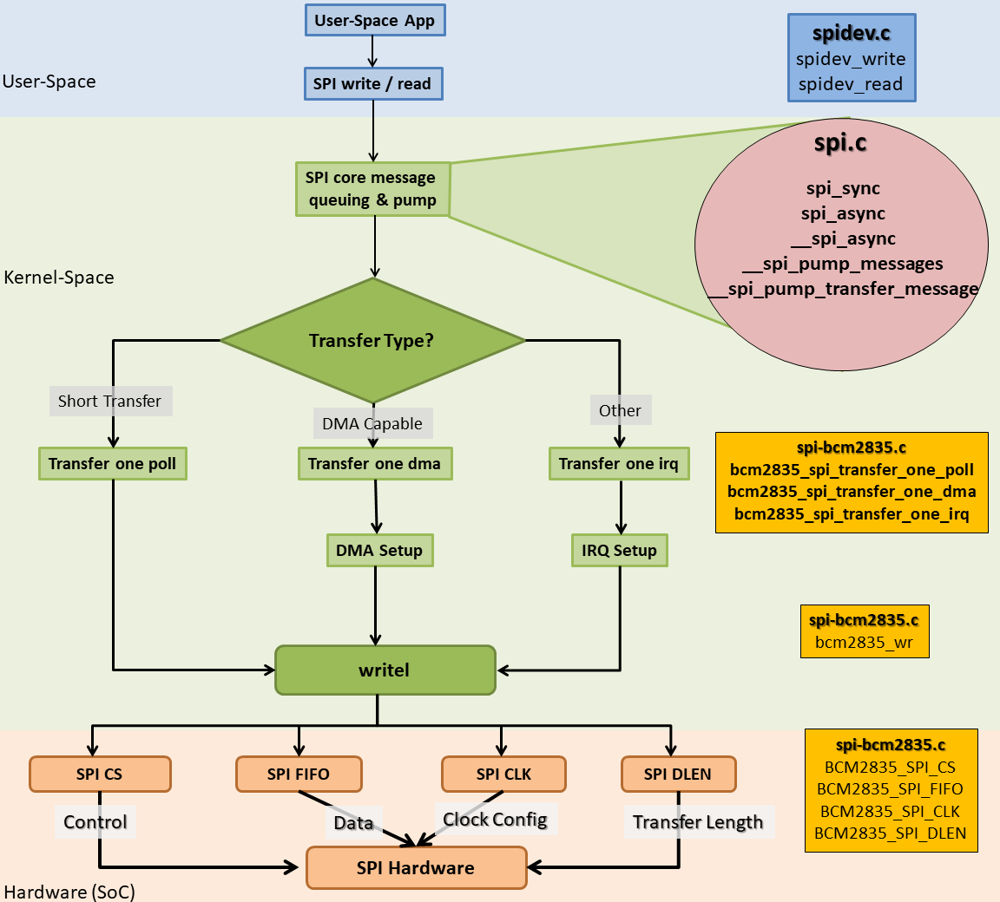

# Linux SPI Subsystem Basics 

### Video :
[](https://www.youtube.com/watch?v=W7CJ3Fz--Ws)

## 1. What is SPI in Linux?
SPI (Serial Peripheral Interface) is a synchronous, full-duplex, master-driven serial bus used to communicate with peripheral devices such as ADCs, DACs, displays, and sensors.



Unlike I2C:
* SPI does not use addressing
* Device selection is done using chip-select (CS or SS) lines
* Data is transferred simultaneously in both directions

In Linux, SPI is implemented as a layered subsystem that separates:

* Hardware-specific logic
* Bus management
* Device-specific drivers

## 2. High-Level SPI Architecture in Linux
The Linux SPI subsystem is built around three core components:

   

*High-level Linux SPI bus driver model showing user space, SPI client driver, SPI core, SPI master driver, and hardware.*

### User Space
* Applications never talk to SPI hardware directly
* They talk via file nodes
* Example:
    - `/dev/spidev0.0`
    - or a custom character device exposed by your SPI client driver,

### Kernel Space

#### 1. SPI Client Driver (Device Driver)

* Device-specific
* Formats commands and data
* Uses SPI core APIs to communicate

*The SPI client driver is device-specific, but hardware-independent.*

#### 2. SPI Core

* Bus management layer (spi.c)
* Matches devices with drivers
* Managing messages and transfers
* Calling into the master driver
* Completely hardware-agnostic

#### 3. SPI Master Driver (Controller Driver)

* Hardware-specific
* Controls :
    - SPI clock
    - Chip select
    - MOSI / MISO transfers
* Example :
    - `spi-bcm2835.c` on Raspberry Pi

*SPI master drivers know how to shift bits;     
SPI client drivers know what bits to shift.*

### Hardware Layer
* SoC SPI controller
* Multiple slaves on the same bus
* Chip-select decides which slave is active

------------------------------------------------------

## SPI Registration / Probe Flow


*(What really happens inside the kernel)*

**SPI Controller Driver**

* `spi-bcm2835.c` loads
* Registers itself using:
```
spi_register_controller()
```
* SPI core calls:
    * controller `probe()`

* Hardware is:
    - mapped
    - initialized
    - registered

*This step creates the SPI bus itself.*  
*No bus → no devices → no client drivers.*

**spidev (or custom driver)**

* `spidev.c` registers as an SPI client driver
* SPI core:
    * matches it with available SPI devices
* `spidev_probe()` is called
* `/dev/spidevX.Y` is created

**Center: SPI Core** 

* SPI core:
    - keeps track of controllers
    - keeps track of SPI devices
    - matches devices with drivers

This is the `traffic controller`.

## SPI Operation Process




* *device-Tree* : to convert the live device tree from the kernel into a readable DTS format:
```
dtc -I fs -O dts -s /sys/firmware/devicetree/base > tmp_dt.dts
```

So during boot:

1. The kernel parses the Device Tree.
2. It finds the SPI controller node.
3. It reads the compatible string.
4. It searches for a driver with a matching of_device_id table.
5. It finds spi-bcm2835.
6. The driver’s probe() function is called.

------------------------------------
------------------------------------

### Example Overview

In this example, we explore the Linux `SPI subsystem fundamentals` by writing a `minimal SPI client driver` and manually binding it to an SPI device `without using Device Tree`.

The purpose of this example is **not production use**, but to:
* Understand SPI architecture in Linux
* Learn how SPI drivers are registered and probed
* Understand `spi_message` and `spi_transfer`
* Observe how driver binding and unbinding works internally

An **ESP32 Dev Kit (SPI slave)** is used to verify full-duplex SPI communication with a **Raspberry Pi (SPI master)**.

#### Hardware Setup

**SPI Master**
* Raspberry Pi (BCM2835 SPI controller)

**SPI Slave**
* ESP32 Dev Kit 1
* Uses ESP32SPISlave library
* Toggles an LED on each SPI transaction

--------------------------------------
--------------------------------------
--------------------------------------

### Raspberry Pi SPI Setup

#### Enable SPI
Using raspi-config:
```
sudo raspi-config
```
Enable SPI under Interface Options.

Or manually:
```
sudo nano /boot/firmware/config.txt
```
add:
```
dtparam=spi=on
```
Reboot:
```
sudo reboot
```
------------------------------------

### Verify SPI Interfaces

#### Check SPI device nodes
```
ls /dev/spi*
```

#### Inspect SPI sysfs entries
```
ls /sys/bus/spi/devices/
ls /sys/bus/spi/drivers/
ls /sys/bus/spi/drivers/spidev/
```

------------------------------------------------

### Build and Load the Driver

#### Step 1: Build the module
```
make
```

#### Step 2: Insert the module
```
sudo insmod my_spi.ko
```
At this stage:
* The driver is loaded
* `probe()` is not called yet

This is expected.

#### Understanding Default Driver Binding
By default, Raspberry Pi binds SPI devices to the `spidev` driver.
```
ls /sys/bus/spi/drivers/spidev/
```
You should see:
```
spi0.0 spi0.1
```
This means:
- The SPI devices are already in use
- Your driver cannot bind yet

#### Manual Driver Binding (Without Device Tree)
Switch to root
```
sudo su
```
Try binding directly (will fail)
```
echo spi0.0 > /sys/bus/spi/drivers/my_spi_driver/bind
```
Error:
```
write error: Device or resource busy
```
Reson:
* `spi0.0` is already bound to `spidev` 

Unbind from `spidev`
```
echo spi0.0 > /sys/bus/spi/drivers/spidev/unbind
```
Verify:
```
ls /sys/bus/spi/drivers/spidev/
```
* `spi0.0` is now free.  

<br></br>
**Prevent `spidev` from rebinding**
```
echo my_spi_driver > /sys/bus/spi/devices/spi0.0/driver_override
```
This ensures:
* Only my_spi_driver can bind to this device

**Bind SPI driver**
```
echo spi0.0 > /sys/bus/spi/drivers/my_spi_driver/bind
```
* `probe()` is called
* SPI transfer happens
* Data is exchanged with ESP32

**Unbind the driver**
```
echo spi0.0 > /sys/bus/spi/drivers/my_spi_driver/unbind
```
* `remove()` is called

---------------------------------------------

### Automatic Probe and Remove

Once driver_override is set:
* Loading the module automatically calls `probe()`
* Unloading the module automatically calls `remove()`
* Manual bind/unbind is no longer required


