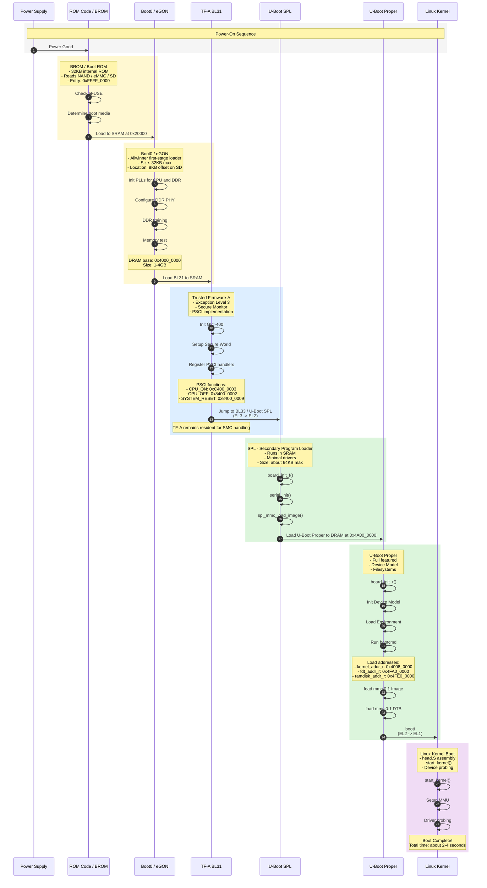
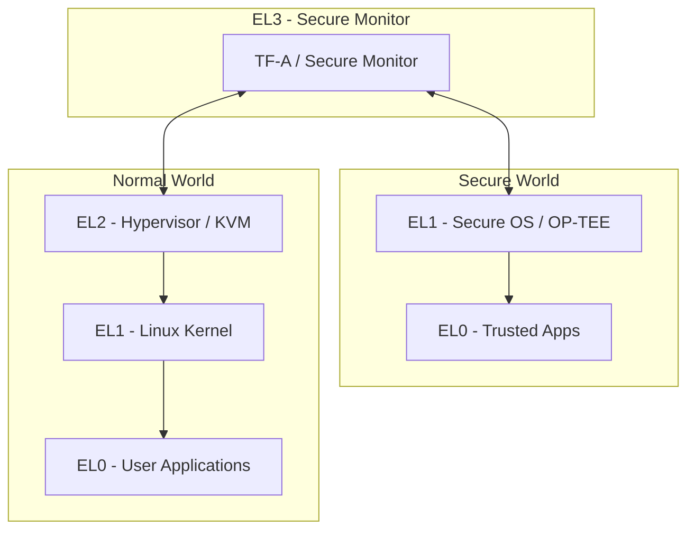
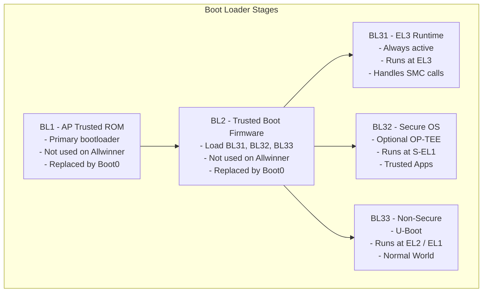
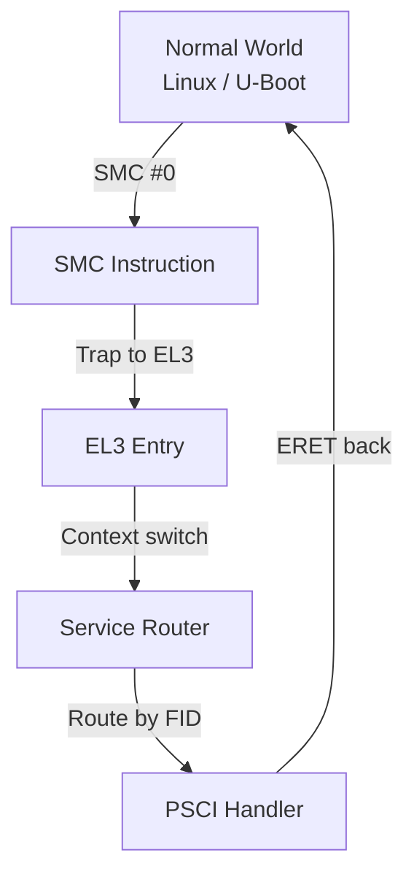
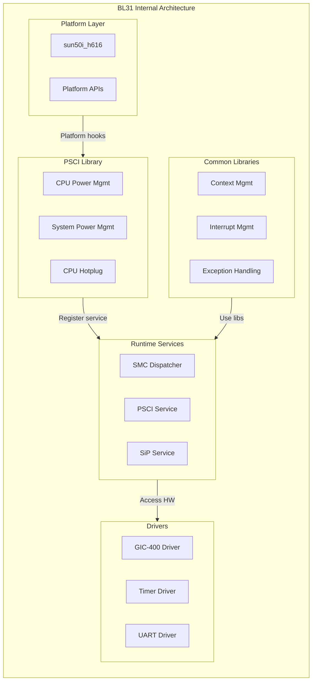
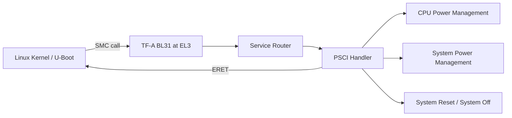
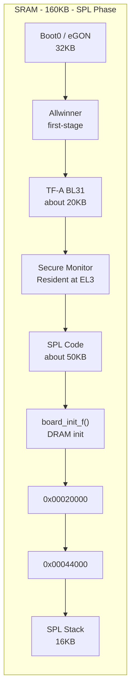
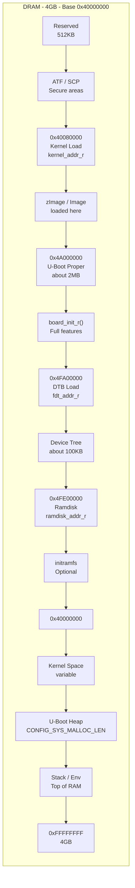
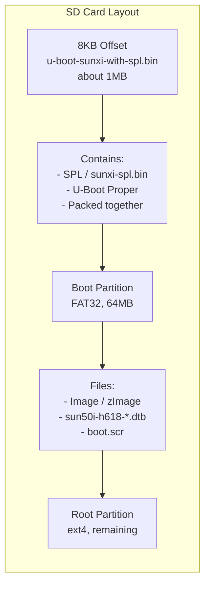
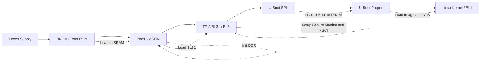

# SYSTEM ARCHITECT ARM CORTEX A

# Bài 1.1: Trusted Firmware-A (TF-A)

**Biên soạn:** Phạm Văn Vũ  
**Đơn vị:** HALA Academy  
**Chủ đề:** System Architect ARM Cortex A

---

## Mục tiêu bài học

Sau buổi học này, học viên sẽ có khả năng:

- Hiểu rõ vai trò của **EL3 (Exception Level 3)** trong kiến trúc ARM64.
- Nắm vững cấu trúc và chức năng của **Trusted Firmware-A (TF-A)**.
- Thực hành build **TF-A BL31** cho **Orange Pi Zero 3 (Allwinner H618)**.

---

# Phần 1: Lý thuyết

## 1.1 ARM Exception Levels

### Hình 1: Quy trình Boot Chain - Orange Pi Zero 3 (H618)

> Diagram gốc đã được chuyển thành Mermaid sequence diagram để có thể đọc trực tiếp trong Markdown.



### Boot Chain theo từng stage

| Stage | Thành phần | Chạy ở đâu | Vai trò chính | Ghi chú quan trọng |
|---|---|---|---|---|
| 1 | Power Supply | Phần cứng | Cấp nguồn cho board | Khi nguồn ổn định sẽ có tín hiệu **Power Good** |
| 2 | BROM / Boot ROM | ROM nội SoC | Boot code đầu tiên của SoC | Entry khoảng `0xFFFF_0000`; đọc NAND/eMMC/SD |
| 3 | Boot0 / eGON | SRAM | Allwinner first-stage loader | Nằm ở offset 8KB trên SD; khởi tạo DDR |
| 4 | TF-A BL31 | SRAM, EL3 | Secure Monitor runtime | Cài PSCI, GIC-400, Secure World |
| 5 | U-Boot SPL | SRAM | Loader tối giản | Load U-Boot Proper vào DRAM |
| 6 | U-Boot Proper | DRAM | Bootloader đầy đủ | Load kernel, DTB, initramfs; chạy `booti` |
| 7 | Linux Kernel | DRAM, EL1 | Hệ điều hành | `head.S`, `start_kernel()`, probe driver |

### ARM64 Exception Levels

ARM64 định nghĩa 4 cấp độ đặc quyền, gọi là **Exception Levels**:

| Level | Tên gọi | Mục đích | Ví dụ |
|---|---|---|---|
| EL0 | User | Ứng dụng người dùng | Apps, Games |
| EL1 | Kernel | Hệ điều hành | Linux Kernel |
| EL2 | Hypervisor | Ảo hóa | KVM, Xen |
| EL3 | Secure Monitor | Bảo mật | TF-A, OP-TEE |

### Tại sao cần nhiều Exception Levels?

- **Cách ly bảo mật:** Mỗi level có quyền hạn riêng.
- **Bảo vệ hệ thống:** Code ở level thấp không thể truy cập trực tiếp level cao.
- **Hỗ trợ ảo hóa:** EL2 cho phép chạy nhiều OS cùng lúc.

---

## 1.2 Secure World vs Normal World

| Thành phần | Secure World | Normal World |
|---|---|---|
| EL3 | TF-A / Secure Monitor | TF-A / Secure Monitor |
| EL2 | - | Hypervisor / KVM |
| EL1 | Secure OS / OP-TEE | Linux Kernel |
| EL0 | Trusted Apps | User Applications |

### Giải thích

- **Secure World:** Chạy code tin cậy, ví dụ keys, DRM, payment.
- **Normal World:** Chạy Linux và ứng dụng thông thường.
- **TF-A ở EL3:** Là điểm chuyển giao giữa Secure World và Normal World.



---

## 1.3 Trusted Firmware-A (TF-A)

### Hình 2: Kiến trúc nội bộ TF-A

> Diagram gốc đã được chuyển thành nhiều Mermaid diagrams nhỏ để dễ đọc trong Markdown.

---

### 1.3.1 Boot Loader Stages



### Các thành phần Boot Loader BLx

| Component | Chạy tại | Chức năng |
|---|---|---|
| BL1 | ROM/SRAM | First stage, validate BL2 |
| BL2 | SRAM | Load BL31, BL32, BL33 |
| BL31 | SRAM, resident | EL3 Runtime, PSCI |
| BL32 | RAM | Secure OS / OP-TEE, optional |
| BL33 | DRAM | Non-secure bootloader / U-Boot |

> **Lưu ý cho Allwinner H618:** Boot0 của Allwinner proprietary thay thế BL1 + BL2, vì vậy trong lab này chỉ cần build **BL31**.

---

### 1.3.2 SMC Call Flow



### PSCI SMC Function IDs

| Function | FID |
|---|---:|
| CPU_ON | `0xC4000003` |
| CPU_OFF | `0x84000002` |
| SUSPEND | `0xC4000001` |

---

### 1.3.3 BL31 Internal Architecture



### Build TF-A cho Allwinner H618

```text
Allwinner H618 TF-A Build:
make PLAT=sun50i_h616 bl31
Output: bl31.bin (~20KB)
```

---

## PSCI - Power State Coordination Interface

PSCI là giao diện chuẩn dùng **SMC (Secure Monitor Call)** để quản lý nguồn.

| Function | PSCI ID | Mô tả |
|---|---:|---|
| CPU_ON | `0xC4000003` | Bật một CPU core |
| CPU_OFF | `0x84000002` | Tắt CPU hiện tại |
| CPU_SUSPEND | `0xC4000001` | Suspend CPU |
| SYSTEM_RESET | `0x84000009` | Reset toàn hệ thống |
| SYSTEM_OFF | `0x84000008` | Tắt nguồn |

### PSCI trong Boot Chain



---

## Hình 3: U-Boot Memory Layout - Orange Pi Zero 3

> Diagram gốc đã được chuyển thành Markdown tables và Mermaid diagrams.

### 3.1 SRAM Layout - SPL Phase



| SRAM item | Kích thước / địa chỉ | Chức năng |
|---|---:|---|
| Boot0 / eGON | 32KB | Allwinner first-stage loader |
| TF-A BL31 | khoảng 20KB | Secure Monitor chạy resident tại EL3 |
| SPL Code | khoảng 50KB | U-Boot SPL code |
| `board_init_f()` | - | Khởi tạo DRAM |
| SPL Stack | 16KB | Stack cho SPL |
| SRAM address | `0x00020000` đến `0x00044000` | Vùng SRAM dùng trong SPL phase |

---

### 3.2 DRAM Layout - 4GB base `0x40000000`



### Memory Regions & Sizes

| Region | Start | Size | Purpose |
|---|---:|---:|---|
| SRAM | `0x20000` | 160KB | SPL, TF-A |
| DRAM | `0x40000000` | 1-4GB | Kernel, U-Boot |
| U-Boot | 8KB offset | about 1MB | Bootloader |

### Important Addresses

| Symbol | Address | Used for |
|---|---:|---|
| `kernel_addr_r` | `0x40080000` | Kernel load |
| `fdt_addr_r` | `0x4FA00000` | DTB load |
| `ramdisk_addr_r` | `0x4FE00000` | Initramfs |

---

### 3.3 SD Card Layout



| SD card area | Nội dung | Ghi chú |
|---|---|---|
| 8KB offset | `u-boot-sunxi-with-spl.bin` | Khoảng 1MB |
| Packed bootloader | SPL + U-Boot Proper | Đóng gói chung |
| Boot partition | FAT32, 64MB | Chứa kernel image, DTB, `boot.scr` |
| Root partition | ext4, phần còn lại | Root filesystem |

---

# Phần 2: Thực hành Lab

## 2.1 Chuẩn bị môi trường

### Bước 1: Cài đặt Cross-compiler

```bash
# Ubuntu/Debian
sudo apt update
sudo apt install gcc-aarch64-linux-gnu make git

# Verify
aarch64-linux-gnu-gcc --version
```

### Bước 2: Clone TF-A source

```bash
cd ~/opi_build
git clone https://github.com/ARM-software/arm-trusted-firmware.git
cd arm-trusted-firmware

# Kiểm tra version
git describe --tags
```

---

## 2.2 Build BL31

### Clean và build

```bash
make CROSS_COMPILE=aarch64-linux-gnu- PLAT=sun50i_h616 DEBUG=1 bl31
```

### Kiểm tra output

```bash
ls -la build/sun50i_h616/debug/bl31.bin
```

### Các tham số build quan trọng

| Tham số | Giá trị | Mô tả |
|---|---|---|
| `PLAT` | `sun50i_h616` | Platform cho H616/H618 |
| `DEBUG` | `1` | Enable debug output |
| `LOG_LEVEL` | `40` | Verbose logging |
| `SUNXI_PSCI_USE_NATIVE` | `1` | Native PSCI |

---

## 2.3 Xác nhận kết quả

Khi boot thành công, UART sẽ hiển thị:

```text
NOTICE: BL31: v2.9(release):v2.9.0
NOTICE: BL31: Built : 10:30:45, Jan 05 2026
NOTICE: BL31: Detected Allwinner H616 SoC
NOTICE: BL31: PSCI: System Reset called
```

### Các lỗi thường gặp

| Lỗi | Nguyên nhân | Giải pháp |
|---|---|---|
| No BL31 output | Sai `PLAT` | Dùng `sun50i_h616` |
| Hang sau BL31 | BL33 path sai | Kiểm tra U-Boot build |
| PSCI not working | Thiếu config | Enable `SUNXI_PSCI_USE_NATIVE` |

---

# Phần 3: Câu hỏi ôn tập

1. ARM64 có bao nhiêu Exception Levels? Liệt kê và mô tả ngắn gọn.
2. TF-A BL31 chạy ở Exception Level nào? Tại sao?
3. PSCI là gì? Nêu 3 function quan trọng nhất.
4. Tại sao với Allwinner H618, chúng ta chỉ cần build BL31?
5. Giải thích sự khác biệt giữa Secure World và Normal World.

---

# Phần 4: Tài liệu tham khảo

- TF-A Documentation: <https://trustedfirmware-a.readthedocs.io/>
- ARM PSCI Specification: <https://developer.arm.com/documentation/den0022/>
- Allwinner H616 in TF-A: <https://github.com/ARM-software/arm-trusted-firmware/tree/master/plat/allwinner>

---

# Yêu cầu bài tập

- Screenshot bootlog hiển thị `BL31: v2.x`.
- File `bl31.bin` đã build thành công.
- Ghi chú các bước đã thực hiện.

---

# Phụ lục A: Tóm tắt đường đi boot



# Phụ lục B: Tóm tắt vai trò từng firmware

| Firmware / Stage | Vị trí | Chạy tại | Nhiệm vụ chính |
|---|---|---|---|
| BROM | ROM trong SoC | ROM | Chọn boot media, load Boot0 |
| Boot0 / eGON | SD/eMMC offset 8KB, sau đó SRAM | SRAM | Init PLL, DDR PHY, DDR training, load BL31 |
| TF-A BL31 | SRAM resident | EL3 | Secure Monitor, PSCI, SMC handling |
| U-Boot SPL | SRAM | EL2/EL1 path | Init tối thiểu, load U-Boot Proper |
| U-Boot Proper | DRAM | EL2 trước khi vào Linux | Load kernel, DTB, ramdisk; chạy `booti` |
| Linux Kernel | DRAM | EL1 | Khởi động OS, MMU, driver probing |