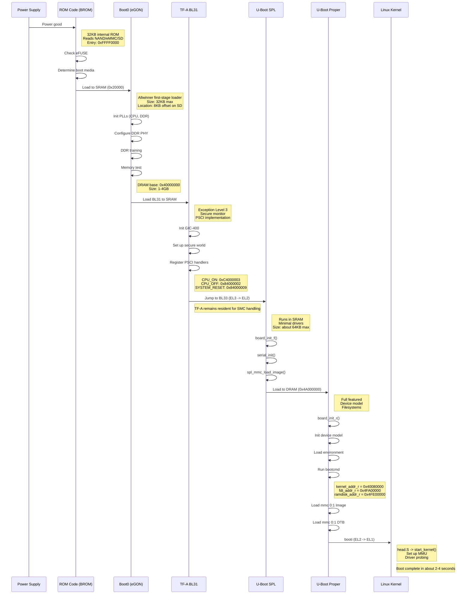
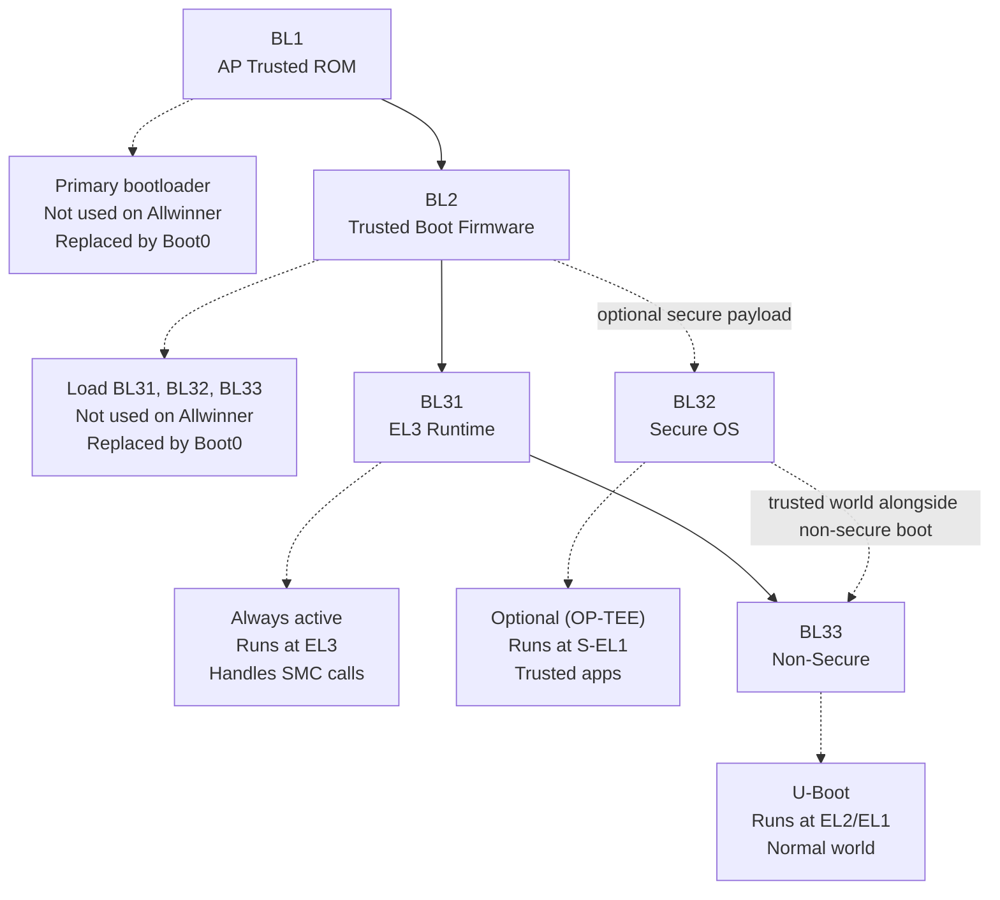
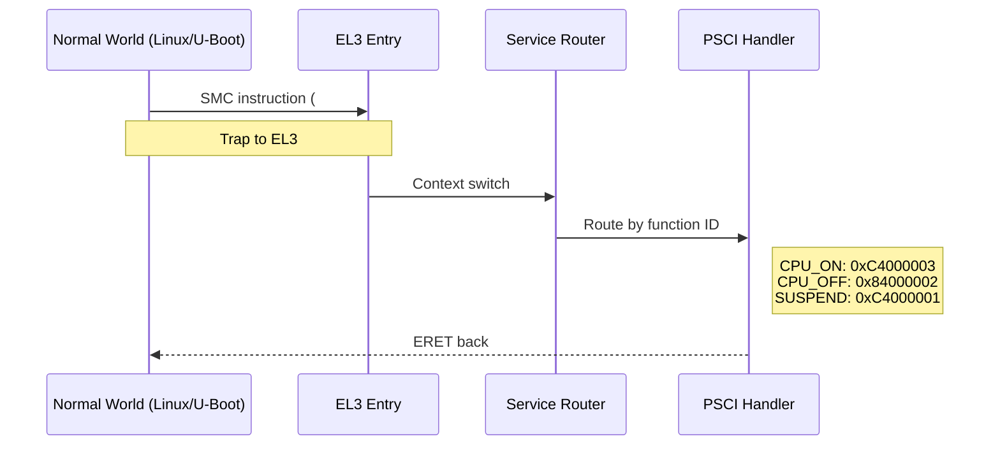
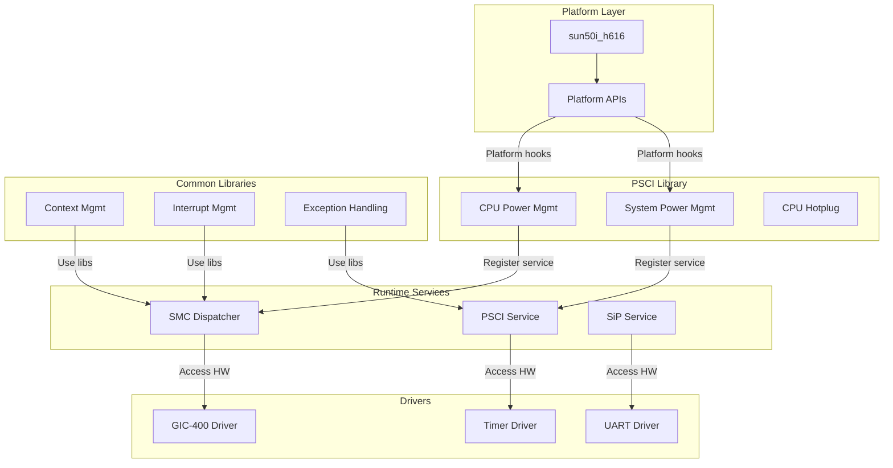

# Bài 1.1: Trusted Firmware-A (TF-A)

## Page 1

# Bài 1.1: Trusted Firmware-A (TF-A)

# Biên soạn: Phạm Văn Vũ

## Page 2

### Mục tiêu Bài học

Sau buổi học này, học viên sẽ có khả năng:

- Hiểu rõ vai trò của EL3 (Exception Level 3) trong kiến trúc ARM64

- Nắm vững cấu trúc và chức năng của Trusted Firmware-A (TF-A)

- Thực hành build TF-A cho Orange Pi Zero 3 (Allwinner H618)

## Page 3

### Phần 1: Lý thuyết

### 1.1 ARM Exception Levels

## Page 4

_No extractable text found on page 4._

## Page 5

*Hình 1: Quy trình Boot Chain*
<!-- mermaid-insert:start:bai_1_1_hinh_1 -->

<!-- mermaid-insert:end:bai_1_1_hinh_1 -->

ARM64 định nghĩa 4 cấp độ đặc quyền (Exception Levels):

Level        Tên gọi                      Mục đích                               Ví dụ

EL0          User                         Ứng dụng người dùng                    Apps, Games

EL1          Kernel                       Hệ điều hành                           Linux Kernel

EL2          Hypervisor                   Ảo hóa                                 KVM, Xen

EL3          Secure Monitor               Bảo mật                                TF-A, OP-TEE

Tại sao cần nhiều Exception Levels?

- Cách ly bảo mật: Mỗi level có quyền hạn riêng
- Bảo vệ hệ thống: Code ở level thấp không thể truy cập level cao
- Hỗ trợ ảo hóa: EL2 cho phép chạy nhiều OS cùng lúc

### 1.2 Secure World vs Normal World

Thành phần                 Secure World                               Normal World

EL3                                                      TF-A (Secure Monitor)

EL2                        -                                          Hypervisor (KVM)

EL1                        Secure OS (OP-TEE)                         Linux Kernel

EL0                        Trusted Apps                               User Applications

Giải thích:

- Secure World: Chạy code tin cậy (keys, DRM, payment)
- Normal World: Chạy Linux và ứng dụng thông thường
- TF-A (EL3): Điểm chuyển giao giữa 2 thế giới

## Page 6

### 1.3 Trusted Firmware-A (TF-A)

*Hình 2: Kiến trúc TF-A*
<!-- mermaid-insert:start:bai_1_1_hinh_2 -->
**Boot Loader Stages**


**SMC Call Flow**


**BL31 Internal Architecture**

<!-- mermaid-insert:end:bai_1_1_hinh_2 -->

Các thành phần Boot Loader (BLx)

Component              Chạy tại                        Chức năng

BL1                    ROM/SRAM                        First stage, validate BL2

BL2                    SRAM                            Load BL31, BL32, BL33

BL31                   SRAM (resident)                 EL3 Runtime, PSCI

BL32                   RAM                             Secure OS (OP-TEE) - Optional

BL33                   DRAM                            Non-secure bootloader (U-Boot)

Lưu ý cho Allwinner H618: Boot0 (Allwinner proprietary) thay thế BL1+BL2, chỉ cần build BL31.

PSCI (Power State Coordination Interface)

PSCI là giao diện chuẩn SMC (Secure Monitor Call) để quản lý nguồn:

Function                              PSCI ID                       Mô tả

CPU_ON                                0xC4000003                    Bật một CPU core

CPU_OFF                               0x84000002                    Tắt CPU hiện tại

## Page 7

CPU_SUSPEND    0xC4000001       Suspend CPU

SYSTEM_RESET   0x84000009       Reset toàn hệ thống

SYSTEM_OFF     0x84000008       Tắt nguồn

## Page 8

### Phần 2: Thực hành (Lab)

### 2.1 Chuẩn bị môi trường

Bước 1: Cài đặt Cross-compiler

```text
    # Ubuntu/Debian
    sudo apt update
    sudo apt install gcc-aarch64-linux-gnu make git
```

```text
    # Verify
    aarch64-linux-gnu-gcc --version
```

Bước 2: Clone TF-A source

```text
    cd ~/opi_build
    git clone https://github.com/ARM-software/arm-trusted-firmware.git
    cd arm-trusted-firmware
```

```text
    # Kiểm tra version
    git describe --tags
```

### 2.2 Build BL31

```text
    # Clean và build
    make CROSS_COMPILE=aarch64-linux-gnu- PLAT=sun50i_h616 DEBUG=1 bl31
```

```text
    # Kiểm tra output
    ls -la build/sun50i_h616/debug/bl31.bin
```

Các tham số build quan trọng

Tham số                              Giá trị            Mô tả

PLAT                                 sun50i_h616        Platform cho H616/H618

DEBUG                                1                  Enable debug output

## Page 9

LOG_LEVEL                                   40                      Verbose logging

SUNXI_PSCI_USE_NATIVE                       1                       Native PSCI

### 2.3 Xác nhận kết quả

Khi boot thành công, UART sẽ hiển thị:

```text
    NOTICE:    BL31: v2.9(release):v2.9.0
    NOTICE:    BL31: Built : 10:30:45, Jan 05 2026
    NOTICE:    BL31: Detected Allwinner H616 SoC
    NOTICE:    BL31: PSCI: System Reset called
```

Các lỗi thường gặp

Lỗi                         Nguyên nhân              Giải pháp

No BL31 output              Sai PLAT                 Dùng sun50i_h616

Hang sau BL31               BL33 path sai            Kiểm tra U-Boot build

PSCI not working            Thiếu config             Enable SUNXI_PSCI_USE_NATIVE

## Page 10

### Phần 3: Câu hỏi Ôn tập

1. ARM64 có bao nhiêu Exception Levels? Liệt kê và mô tả ngắn gọn.

2. TF-A BL31 chạy ở Exception Level nào? Tại sao?

3. PSCI là gì? Nêu 3 function quan trọng nhất.

4. Tại sao với Allwinner H618, chúng ta chỉ cần build BL31?

5. Giải thích sự khác biệt giữa Secure World và Normal World.

### Phần 4: Tài liệu Tham khảo

• TF-A Documentation: https://trustedfirmware-a.readthedocs.io/ • ARM PSCI Specification: https://developer.arm.com/documentation/den0022/ • Allwinner H616 in TF-A: https://github.com/ARM-software/arm-trusted-firmware/tree/master/plat/ allwinner

Yêu cầu Bài tập

- Screenshot bootlog hiển thị "BL31: v2.x"
- File bl31.bin đã build thành công
- Ghi chú các bước đã thực hiện

HALA Academy | Biên soạn: Phạm Văn Vũ
