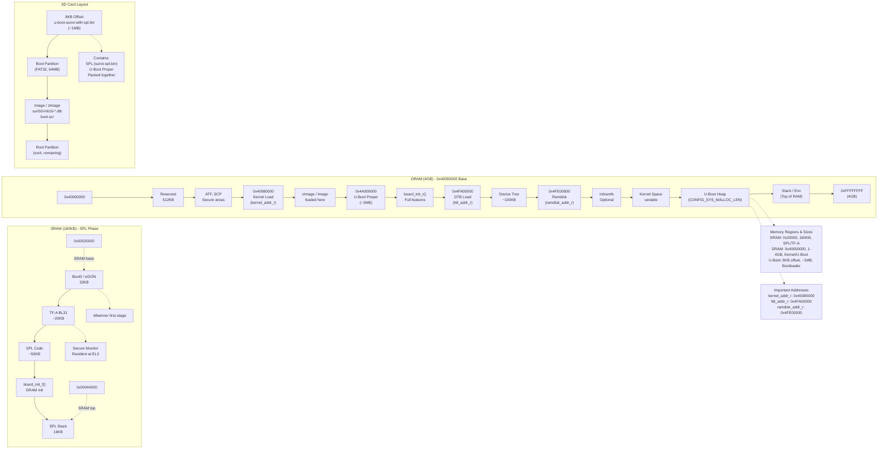

# Bài 1.2: U-Boot (SPL + Proper)

## Page 1

# Bài 1.2: U-Boot (SPL + Proper)

# Biên soạn: Phạm Văn Vũ

## Page 2

### Mục tiêu Bài học

Sau buổi học này, học viên sẽ có khả năng:

- Hiểu kiến trúc 2 giai đoạn của U-Boot (SPL + Proper)

- Nắm vững quy trình build U-Boot cho Orange Pi Zero 3

- Cấu hình bootargs và các phương thức boot

### Phần 1: Kiến trúc U-Boot

*Hình 1: Kiến trúc bộ nhớ U-Boot*
<!-- mermaid-insert:start:bai_1_2_hinh_1 -->

<!-- mermaid-insert:end:bai_1_2_hinh_1 -->

### 1.1 Tại sao cần 2 giai đoạn?

Vấn đề: SRAM rất nhỏ (~64KB), không đủ chứa U-Boot đầy đủ.

Giải pháp: Chia U-Boot thành 2 phần:

- SPL (16KB): Chạy trên SRAM, khởi tạo DRAM
- Proper (800KB+): Chạy trên DRAM, đầy đủ tính năng

### 1.2 So sánh SPL vs Proper

Đặc điểm                SPL                                          U-Boot Proper

Chạy trên               SRAM                                         DRAM

Kích thước              ~16-64KB                                     ~800KB-2MB

## Page 3

Filesystem              Không                             FAT, EXT4, UBIFS

Network                 Không                             TFTP, DHCP, NFS

USB                     Không (hoặc minimal)              Đầy đủ

Display                 Không                             HDMI, LCD

Shell                   Không                             Có (Hush shell)

### Phần 2: U-Boot SPL Chi tiết

### 2.1 Nhiệm vụ chính của SPL

```text
    // Pseudo-code of SPL flow
    void board_init_f() {
          // 1. Minimal hardware init
          timer_init();
          serial_init();      // UART for debug
```

```text
          // 2. DRAM initialization (CRITICAL)
          dram_init();        // Configure DDR controller
```

```text
          // 3. Load next stage
          spl_load_image();   // Load U-Boot Proper from SD/eMMC
```

```text
          // 4. Jump to U-Boot Proper
          jump_to_image();
    }
```

### 2.2 DRAM Initialization

Quá trình init DRAM rất phức tạp:

1. Configure PLL cho DDR clock 2. Setup DDR PHY (Physical layer) 3. DDR training (calibration) 4. Memory test

## Page 4

Lưu ý: Với Allwinner, phần này thường dùng blob từ vendor hoặc reverse-engineered code.

## Page 5

### Phần 3: Build U-Boot

### 3.1 Chuẩn bị

```text
    # Clone U-Boot
    git clone https://github.com/u-boot/u-boot.git
    cd u-boot
```

```text
    # Checkout stable version
    git checkout v2024.01
```

### 3.2 Configure và Build

```text
    # Export BL31 path (từ TF-A build)
    export BL31=/path/to/arm-trusted-firmware/build/sun50i_h616/debug/bl31.bin
```

```text
    # Configure cho Orange Pi Zero 3
    make CROSS_COMPILE=aarch64-linux-gnu- orangepi_zero3_defconfig
```

```text
    # Build
    make CROSS_COMPILE=aarch64-linux-gnu- -j$(nproc)
```

### 3.3 Output Files

File                                 Mô tả                           Sử dụng

spl/sunxi-spl.bin                   SPL binary                      Không dùng riêng

u-boot.itb                          FIT image (U-Boot + DTB)        Không dùng riêng

u-boot-sunxi-with-spl.bin           Combined image                  Flash cái này

## Page 6

### 3.4 Flash vào SD Card

```text
    # Flash U-Boot vào SD card (offset 8KB)
    sudo dd if=u-boot-sunxi-with-spl.bin of=/dev/sdX bs=1k seek=8 conv=notrunc
    sync
```

### Phần 4: Bootargs và Boot Methods

### 4.1 Bootargs chuẩn cho IVI

setenv bootargs "console=ttyS0,115200 root=/dev/mmcblk0p2 rootfstype=ext4 rw rootwait"

Tham số              Giá trị                        Mô tả

console              ttyS0,115200                   Serial debug

root                 /dev/mmcblk0p2                 Root partition

rootfstype           ext4                           Filesystem type

rw                   -                              Mount read-write

rootwait             -                              Wait for root device

### 4.2 Boot Methods

Legacy Image (zImage/Image)

```text
    load mmc 0:1 ${kernel_addr_r} Image
    load mmc 0:1 ${fdt_addr_r} sun50i-h618-orangepi-zero3.dtb
    booti ${kernel_addr_r} - ${fdt_addr_r}
```

FIT Image (Recommended)

```text
    load mmc 0:1 ${kernel_addr_r} image.itb
    bootm ${kernel_addr_r}
```

## Page 7

FIT Image an toàn hơn vì có checksum và signature verification.

## Page 8

### Phần 5: U-Boot Commands

### 5.1 Thông tin hệ thống

```text
    # Xem thông tin board
    bdinfo
```

```text
    # Xem memory map
    md.l 0x40000000 100
```

```text
    # Xem device tree
    fdt addr ${fdt_addr_r}
    fdt print
```

### 5.2 Storage commands

```text
    # MMC info
    mmc info
    mmc part
```

```text
    # Load file
    load mmc 0:1 ${loadaddr} /boot/Image
```

### 5.3 Network commands

```text
    # DHCP
    dhcp
```

```text
    # TFTP load kernel
    tftp ${kernel_addr_r} Image
```

### Phần 6: Câu hỏi Ôn tập

1. Tại sao U-Boot cần chia thành 2 giai đoạn (SPL và Proper)?

## Page 9

2. SPL thực hiện những nhiệm vụ chính nào?

3. File nào cần flash vào SD card? Tại offset bao nhiêu?

4. Giải thích các tham số trong bootargs.

5. So sánh Legacy Image và FIT Image.

Tài liệu Tham khảo

- U-Boot Documentation: https://docs.u-boot.org/
- U-Boot Sunxi: https://linux-sunxi.org/U-Boot
- FIT Image Documentation: https://docs.u-boot.org/en/latest/usage/fit/index.html

Yêu cầu Bài tập

- File u-boot-sunxi-with-spl.bin đã build
- Screenshot U-Boot prompt qua UART
- Ghi chú defconfig và BL31 path đã dùng

HALA Academy | Biên soạn: Phạm Văn Vũ
