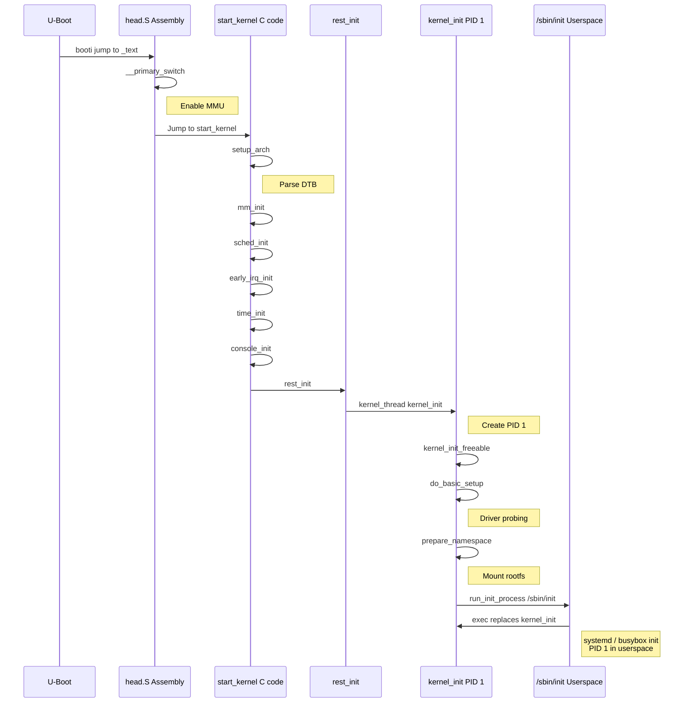

# Bài 2.1: Kernel Build & Device Tree Baseline

## Page 1

# Bài 2.1: Kernel Build & Device Tree

# Biên soạn: Phạm Văn Vũ

## Page 2

### Mục tiêu Bài học

Sau buổi học này, học viên sẽ có khả năng:

- Hiểu luồng khởi động của Linux Kernel (head.S → start_kernel)

- Nắm vững cách build kernel cho Orange Pi Zero 3

- Hiểu Device Tree và chọn đúng DTB

### Phần 1: Luồng Khởi động Kernel

*Hình 1: Luồng khởi động Kernel*
<!-- mermaid-insert:start:bai_2_1_hinh_1 -->

<!-- mermaid-insert:end:bai_2_1_hinh_1 -->

## Page 3

### 1.1 Từ U-Boot sang Kernel

U-Boot sử dụng lệnh booti hoặc bootz để nhảy vào kernel:

- kernel_addr_r: Địa chỉ kernel Image
- fdt_addr_r: Địa chỉ Device Tree
- ramdisk_addr_r: Địa chỉ initramfs (optional)

### 1.2 Chi tiết start_kernel()

```text
    // init/main.c
    asmlinkage __visible void __init start_kernel(void) {
        set_task_stack_end_magic(&init_task);
        setup_arch(&command_line); // Parse DTB here
        mm_init();                  // Memory init
        sched_init();               // Scheduler init
        early_irq_init();
        init_IRQ();
        time_init();
        console_init();                    // earlycon -> proper console
        rest_init();                       // Creates PID 1
    }
```

### 1.3 Từ rest_init() đến Userspace

Function                                     PID        Mô tả

kernel_thread(kernel_init)                   1          Init process, exec /sbin/init

kernel_thread(kthreadd)                      2          Kernel thread daemon

### Phần 2: Device Tree (DTB)

### 2.1 Device Tree là gì?

- Mục đích: Mô tả phần cứng cho kernel thay vì hardcode
- Format: DTS (source) → DTC → DTB (binary)
- Location: arch/arm64/boot/dts/allwinner/

## Page 4

### 2.2 Cấu trúc cơ bản

```text
    // sun50i-h618-orangepi-zero3.dts
    /dts-v1/;
    #include "sun50i-h616.dtsi"
```

```text
    / {
          model = "OrangePi Zero3";
          compatible = "xunlong,orangepi-zero3", "allwinner,sun50i-h618";
```

```text
          aliases {
              serial0 = &uart0;
          };
```

```text
          chosen {
              stdout-path = "serial0:115200n8";
          };
    };
```

```text
    &uart0 {
        pinctrl-names = "default";
        pinctrl-0 = <&uart0_ph_pins>;
        status = "okay";
    };
```

```text
    &mmc0 {
        vmmc-supply = <®_vcc3v3>;
        status = "okay";
    };
```

## Page 5

### Phần 3: Build Linux Kernel

### 3.1 Chuẩn bị

```text
    # Cài đặt dependencies
    sudo apt install -y git build-essential libncurses-dev \
        bison flex libssl-dev libelf-dev bc
```

```text
    # Cross-compiler
    aarch64-linux-gnu-gcc --version
```

### 3.2 Clone Kernel Source

```text
    # Cách 1: Mainline kernel
    git clone --depth=1 -b v6.6 https://git.kernel.org/pub/scm/linux/kernel/git/stable/linux.git
    cd linux
```

```text
    # Cách 2: Sunxi/Megous kernel (nhiều driver hơn)
    git clone --depth=1 https://github.com/megous/linux.git -b orange-pi-6.6
```

### 3.3 Configure và Build

```text
    # Sử dụng defconfig
    make ARCH=arm64 CROSS_COMPILE=aarch64-linux-gnu- defconfig
```

```text
    # Customize (optional)
    make ARCH=arm64 CROSS_COMPILE=aarch64-linux-gnu- menuconfig
```

```text
    # Build kernel Image
    make ARCH=arm64 CROSS_COMPILE=aarch64-linux-gnu- -j$(nproc) Image
```

```text
    # Build DTBs
    make ARCH=arm64 CROSS_COMPILE=aarch64-linux-gnu- -j$(nproc) dtbs
```

### 3.4 Output Files

File          Path                                              Mô tả

## Page 6

Image        arch/arm64/boot/Image                           Kernel binary (~20MB)

DTB          arch/arm64/boot/dts/allwinner/*.dtb             Device Tree

Modules      *.ko                                            Kernel modules

### Phần 4: Bootargs Chi tiết

console=ttyS0,115200 root=/dev/mmcblk0p2 rootfstype=ext4 rw rootwait

Tham số             Giá trị                                   Mô tả

console             ttyS0,115200                              Serial console

root                /dev/mmcblk0p2                            Root partition

rootfstype          ext4                                      Filesystem type

rootwait            -                                         Chờ root device

earlycon            uart8250,mmio32,0x05000000                Early console

## Page 7

### Phần 5: Câu hỏi Ôn tập

1. Giải thích luồng từ U-Boot đến start_kernel().

2. Device Tree có vai trò gì? So sánh với cách cũ (hardcode).

3. Liệt kê các bước build kernel cho ARM64.

4. Giải thích các tham số trong bootargs.

5. Kernel panic "Unable to mount root fs" nghĩa là gì?

Tài liệu Tham khảo

- Kernel Newbies: https://kernelnewbies.org/
- Bootlin Kernel Training: https://bootlin.com/training/kernel/
- Device Tree Specification: https://www.devicetree.org/

Yêu cầu Bài tập

- Kernel Image đã build thành công
- DTB file đúng cho Orange Pi Zero 3
- Bootlog hiển thị "Starting kernel ..." và kernel messages

HALA Academy | Biên soạn: Phạm Văn Vũ
