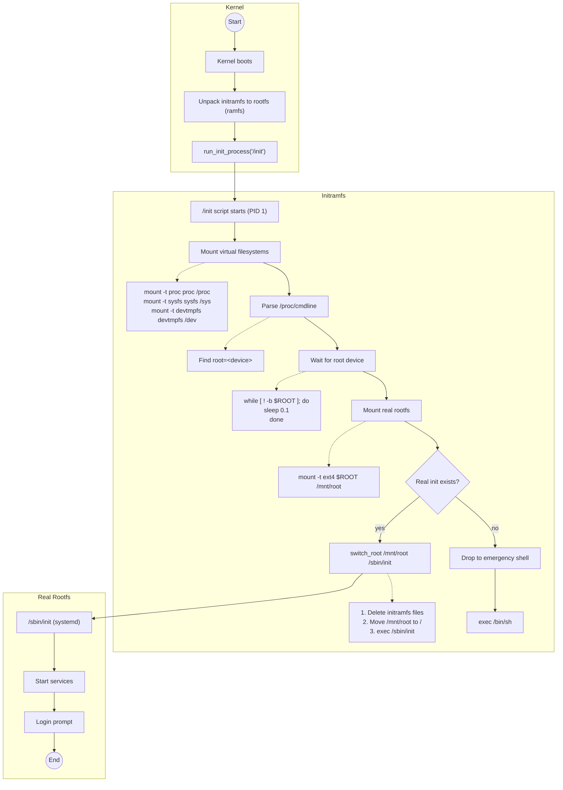

# Bài 2.2: Initramfs & Switch_root

## Page 1

# Bài 2.2: Initramfs & Switch_root

# Biên soạn: Phạm Văn Vũ

## Page 2

### Mục tiêu Bài học

Sau buổi học này, học viên sẽ có khả năng:

- Hiểu vai trò của initramfs trong boot process

- Tạo được initramfs minimal với Busybox

- Nắm vững cơ chế switch_root

### Phần 1: Initramfs là gì?

*Hình 1: Luồng boot với Initramfs*
<!-- mermaid-insert:start:bai_2_2_hinh_1 -->

<!-- mermaid-insert:end:bai_2_2_hinh_1 -->

## Page 3

### 1.1 Định nghĩa

- Initramfs (initial RAM filesystem): Filesystem tạm thời được nạp vào RAM
- Mục đích: Chuẩn bị môi trường trước khi mount rootfs thực

### 1.2 Initramfs vs Initrd

Đặc điểm                Initramfs                        Initrd (Legacy)

Format                  cpio archive                     Disk image

Mount                   Unpack to rootfs                 Mount as block device

Memory                  Uses page cache                  Needs block driver

Flexibility             Dễ customize                     Cố định hơn

### 1.3 Khi nào cần Initramfs?

- Root filesystem trên LVM, RAID, encrypted
- Cần load driver trước khi mount root
- Network boot (NFS root)
- Complex boot logic (A/B partitions)

### Phần 2: Cấu trúc Initramfs

### 2.1 Cấu trúc thư mục

```text
    initramfs/
    ├── bin/
    │   └── busybox             # Multi-tool binary
    ├── dev/
    │   ├── console             # c 5 1
    │   └── null                # c 1 3
    ├── etc/
    ├── lib/
    ├── mnt/
    │   └── root/               # Mount point for real rootfs
    ├── proc/
```

## Page 4

```text
    ├── sys/
    ├── sbin/
    │   └── init -> ../bin/busybox
    └── init                # Init script (executable)
```

### 2.2 Script /init

#!/bin/busybox sh

```text
    # Remount rootfs read-write
    mount -o remount,rw /
```

```text
    # Create essential symlinks
    /bin/busybox --install -s /bin
    /bin/busybox --install -s /sbin
```

```text
    # Mount virtual filesystems
    mount -t proc proc /proc
    mount -t sysfs sysfs /sys
    mount -t devtmpfs devtmpfs /dev
```

echo "Welcome to Minimal Initramfs"

```text
    # Parse kernel cmdline for root device
    ROOT_DEV=""
    for param in $(cat /proc/cmdline); do
         case $param in
             root=*) ROOT_DEV="${param#root=}" ;;
         esac
    done
```

```text
    # Mount real rootfs and switch
    if [ -n "$ROOT_DEV" ]; then
        mount -t ext4 "$ROOT_DEV" /mnt/root
        exec switch_root /mnt/root /sbin/init
    fi
```

```text
    # Fallback: Launch shell
    exec /bin/sh
```

## Page 5

### Phần 3: Switch_root Chi tiết

### 3.1 switch_root làm gì?

1. Mount move: Move /proc, /sys, /dev to new root 2. Delete old root: Xóa tất cả files trong initramfs 3. Chroot: Change root to new filesystem 4. Exec init: Replace PID 1 với /sbin/init mới

### 3.2 So sánh với pivot_root

Aspect                switch_root                          pivot_root

Old root              Deleted (free memory)                Moved to another dir

Memory                Freed                                Still accessible

Use case              Initramfs → rootfs                   Container, chroot

### Phần 4: Tạo Initramfs với Busybox

### 4.1 Build Busybox Static

```text
    # Download Busybox
    wget https://busybox.net/downloads/busybox-1.36.0.tar.bz2
    tar xf busybox-1.36.0.tar.bz2
    cd busybox-1.36.0
```

```text
    # Configure (enable static build)
    make ARCH=arm64 CROSS_COMPILE=aarch64-linux-gnu- defconfig
    make ARCH=arm64 CROSS_COMPILE=aarch64-linux-gnu- menuconfig
    # Settings -> Build static binary (no shared libs)
```

```text
    # Build
    make ARCH=arm64 CROSS_COMPILE=aarch64-linux-gnu- -j$(nproc)
```

## Page 6

```text
    # Install
    make CONFIG_PREFIX=../initramfs install
```

### 4.2 Pack thành cpio

cd ~/opi_build/initramfs

```text
    # Create device nodes
    sudo mknod -m 600 dev/console c 5 1
    sudo mknod -m 666 dev/null c 1 3
```

```text
    # Create cpio archive
    find . | cpio -H newc -o | gzip > ../initramfs.cpio.gz
```

```text
    # Check size (expect 1-3 MB)
    ls -lh ../initramfs.cpio.gz
```

### Phần 5: Boot với Initramfs

```text
    # U-Boot commands
    load mmc 0:1 ${kernel_addr_r} Image
    load mmc 0:1 ${fdt_addr_r} sun50i-h618-orangepi-zero3.dtb
    load mmc 0:1 ${ramdisk_addr_r} initramfs.cpio.gz
```

```text
    # Boot với ramdisk
    booti ${kernel_addr_r} ${ramdisk_addr_r}:${filesize} ${fdt_addr_r}
```

Expected output: Kernel boots, runs /init script, drops to shell or switches to real rootfs.

## Page 7

### Phần 6: Câu hỏi Ôn tập

1. Initramfs là gì? Khác gì với initrd?

2. Liệt kê các bước trong script /init.

3. switch_root khác gì pivot_root?

4. Tại sao cần build Busybox static?

5. Làm sao để tạo file initramfs.cpio.gz?

Tài liệu Tham khảo

- Kernel ramfs-rootfs-initramfs.txt
- Busybox Documentation: https://busybox.net/FAQ.html
- LWN: Early userspace: https://lwn.net/Articles/191004/

Yêu cầu Bài tập

- Busybox static binary đã build
- initramfs.cpio.gz đã tạo
- Boot vào shell trong initramfs
- switch_root thành công sang real rootfs

HALA Academy | Biên soạn: Phạm Văn Vũ
