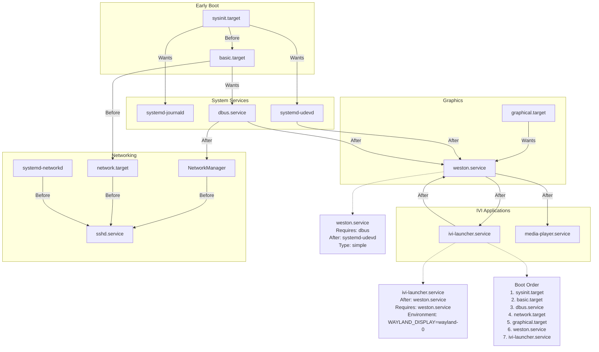

# Bài 2.3: Buildroot & Service Graph

## Page 1

# Bài 2.3: Buildroot & Service Graph

# Biên soạn: Phạm Văn Vũ

## Page 2

### Mục tiêu Bài học

Sau buổi học này, học viên sẽ có khả năng:

- Hiểu workflow của Buildroot

- Tạo rootfs hoàn chỉnh cho IVI system

- Nắm vững thứ tự khởi động services (Systemd)

### Phần 1: Buildroot là gì?

*Hình 1: Systemd Service Graph*
<!-- mermaid-insert:start:bai_2_3_hinh_1 -->

<!-- mermaid-insert:end:bai_2_3_hinh_1 -->

## Page 3

### 1.1 Định nghĩa

- Buildroot: Tool tự động hóa việc tạo embedded Linux system
- Output: Cross-toolchain, rootfs, kernel, bootloader (all-in-one)

### 1.2 So sánh với Yocto

Đặc điểm                        Buildroot                             Yocto

Complexity                      Đơn giản                              Phức tạp

Build time                      Nhanh (~30 min)                       Chậm (giờ)

Flexibility                     Trung bình                            Cao

Package format                  No package mgmt                       .ipk, .deb, .rpm

Learning curve                  Thấp                                  Cao

Suited for                      Small systems                         Large, commercial

### Phần 2: Cấu hình Buildroot

### 2.1 Target Options

```text
    Target options --->
        Target Architecture: AArch64 (little endian)
        Target Architecture Variant: cortex-A53
```

### 2.2 System Configuration

```text
    System configuration --->
        System hostname: orangepi-ivi
        System banner: Welcome to IVI System
        Init system: systemd
        /dev management: Dynamic using devtmpfs + eudev
```

## Page 4

```text
        Root password: (đặt password)
        Enable root login with password: Yes
```

### 2.3 Packages cho IVI

```text
    Target packages --->
        Audio and video applications --->
            [*] gstreamer 1.x
            [*]   gst1-plugins-base
            [*]   gst1-plugins-good
```

```text
        Graphic libraries --->
            [*] mesa3d
            [*] wayland
            [*] weston
```

```text
        Networking applications --->
            [*] dropbear (SSH server)
```

## Page 5

### Phần 3: Build Rootfs

### 3.1 Download và Configure

```text
    # Download Buildroot
    wget https://buildroot.org/downloads/buildroot-2024.02.tar.gz
    tar xf buildroot-2024.02.tar.gz
    cd buildroot-2024.02
```

```text
    # Configure
    make menuconfig
```

### 3.2 Build

```text
    # Build everything (30-60 minutes)
    make -j$(nproc)
```

```text
    # Output
    ls output/images/
    # rootfs.ext4 rootfs.tar     sdcard.img
```

### 3.3 Output Files

File                         Mô tả                        Sử dụng

rootfs.ext4                 Root filesystem              Flash to partition 2

rootfs.tar                  Tar archive                  Extract manually

sdcard.img                  Complete SD image            dd trực tiếp

## Page 6

### Phần 4: Systemd Service Graph

### 4.1 Startup Order

Order              Service                          Mô tả

### 1                  systemd (PID 1)                  Init system

### 2                  systemd-journald                 Logging

### 3                  systemd-udevd                    Device manager

### 4                  dbus                             IPC bus

### 5                  NetworkManager                   Network

### 6                  weston                           Wayland compositor

### 7                  ivi-launcher                     IVI application

### 4.2 Weston Service File

```text
      # /etc/systemd/system/weston.service
      [Unit]
      Description=Weston Compositor
      After=systemd-udevd.service dbus.service
      Wants=dbus.service
```

```text
      [Service]
      Type=simple
      ExecStart=/usr/bin/weston --tty=1 --log=/var/log/weston.log
      Restart=on-failure
      Environment=XDG_RUNTIME_DIR=/run/user/0
```

```text
      [Install]
      WantedBy=graphical.target
```

### 4.3 IVI Launcher Service

```text
      # /etc/systemd/system/ivi-launcher.service
      [Unit]
      Description=IVI Launcher Application
```

## Page 7

```text
    After=weston.service
    Requires=weston.service
```

```text
    [Service]
    Type=simple
    ExecStart=/usr/bin/ivi-launcher
    Environment=WAYLAND_DISPLAY=wayland-0
    Restart=always
```

```text
    [Install]
    WantedBy=graphical.target
```

## Page 8

### Phần 5: Customization

### 5.1 Overlay Directory

```text
    # Tạo overlay
    mkdir -p board/orangepi/zero3/rootfs_overlay
```

```text
    # Thêm custom files
    cp my-config board/orangepi/zero3/rootfs_overlay/etc/
```

```text
    # Trong menuconfig:
    System configuration --->
        Root filesystem overlay: board/orangepi/zero3/rootfs_overlay
```

### 5.2 Post-build Script

```text
    #!/bin/bash
    # board/orangepi/zero3/post-build.sh
```

```text
    # Enable SSH
    ln -sf /lib/systemd/system/sshd.service \
        $TARGET_DIR/etc/systemd/system/multi-user.target.wants/
```

```text
    # Set timezone
    ln -sf /usr/share/zoneinfo/Asia/Ho_Chi_Minh \
        $TARGET_DIR/etc/localtime
```

### Phần 6: Câu hỏi Ôn tập

1. Buildroot là gì? So sánh với Yocto.

2. Liệt kê các bước để build rootfs với Buildroot.

3. Systemd target nào chạy Weston?

4. Giải thích cách tạo custom service file.

## Page 9

5. Overlay directory dùng để làm gì?

Tài liệu Tham khảo

- Buildroot Manual: https://buildroot.org/downloads/manual/manual.html
- Bootlin Buildroot Training: https://bootlin.com/training/buildroot/
- Systemd Documentation: https://systemd.io/

Yêu cầu Bài tập

- Buildroot config cho Orange Pi Zero 3
- rootfs.ext4 hoặc rootfs.tar đã build
- Boot thành công vào login prompt
- SSH connection working
- Weston running (nếu có display)

HALA Academy | Biên soạn: Phạm Văn Vũ
