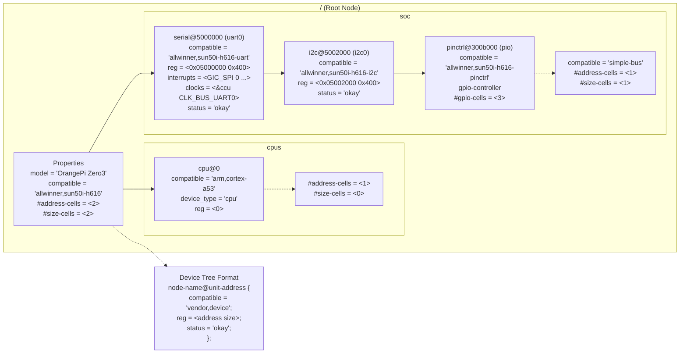

# Bài 3.1: Device Tree Chuyên Sâu

## Page 1

# Bài 3.1: Device Tree Chuyên Sâu

# Biên soạn: Phạm Văn Vũ

## Page 2

### Mục tiêu Bài học

Sau buổi học này, học viên sẽ có khả năng:

- Hiểu sâu cấu trúc và cú pháp Device Tree

- Nắm vững Bindings, Phandles, Interrupts, Pinctrl

- Sử dụng DT Overlay để modify hardware runtime

### Phần 1: Device Tree Fundamentals

*Hình 1: Cấu trúc Device Tree*
<!-- mermaid-insert:start:bai_3_1_hinh_1 -->

<!-- mermaid-insert:end:bai_3_1_hinh_1 -->

### 1.1 DT Compilation Flow

DTS (source) → DTC (compiler) → DTB (binary)

- .dts: Device Tree Source (cho board cụ thể)
- .dtsi: Device Tree Source Include (shared)
- .dtb: Device Tree Blob (binary, kernel load)

### 1.2 Node Syntax

```text
    label: node-name@unit-address {
        compatible = "vendor,device";
        reg = <address size>;
        property-name = <value>;
```

## Page 3

```text
         child-node {
             // ...
         };
    };
```

### 1.3 Important Properties

Property               Mô tả                   Ví dụ

compatible            Driver matching         "allwinner,sun50i-h616-uart"

reg                   Address/size            <0x05000000 0x400>

interrupts            IRQ specification       <GIC_SPI 0 IRQ_TYPE_LEVEL_HIGH>

status                Enable/disable          "okay" or "disabled"

clocks                Clock references        <&ccu CLK_BUS_UART0>

### Phần 2: Phandles & References

### 2.1 Phandle là gì?

Phandle là unique ID để reference node khác. DTC tự động gán phandle.

```text
    // Node được reference
    clk_osc24m: osc24M-clk {
        #clock-cells = <0>;
        compatible = "fixed-clock";
        clock-frequency = <24000000>;
    };
```

```text
    // Node reference bằng phandle
    uart0: serial@5000000 {
        clocks = <&clk_osc24m>; // Reference
    };
```

## Page 4

### 2.2 Cells Properties

Property              Mô tả

#address-cells       Số cells cho address

#size-cells          Số cells cho size

#clock-cells         Args cho clock consumer

#interrupt-cells     Args cho interrupt

#gpio-cells          Args cho GPIO consumer

## Page 5

### Phần 3: Interrupts

### 3.1 Interrupt Controller

```text
    gic: interrupt-controller@3021000 {
        compatible = "arm,gic-400";
        #interrupt-cells = <3>;
        interrupt-controller;
        reg = <0x03021000 0x1000>,
              <0x03022000 0x2000>;
    };
```

### 3.2 Interrupt Consumer

```text
    uart0: serial@5000000 {
        interrupt-parent = <&gic>;
        interrupts = <GIC_SPI 0 IRQ_TYPE_LEVEL_HIGH>;
        // GIC_SPI = 0 (Shared Peripheral Interrupt)
        // 0 = IRQ number
        // IRQ_TYPE_LEVEL_HIGH = trigger type
    };
```

### 3.3 Interrupt Types

Macro                                             Value   Mô tả

IRQ_TYPE_EDGE_RISING                              1       Rising edge

IRQ_TYPE_EDGE_FALLING                             2       Falling edge

IRQ_TYPE_LEVEL_HIGH                               4       High level

IRQ_TYPE_LEVEL_LOW                                8       Low level

## Page 6

### Phần 4: Pinctrl

### 4.1 Pin Controller

```text
    pio: pinctrl@300b000 {
        compatible = "allwinner,sun50i-h616-pinctrl";
        reg = <0x0300b000 0x400>;
        #gpio-cells = <3>;
        gpio-controller;
```

```text
         uart0_ph_pins: uart0-ph-pins {
             pins = "PH0", "PH1";
             function = "uart0";
         };
    };
```

### 4.2 Pin Consumer

```text
    &uart0 {
        pinctrl-names = "default";
        pinctrl-0 = <&uart0_ph_pins>;
    };
```

### Phần 5: Device Tree Overlay

### 5.1 Overlay Syntax

```text
    /dts-v1/;
    /plugin/;
```

```text
    &{/} {
        // Add new node to root
        my_led {
            compatible = "gpio-leds";
            status = "okay";
            led0 {
                gpios = <&pio 2 13 GPIO_ACTIVE_HIGH>;
                label = "user-led";
            };
        };
```

## Page 7

};

```text
    &uart1 {
        status = "okay";   // Modify existing node
    };
```

### 5.2 Compile và Apply

```text
    # Compile overlay
    dtc -@ -I dts -O dtb -o my_overlay.dtbo my_overlay.dts
```

```text
    # Apply tại U-Boot
    fdt apply my_overlay.dtbo
```

```text
    # Apply tại Linux (configfs)
    mkdir /sys/kernel/config/device-tree/overlays/my_overlay
    cat my_overlay.dtbo > /sys/kernel/config/device-tree/overlays/my_overlay/dtbo
```

## Page 8

### Phần 6: Debug Device Tree

### 6.1 Xem DT trong Linux

```text
    # View tree structure
    ls /proc/device-tree/
```

```text
    # Read property
    cat /proc/device-tree/model
    hexdump -C /proc/device-tree/serial@5000000/reg
```

```text
    # Decompile runtime DT
    dtc -I fs /proc/device-tree > runtime.dts
```

### Phần 7: Câu hỏi Ôn tập

1. Giải thích cấu trúc một node Device Tree.

2. Phandle là gì? Cho ví dụ.

3. #interrupt-cells = 3 nghĩa là gì?

4. Overlay dùng để làm gì? Cú pháp?

5. Làm sao debug DT trong Linux?

Tài liệu Tham khảo

- Device Tree Specification: https://www.devicetree.org/
- Kernel DT Bindings
- Bootlin DT Training

## Page 9

Yêu cầu Bài tập

- Giải thích được cấu trúc một node DT
- Tạo được DT overlay enable GPIO LED
- Debug thành công với /proc/device-tree

HALA Academy | Biên soạn: Phạm Văn Vũ
