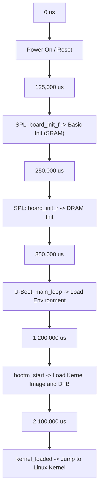
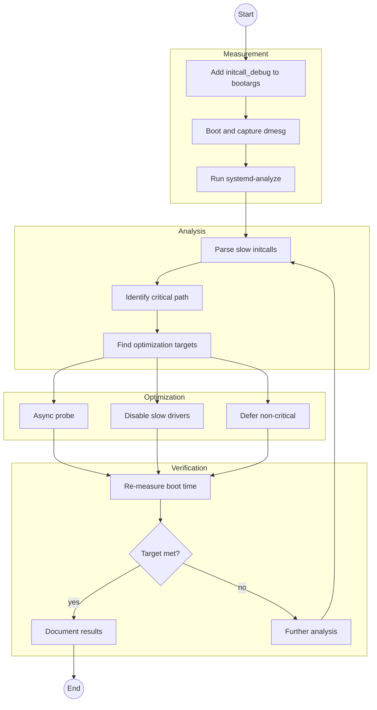

# Bài 4.1: Advanced Boot Time Profiling

## Page 1

# Bài 4.1: Advanced Boot Time Profiling

# Biên soạn: Phạm Văn Vũ

## Page 2

### Mục tiêu Bài học

```text
      • Deep dive vào các công cụ profiling: Bootstage, Bootgraph, Grabserial
      • Phân tích chi tiết initcall latency và kernel initialization
      • Thực hành tối ưu hóa thời gian khởi động nâng cao
```

### Phần 1: Bootstage (U-Boot Profiling)

Bootstage là công cụ built-in của U-Boot để đo thời gian chính xác từng giai đoạn khởi động.

## Page 3

*Hình 1: U-Boot Bootstage Timeline*
<!-- mermaid-insert:start:bai_4_1_hinh_1 -->

<!-- mermaid-insert:end:bai_4_1_hinh_1 -->

### 1.1 Cấu hình U-Boot

```text
    CONFIG_BOOTSTAGE=y
    CONFIG_BOOTSTAGE_REPORT=y
    CONFIG_BOOTSTAGE_USER_COUNT=20
    CONFIG_SHOW_BOOT_PROGRESS=y
```

### 1.2 Phân tích Report

```text
    => bootstage report
    Timer summary in microseconds (12 records):
```

## Page 4

```text
             Mark      Elapsed     Stage
                0            0     reset
        125,000        125,000     board_init_f
        250,000        125,000     board_init_r
        850,000        600,000     main_loop
      1,200,000        350,000     bootm_start
      2,100,000        900,000     kernel_loaded
```

Lưu ý: "Elapsed" cho biết thời gian tiêu tốn của từng step. Cần tập trung vào các step có elapsed time lớn bất thường.

### Phần 2: Kernel Bootgraph

Bootgraph giúp trực quan hóa quá trình khởi động kernel dưới dạng biểu đồ timeline.

## Page 5

*Hình 2: Quy trình Phân tích và Tối ưu Boot Time*
<!-- mermaid-insert:start:bai_4_1_hinh_2 -->

<!-- mermaid-insert:end:bai_4_1_hinh_2 -->

## Page 6

### 2.1 Thu thập dữ liệu

```text
    # 1. Thêm vào bootargs
    setenv bootargs "initcall_debug printk.time=1 ..."
```

```text
    # 2. Sau khi boot, lấy log dmesg
    dmesg > boot.log
```

```text
    # 3. Tạo biểu đồ (trên Host PC)
    scripts/bootgraph.pl boot.log > boot.svg
```

### 2.2 Phân tích biểu đồ

- Tìm các thanh dài nhất (thời gian thực thi lâu nhất).
- Phát hiện các khoảng trống (CPU idle waiting for I/O).
- Xác định thứ tự thực thi của các driver (serial vs parallel).

### Phần 3: Grabserial (I/O Latency)

Đo thời gian thực thi thực tế từ góc nhìn bên ngoài (qua cổng Console), bao gồm cả thời gian firmware/ ROM mà kernel không thấy.

### 3.1 Cài đặt & Sử dụng

```text
    # Trên Host PC
    pip install grabserial
```

```text
    # Capture boot log với timestamp chính xác
    grabserial -d /dev/ttyUSB0 -b 115200 -t -e 30 > boot_timing.log
```

### 3.2 Phân tích Log

```text
    [0.000000] TF-A BL31
    [0.150000] U-Boot SPL
    [0.850000] Loading Kernel... <-- Bottleneck tại load kernel?
    [2.100000] Starting kernel...
```

Công thức tính: Delta = Timestamp[n] - Timestamp[n-1]

## Page 7

### Phần 4: initcall_debug Nâng cao

### 4.1 Script phân tích tự động

```text
    #!/bin/bash
    # analyze_initcalls.sh
    dmesg | grep "initcall" | sed 's/\(.*\) returned.*after \(.*\) usecs/\2 \1/' | \
    awk '{ if ($1 > 1000) print $0 }' | sort -nr | head -20
```

### 4.2 Blacklist Driver/Module

Nếu driver không cần thiết gây chậm boot, disable hoặc blacklist:

```text
    # Trong bootargs
    initcall_blacklist=driver_name_init
```

```text
    # Hoặc tắt trong menuconfig
    # Device Drivers -> ... -> [ ] Enable Driver X
```

### Phần 5: systemd-analyze Deep Dive

### 5.1 Critical Chain

```text
    systemd-analyze critical-chain
    graphical.target @2.5s
    └─multi-user.target @2.4s
      └─network.target @2.1s
        └─NetworkManager.service @1.8s +300ms            <-- Critical path!
          └─...
```

### 5.2 Service Optimization

- Type=notify: Chuyển sang Type=simple nếu không cần chờ start-up complete.
- Before/After: Giảm dependencies không cần thiết.
- TimeoutSec: Giảm timeout mặc định (90s) xuống thấp hơn.

## Page 8

Câu hỏi Ôn tập

```text
     1. Bootstage khác gì với `bootchart`?
     2. Tại sao `grabserial` lại quan trọng khi đo thời gian BIOS/Firmware?
     3. Làm thế nào để tìm ra driver nào chiếm nhiều thời gian nhất khi boot kernel?
```

HALA Academy | Biên soạn: Phạm Văn Vũ
