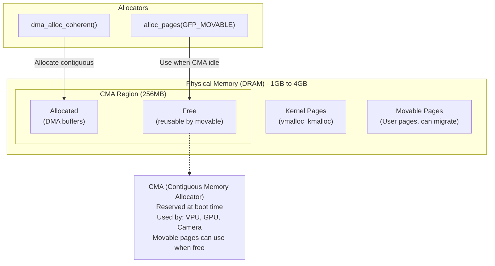

# Bài 4.2: Advanced Memory Management: DMA-BUF & Allocators

## Page 1

# Bài 4.2: DMA-BUF Heaps & Memory Analysis

# Biên soạn: Phạm Văn Vũ

## Page 2

### Mục tiêu Bài học

```text
      • Nắm vững cơ chế DMA-BUF Heaps (thay thế ION)
      • Phân tích chi tiết Slab allocator với Slabtop
      • Debug Memory Leak và Fragmentation với Vmstat
```

### Phần 1: DMA-BUF Heaps

DMA-BUF Heaps là giao diện userspace hiện đại để cấp phát contiguous memory, thay thế cho ION framework cũ.

*Hình 1: DMA-BUF Heaps System vs CMA*
<!-- mermaid-insert:start:bai_4_2_hinh_1 -->
```mermaid
flowchart TB
    subgraph userspace["Userspace"]
        app["Application (Camera/Display)"]
    end

    subgraph heaps["Kernel DMA-BUF Heaps"]
        subgraph system_heap["System Heap"]
            alloc_pages["alloc_pages()"]
            sys_note["Non-contiguous (vmalloc)<br/>Cacheable/Uncacheable"]
        end
        subgraph cma_heap["CMA Heap"]
            dma_alloc["dma_alloc_contiguous()"]
            cma_note["Physically contiguous<br/>For legacy HW"]
        end
    end

    subgraph hw["I/O Hardware"]
        iommu["MMU-Capable (GPU/ISP)"]
        simple["Simple DMA (Display)"]
    end

    app -->|/dev/dma_heap/system| alloc_pages
    app -->|/dev/dma_heap/reserved| dma_alloc
    alloc_pages -->|OK (via IOMMU)| iommu
    dma_alloc -->|OK| iommu
    dma_alloc -->|Required| simple
    alloc_pages -.-> sys_note
    dma_alloc -.-> cma_note
```
<!-- mermaid-insert:end:bai_4_2_hinh_1 -->

### 1.1 Architecture

```text
     • System Heap: Cấp phát trang rời rạc (vmalloc), tốt cho CPU/GPU có MMU.
     • CMA Heap: Cấp phát vùng nhớ vật lý liên tục (contiguous), cần cho Display/Video HW cũ.
```

## Page 3

### 1.2 Sử dụng (Userspace)

```text
    int heap_fd = open("/dev/dma_heap/system", O_RDONLY);
    struct dma_heap_allocation_data data = {
          .len = 4 * 1024 * 1024, // 4MB
          .fd_flags = O_RDWR | O_CLOEXEC,
          .heap_flags = 0,
    };
    ioctl(heap_fd, DMA_HEAP_IOCTL_ALLOC, &data);
    // data.fd is now a dma-buf fd
```

### Phần 2: Slab Allocator Analysis

Slab allocator quản lý các kernel object nhỏ (inode, task_struct, dentry) để tránh fragmentation.

### 2.1 Slabtop Tool

```text
    # Hiển thị TOP kernel memory consumers
    slabtop -s c
```

```text
    # Output:
    #    OBJS ACTIVE    USE O BJ SIZE     CACHE SIZE NAME
    # 50000    49000    98%     0.19K          9700K dentry
    # 10000     9000    90%     1.00K         10000K kmalloc-1k
```

```text
    Nếu dentry hoặc inode_cache tăng liên tục không giảm -> Dấu hiệu của Directory Cache không được
    thu hồi.
```

### 2.2 Debugging Slab Leaks

```text
    # Enable Slab Debugging (Kernel Config)
    CONFIG_SLUB_DEBUG=y
    CONFIG_SLUB_DEBUG_ON=y
```

```text
    # Check log
    cat /proc/slab_allocators
```

## Page 4

### Phần 3: Memory Fragmentation Detection

Sự phân mảnh bộ nhớ (Fragmentation) làm giảm hiệu suất và ngăn cản việc cấp phát các khối bộ nhớ lớn liên tục.

*Hình 2: Kernel/Movable Pages & CMA Region*
<!-- mermaid-insert:start:bai_4_2_hinh_2 -->

<!-- mermaid-insert:end:bai_4_2_hinh_2 -->

### 3.1 Buddy Info

```text
    cat /proc/buddyinfo
    # Node 0, zone Normal 100 50 30 10 5 2 1 0 0 0 0
    #                         ^      ^   ^   ^   ^ ^ ^ ... ^
    #                      4K     8K 16K ...              4MB
```

Nếu các cột bên phải (blocks lớn) đều là 0 -> High External Fragmentation. CMA allocation sẽ thất bại.

### 3.2 Vmstat Monitor

```text
    # Monitor memory events (delay 1s)
    vmstat 1
```

```text
    # Columns:
    # si/so: Swap In/Out (!= 0 là hệ thống thiếu RAM)
```

## Page 5

```text
    # buff/cache: Disk cache
    # free: Free RAM
```

### Phần 4: Debug dma-buf Orphans

Khi ứng dụng crash mà không close dma-buf fd, memory sẽ bị leak.

```text
    # Mount debugfs
    mount -t debugfs none /sys/kernel/debug
```

```text
    # List active dma-bufs
    cat /sys/kernel/debug/dma_buf/bufinfo
```

```text
    # Output:
    # size      flags    mode      count    exp_name
    # 4194304 000000     0600      2        panfrost-gem
```

Kiểm tra cột count (reference count). Nếu count cao bất thường mà không có process nào dùng -> Leak.

Câu hỏi Ôn tập

```text
     1. ION framework đã bị thay thế bởi công nghệ nào?
     2. Làm thế nào để phát hiện kernel object leak?
     3. Dấu hiệu nhận biết external fragmentation trong `/proc/buddyinfo`?
```

HALA Academy | Biên soạn: Phạm Văn Vũ
