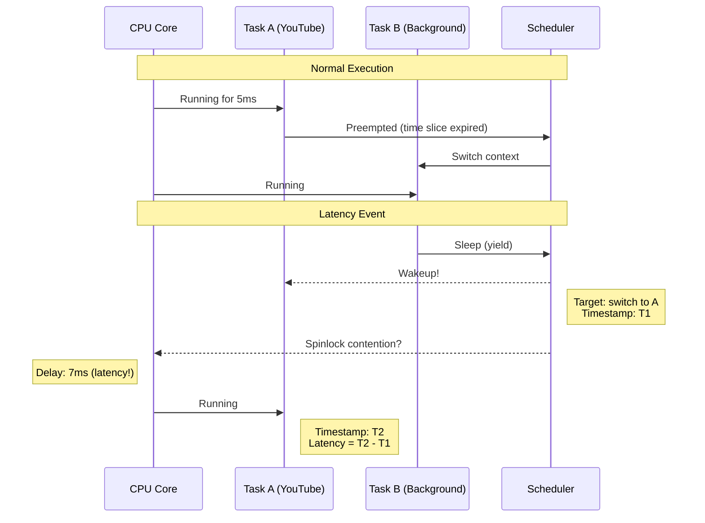
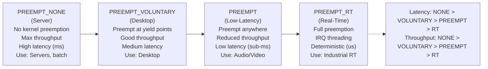

# Bài 4.3: Advanced Scheduler & Isolation

## Page 1

# Bài 4.3: Advanced Scheduler, Perf & Cgroups

# Biên soạn: Phạm Văn Vũ

## Page 2

### Mục tiêu Bài học

```text
      • Phân tích Latency sâu với `perf sched`
      • Quản lý tài nguyên hệ thống với Cgroups v2
      • System Tuning nâng cao với sysctl
```

### Phần 1: Perf Sched Analysis

Perf Sched ghi lại mọi sự kiện scheduling (switch, wakeup) để phân tích độ trễ.

*Hình 1: Scheduling Context Switch & Latency Analysis*
<!-- mermaid-insert:start:bai_4_3_hinh_1 -->

<!-- mermaid-insert:end:bai_4_3_hinh_1 -->

## Page 3

### 1.1 Record Scheduling Events

```text
    # Record 5 seconds of scheduling
    perf sched record -- sleep 5
```

### 1.2 Latency Analysis

perf sched latency --sort max

```text
    # Output:
    # Task          Runtime     Switches    Average Delay    Maximum Delay
    # youtube       25.321 ms         150        0.012 ms         7.321 ms *
    # kworker       10.111 ms         400        0.005 ms         0.123 ms
```

Task `youtube` có max delay lên tới 7ms -> Có thể gây dropped frames.

### 1.3 Visual Map

```text
    perf sched map
    # Hiển thị biểu đồ ASCII mô tả task switching trên từng CPU
```

### Phần 2: Cgroups v2 (Resource Control)

Kiểm soát tối đa CPU/Memory mà một nhóm process được phép sử dụng.

### 2.1 Setup Cgroups v2

```text
    # Mount
    mount -t cgroup2 none /sys/fs/cgroup
```

```text
    # Create group
    mkdir /sys/fs/cgroup/limit_g
```

## Page 4

### 2.2 Limit CPU & Memory

```text
    # CPU Limit: Max 50% CPU
    # quota 50000us / period 100000us
    echo "50000 100000" > /sys/fs/cgroup/limit_g/cpu.max
```

```text
    # Memory Limit: Max 128MB
    echo 134217728 > /sys/fs/cgroup/limit_g/memory.max
```

```text
    # Add Process
    echo $PID > /sys/fs/cgroup/limit_g/cgroup.procs
```

### Phần 3: Sysctl Tuning Advanced

Tinh chỉnh các tham số kernel sâu hơn để tối ưu throughput hoặc latency.

### 3.1 Scheduler Migration Cost

```text
    # Chi phí ước tính (ns) để migrate task giữa các core
    cat /proc/sys/kernel/sched_migration_cost_ns
    # Default: 500000 (0.5ms)
```

```text
      • Tăng lên: Giữ task ở lại CPU lâu hơn (better cache locality, higher throughput).
      • Giảm xuống: Load balance tích cực hơn (better responsiveness).
```

### 3.2 Virtual Memory dirty ratio

```text
    # Khi nào bắt đầu ghi data xuống đĩa?
    sysctl -w vm.dirty_ratio=10                    # Bắt đầu writeback khi 10% RAM bẩn (absolute limit)
    sysctl -w vm.dirty_background_ratio=5 # Background writeback khi 5% RAM bẩn
```

Giảm dirty ratio giúp hệ thống mượt hơn, tránh I/O stall lớn khi flush cache.

## Page 5

### Phần 4: RTThrottling

Cơ chế bảo vệ hệ thống khỏi các RT process bị treo (chiếm 100% CPU).

*Hình 2: Các Kernel Preemption Models*
<!-- mermaid-insert:start:bai_4_3_hinh_2 -->

<!-- mermaid-insert:end:bai_4_3_hinh_2 -->

```text
    # Mặc định: RT tasks chỉ được chạy 95% thời gian (0.95s trong mỗi 1s)
    cat /proc/sys/kernel/sched_rt_period_us
    # 1000000 (1s)
```

```text
    cat /proc/sys/kernel/sched_rt_runtime_us
    # 950000 (0.95s)
```

Nếu muốn 100% CPU cho RT (nguy hiểm): Set `sched_rt_runtime_us` = -1.

Câu hỏi Ôn tập

```text
     1. `perf sched latency` cung cấp thông tin quan trọng gì?
     2. Cgroups v2 khác gì v1 (cấu trúc thư mục)?
     3. Tại sao nên giảm `vm.dirty_ratio` trên thiết bị nhúng?
```

HALA Academy | Biên soạn: Phạm Văn Vũ
