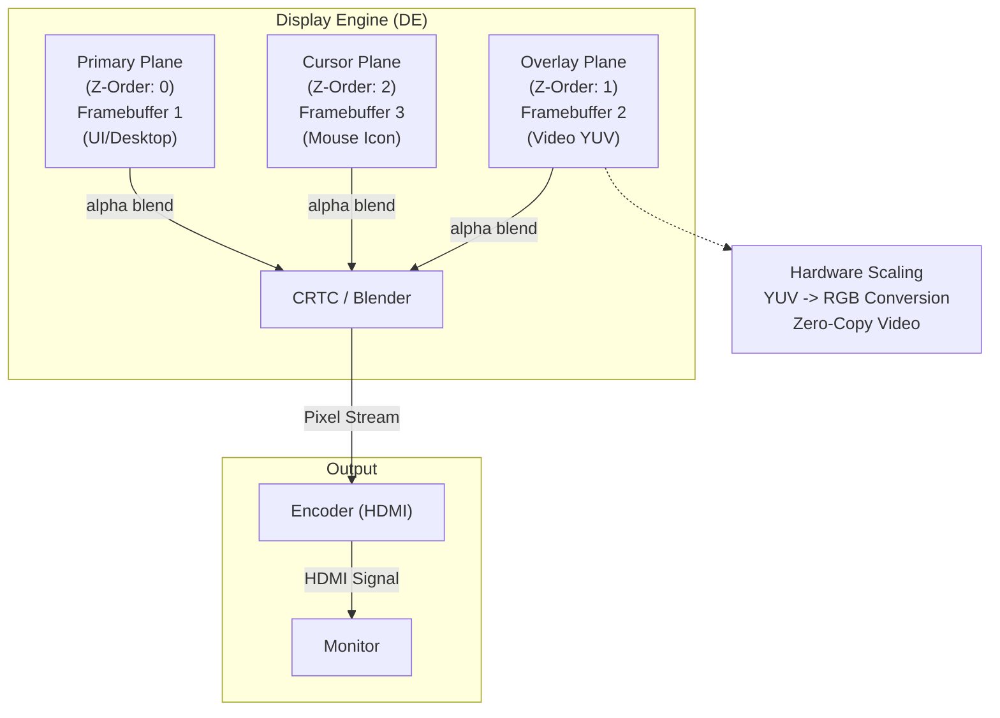

# Bài 5.1: Advanced DRM/KMS Architecture

## Page 1

```text
    Bài 5.1: Advanced DRM/KMS Architecture &
                             Atomic API
```

# Biên soạn: Phạm Văn Vũ

## Page 2

### Mục tiêu Bài học

```text
      • Chuyển dịch từ Legacy API sang Atomic Modesetting API
      • Tối ưu hóa hiển thị với DRM Planes (Hardware Composition)
      • Xử lý EDID và Custom Modeline nâng cao
```

### Phần 1: DRM Planes & Hardware Composition

DRM Planes cho phép GPU giảm tải việc composite bằng cách sử dụng hardware overlays chuyên dụng của Display Engine (DE).

*Hình 1: Hardware Planes Architecture*
<!-- mermaid-insert:start:bai_5_1_hinh_1 -->

<!-- mermaid-insert:end:bai_5_1_hinh_1 -->

### 1.1 Các loại Plane

Loại         Chức năng    Mô tả

## Page 3

Primary      Base Layer     Thường là Framebuffer chính, luôn được hiển thị.

Overlay      Video/Sprite   Chứa video YUV hoặc UI popup, hỗ trợ scaling/format riêng.

```text
               Mouse          Kích thước nhỏ (64x64), di chuyển nhanh mà không cần redraw toàn bộ màn
  Cursor
               Pointer        hình.
```

### 1.2 Lợi ích của Planes

```text
      • Zero-Copy Video: Video frame (dma-buf) được đẩy thẳng vào Overlay Plane. GPU không cần
       tham gia composite.
      • Power Saving: Giảm băng thông memory và GPU load.
```

### Phần 2: Atomic Modesetting API

Khắc phục nhược điểm của Legacy API (xé hình khi update nhiều thuộc tính, không transactional).

### 2.1 Atomic Workflow

```text
    // 1. Allocate Request
    drmModeAtomicReq *req = drmModeAtomicAlloc();
```

```text
    // 2. Add Properties (Transactional)
    drmModeAtomicAddProperty(req, plane_id, "FB_ID", fb_id);
    drmModeAtomicAddProperty(req, plane_id, "CRTC_ID", crtc_id);
    drmModeAtomicAddProperty(req, crtc_id, "MODE_ID", blob_id);
    drmModeAtomicAddProperty(req, crtc_id, "ACTIVE", 1);
```

```text
    // 3. Commit (Test Only - Verify)
    ret = drmModeAtomicCommit(fd, req, DRM_MODE_ATOMIC_TEST_ONLY, NULL);
```

```text
    // 4. Commit (Real)
    ret = drmModeAtomicCommit(fd, req, DRM_MODE_PAGE_FLIP_EVENT, NULL);
```

## Page 4

### Phần 3: Advanced Debugging

### 3.1 EDID & Modeline

Khi màn hình không nhận đúng độ phân giải, cần parse EDID hoặc ép Modeline.

```text
    # Dump EDID raw data
    cat /sys/class/drm/card0-HDMI-A-1/edid > edid.bin
```

```text
    # Parse EDID (cần cài edid-decode)
    edid-decode edid.bin
```

```text
    # Add Custom Modeline (Video=Kernel Cmdline)
    video=HDMI-A-1:1920x1080@60e      # Force enable
```

### 3.2 Debugfs Planes State

```text
    # Inspect Plane State (Z-order, coords)
    cat /sys/kernel/debug/dri/0/state
```

```text
    # Example Output:
    # plane[30]: Overlay-1
    #   crtc=crtc-0
    #   fb=35
    #   src=0,0,1920,1080
    #   dst=100,100,400,300     <-- Windowed Video
```

Câu hỏi Ôn tập

```text
    1. Hardware Overlay giúp tiết kiệm năng lượng như thế nào?
    2. Tại sao Atomic API lại ưu việt hơn Legacy SetCrtc/SetPlane?
    3. Lệnh `video=` trong kernel cmdline dùng để làm gì?
```

HALA Academy | Biên soạn: Phạm Văn Vũ
