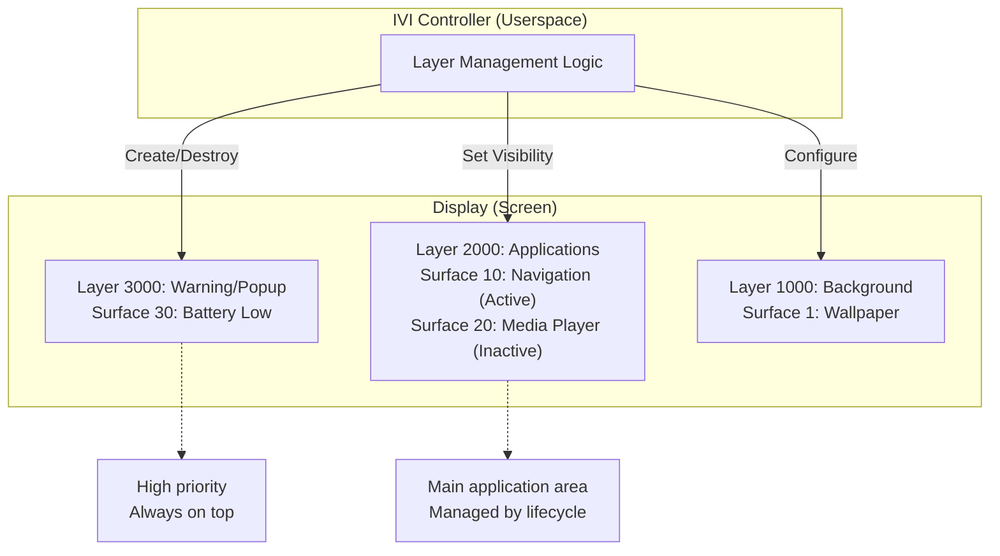

# Bài 5.3: Advanced Wayland Compositor & Optimization

## Page 1

# Bài 5.3: IVI-Shell Architecture & Jank Analysis

# Biên soạn: Phạm Văn Vũ

## Page 2

### Mục tiêu Bài học

```text
      • Làm chủ kiến trúc IVI-Shell và Layer Management
      • Kỹ thuật tối ưu hóa Direct Scanout
      • Phân tích Jank (Giật/Lag) với Perfetto
```

### Phần 1: IVI-Shell Deep Dive

IVI-Shell được thiết kế riêng cho ô tô, nơi các ứng dụng được quản lý chặt chẽ theo ID và Layer thay vì cửa sổ tự do như Desktop.

*Hình 1: IVI Shell Layer Management*
<!-- mermaid-insert:start:bai_5_3_hinh_1 -->

<!-- mermaid-insert:end:bai_5_3_hinh_1 -->

### 1.1 Layer Management Protocol

```text
      • Surface ID: Mỗi ứng dụng IVI được gán một ID duy nhất (VD: Nav=10, Media=20).
      • Layer ID: Layout màn hình được chia thành các lớp (Background=1000, App=2000,
       Popup=3000).
      • Control: ivi-controller map Surface vào Layer thông qua ID.
```

### Phần 2: Direct Scanout (Optimization)

Kỹ thuật giúp bỏ qua bước Composition của GPU khi chỉ có một ứng dụng Fullscreen đang chạy.

## Page 3

### 2.1 Cơ chế

```text
    Bình thường: App Buffer -> GPU Composite -> Framebuffer -> Display
    Direct Scanout: App Buffer ----------------------------> Display
```

### 2.2 Cấu hình Weston

Weston tự động kích hoạt Direct Scanout nếu đủ điều kiện:

```text
      • Surface là Fullscreen.
      • Không có layer nào khác đè lên (Opaque).
      • Format buffer được Display Controller hỗ trợ.
```

```text
    # Kiểm tra log để xem Direct Scanout có hoạt động không
    grep "assigning plane" /tmp/weston.log
```

### Phần 3: Advanced Jank Analysis

Phân tích nguyên nhân gây dropped frames (Jank) chuyên sâu.

### 3.1 Weston Debug Timeline

```text
    # Kích hoạt debug timeline
    weston --debug
    # Sử dụng weston-debug tool
    weston-debug -l timeline > weston_timeline.json
    # Load file JSON vào chrome://tracing hoặc Perfetto UI
```

### 3.2 Perfetto Tracing

Công cụ mạnh mẽ nhất để trace toàn bộ hệ thống (Kernel + Userspace).

```text
    # 1. Start Perfetto record
    perfetto -c config.pbtx -o trace.protobuf
```

# 2. Run IVI scenario (video playback + nav)

## Page 4

```text
    # 3. Stop and Analyze
    # Upload trace.protobuf lên ui.perfetto.dev
```

Tìm kiếm các đoạn vkms_atomic_commit hoặc panfrost_job_submit kéo dài quá 16ms (cho 60FPS).

Câu hỏi Ôn tập

```text
    1. Quy tắc ID trong IVI-Shell giúp ích gì cho việc quản lý ứng dụng?
    2. Direct Scanout cải thiện hiệu năng và độ trễ như thế nào?
    3. Nếu một frame mất 20ms để render, điều gì sẽ xảy ra trên màn hình 60Hz?
```

HALA Academy | Biên soạn: Phạm Văn Vũ
