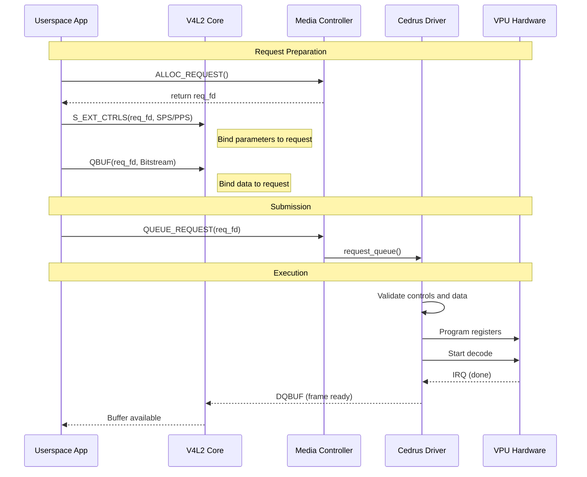

# Bài 6.1: Advanced V4L2 Stateless Codec Architecture

## Page 1

```text
          Bài 6.1: Advanced V4L2 Stateless Codec
                             Architecture
```

# Biên soạn: Phạm Văn Vũ

## Page 2

### Mục tiêu Bài học

```text
      • Phân tích sâu kiến trúc V4L2 Stateless Codec trên Linux Mainline.
      • Nắm vững cơ chế Media Request API để đồng bộ hóa tham số decode.
      • Hiểu rõ cấu trúc Cedrus Driver và cách tương tác với phần cứng VPU Allwinner.
      • Thực hành debug và phân tích luồng dữ liệu H.264 decoding chi tiết.
```

1. Tổng quan về Video Codec Hardware (VPU)

### 1.1 Stateful vs Stateless Architecture

Trong thế giới Embedded Linux, có hai loại kiến trúc Video Decoder hardware chính:

Đặc điểm        Stateful Decoder                           Stateless Decoder (H618 VPU)

```text
                  Có Firmware chạy trên VPU (Black
  Firmware                                                   Không có Firmware, VPU là pure logic registers.
                  box).
```

Parsing         VPU tự parse bitstream (SPS/PPS).          Userspace (CPU) phải parse và gửi thông số xuống.

```text
                  Userspace đơn giản, Driver phức            Userspace phức tạp (cần GStreamer/FFmpeg), Driver
  Complexity
                  tạp.                                       đơn giản.
```

Ví dụ           Samsung MFC, Amlogic.                      Allwinner Cedrus, Rockchip Hantro.

```text
    Tại sao Stateless lại phổ biến trên Mainline? Vì Stateless driver không phụ thuộc vào firmware blob đóng
    (binary blob), giúp code minh bạch và dễ bảo trì trong Linux Kernel upstream.
```

## Page 3

2. Kiến trúc V4L2 Request API

### 2.1 Vấn đề của frame-based decoding

Đối với Stateless codec, mỗi frame (hoặc slice) cần đi kèm với một bộ tham số cấu hình chính xác

(Scaling Lists, Reference Pictures, Headers). Nếu chúng ta dùng `ioctl(S_CTRL)` thông thường, race condition có thể xảy ra nếu userspace gửi frame mới nhanh hơn tốc độ xử lý của hardware.

### 2.2 Giải pháp Media Request

Media Request API giới thiệu khái niệm Request Objects. Mỗi Request hoạt động như một transaction container chứa:

```text
      • Output Buffer (Dữ liệu bitstream nén).
      • Capture Buffer Reference (Nơi chứa ảnh giải mã).
      • Controls (Các tham số SPS, PPS, Slice Header).
```

*Hình 1: Quy trình xử lý Media Request atomic từ Userspace xuống Kernel*
<!-- mermaid-insert:start:bai_6_1_hinh_1 -->

<!-- mermaid-insert:end:bai_6_1_hinh_1 -->

## Page 4

### 2.3 Workflow Chi tiết

```text
     1. Request Allocation: Userspace tạo một Request FD mới từ `/dev/media0`.
     2. Control Binding: Userspace set các V4L2 Controls, nhưng thay vì apply ngay, chúng được bind
       vào Request FD.
     3. Buffer Queuing: Buffer cũng được queue với flag `V4L2_BUF_FLAG_REQUEST_FD`.
     4. Submission: Khi gọi `MEDIA_REQUEST_IOC_QUEUE`, toàn bộ bundle này được đẩy xuống
       driver 1 cách atomic. Driver đảm bảo hardware sẽ dùng đúng bộ Controls cho đúng Buffer đó.
```

3. Phân tích Cedrus Driver Internals

### 3.1 Register Map & Memory IO

Cedrus driver (drivers/staging/media/sunxi/cedrus) map các thanh ghi vật lý của VPU vào kernel space.

Một số thanh ghi quan trọng:

```text
    #define VE_MODE     0x000       // Chọn chế độ MPEG/H264/HEVC
    #define VE_BUF_ADDR 0x800       // Địa chỉ vật lý của Source Buffer (Bitstream)
    #define VE_DST_ADDR 0x810       // Địa chỉ vật lý của Destination Buffer (NV12)
    #define VE_CTRL     0x820       // Trigger Start bit
```

### 3.2 Slice Decoding Flow

H.264 hỗ trợ Slice Decoding, tức là một frame có thể được chia thành nhiều phần nhỏ (slices) để decode song song hoặc giảm độ trễ. Cedrus driver xử lý như sau:

```text
     1. Userspace parse NAL Unit, xác định nó là Slice NAL.
     2. Gửi Slice Data và Slice Parameters (như `first_mb_in_slice`) xuống kernel.
     3. Cedrus driver program thanh ghi để VPU decode chỉ slice đó.
     4. Kết quả được ghi đè (accumulate) vào Destination Buffer của cả Frame.
     5. Khi tất cả slices hoàn tất, frame được đánh dấu là `DONE`.
```

## Page 5

4. Thực hành: Kiểm tra tính năng VPU

### 4.1 Kiểm tra Kernel Support

```text
    # Kiểm tra module
    modprobe sunxi-cedrus
    dmesg | grep cedrus
    # [    5.123456] cedar_ve: device registered successfully
    # [    5.123456] cedrus 1c0e000.video-codec: device registered as /dev/video0
```

```text
    # Kiểm tra formats hỗ trợ
    v4l2-ctl -d /dev/video0 --list-formats-out
    # ioctl: VIDIOC_ENUM_FMT
    # Type: Video Output
    # [0]: 'H264' (H.264)
    # [1]: 'HEVC' (HEVC)
    # [2]: 'NM12' (NV12 Tiled)
```

### 4.2 Thiết lập FFmpeg cho Request API

Để FFmpeg sử dụng được V4L2 Request API, cần enable hwaccel `drm` hoặc `v4l2_request` (tuỳ phiên bản patch).

```text
    # Decode và hiển thị thông tin debug
    ffmpeg -loglevel debug -hwaccel drm -i input_hevc.mp4 -f null -
```

Quan sát log để thấy các ioctl `MEDIA_REQUEST_IOC_QUEUE` được gọi liên tục.

5. Tổng kết & Câu hỏi

Trong bài này, chúng ta đã đi sâu vào cơ chế hoạt động của Stateless Decoder. Sự phức tạp được đẩy về phía phần mềm (Userspace) giúp phần cứng đơn giản và rẻ tiền hơn, đồng thời cho phép cập nhật thuật toán parsing linh hoạt mà không cần upgrade hardware firmware.

Câu hỏi thảo luận:

```text
     1. Nếu Userspace crash khi đang giữ Request FD, kernel sẽ xử lý resource cleanup như thế nào?
     2. Tại sao H.264 lại cần thông tin về Reference Pictures (DPB) để decode một P-Frame, trong khi I-
       Frame thì không?
     3. So sánh ưu nhược điểm của việc dùng `dma-buf` heap cho bitstream buffer so với userptr?
```

## Page 6

HALA Academy | Biên soạn: Phạm Văn Vũ
