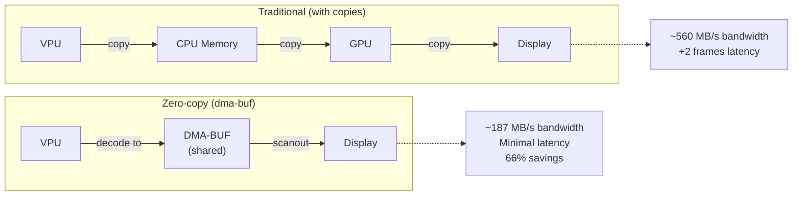
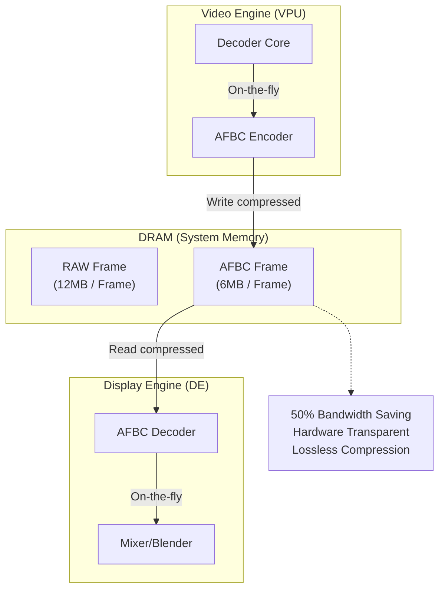
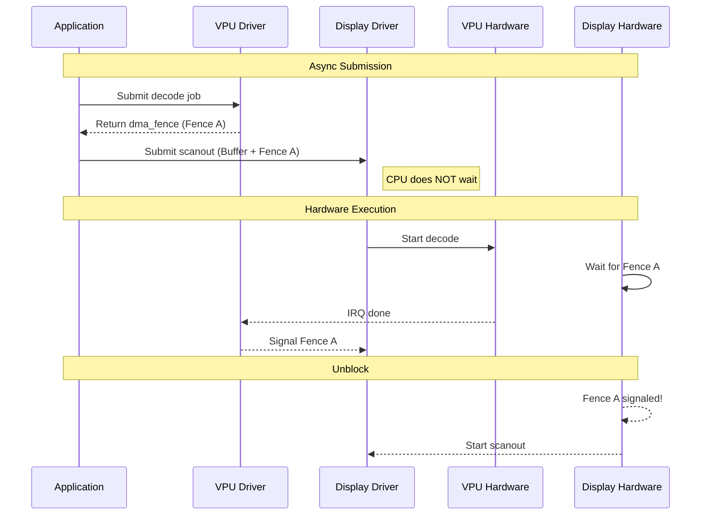

# Bài 6.2: Advanced Zero-Copy Pipeline & AFBC

## Page 1

# Bài 6.2: Advanced Zero-Copy Pipeline & AFBC

# Biên soạn: Phạm Văn Vũ

## Page 2

### Mục tiêu Bài học

```text
      • Triển khai Zero-Copy Pipeline hoàn chỉnh từ VPU (Decoder) đến Display (DRM).
      • Tìm hiểu công nghệ nén frame AFBC (Arm Frame Buffer Compression) để tối ưu băng thông.
      • Sử dụng dma_fence để đồng bộ hóa quá trình render bất đồng bộ (Asynchronous Rendering).
```

1. Zero-Copy Pipeline with DMA-BUF

### 1.1 Tại sao cần Zero-Copy?

Trong các hệ thống xử lý video 4K@60fps, băng thông bộ nhớ (Memory Bandwidth) là tài nguyên quý giá nhất. Một frame 4K NV12 chiếm khoảng 12MB. Nếu ta copy frame này từ Kernel Space sang User Space rồi copy lại vào GPU, ta tốn:

```text
    BW = Size * FPS * (Read + Write)
       = 12MB * 60 * 2 = 1.44 GB/s cho mỗi lần copy!
```

Zero-Copy loại bỏ hoàn toàn các bước copy này bằng cách chia sẻ pointer (quản lý bởi DMA-BUF) giữa các device driver.

## Page 3

*Hình 1: Pipeline không copy dữ liệu giữa VPU và Display*
<!-- mermaid-insert:start:bai_6_2_hinh_1 -->

<!-- mermaid-insert:end:bai_6_2_hinh_1 -->

### 1.2 DMA-BUF Workflow

```text
    1. Userspace yêu cầu V4L2 driver cấp phát buffer (VIDIOC_REQBUFS). Driver dùng CMA để cấp
       vùng nhớ vật lý liên tục.
    2. Userspace gọi `VIDIOC_EXPBUF` để lấy Export FD (dma_buf fd) cho buffer đó.
    3. Userspace      gửi       Export      FD       này      sang      DRM           driver     thông       qua
       `DRM_IOCTL_PRIME_FD_TO_HANDLE`.
    4. DRM Driver import buffer đó và tạo một Framebuffer object (`DRM_IOCTL_MODE_ADDFB2`).
    5. Dữ liệu pixel nằm yên trên RAM, chỉ quyền sở hữu được chuyển giao.
```

2. Arm Frame Buffer Compression (AFBC)

### 2.1 Giới thiệu AFBC

AFBC là giao thức nén không mất dữ liệu (lossless compression) độc quyền của ARM, được hỗ trợ bởi GPU Mali, Video Engine và Display Engine. Mục tiêu là giảm lượng dữ liệu phải đọc/ghi xuống DRAM.

## Page 4

*Hình 2: Luồng dữ liệu nén AFBC trong SoC*
<!-- mermaid-insert:start:bai_6_2_hinh_2 -->

<!-- mermaid-insert:end:bai_6_2_hinh_2 -->

### 2.2 Cơ chế hoạt động

```text
      • Frame được chia thành các Superblocks (ví dụ 16x16 pixels).
      • Mỗi Superblock có header chứa metadata và payload nén.
      • Nếu khối nén được -> Ghi dạng nén. Nếu không (nhiễu quá nhiều) -> Ghi dạng raw.
      • Display Engine tự động giải nén on-the-fly khi scanout ra màn hình HDMI.
```

### 2.3 Sử dụng DRM Modifiers

Để userspace xin cấp phát buffer AFBC, ta dùng Modifier:

#define DRM_FORMAT_MOD_ARM_AFBC(...)

```text
    // Khi tạo Framebuffer
    struct drm_mode_fb_cmd2 cmd = {
        .width = 1920,
        .height = 1080,
        .pixel_format = DRM_FORMAT_NV12,
        .flags = DRM_MODE_FB_MODIFIERS,
        .modifier = { DRM_FORMAT_MOD_ARM_AFBC(...) },
```

## Page 5

```text
          .handles = { gem_handle },
    };
```

3. Explicit Synchronization (Direct Rendering)

### 3.1 Implicit vs Explicit Sync

```text
     • Implicit Sync: Kernel tự theo dõi buffer đang được ai dùng. Khi Userspace submit job mới, Kernel
         tự block chờ job cũ xong. Dễ dùng nhưng kém linh hoạt.
     • Explicit Sync (dma_fence): Userspace chịu trách nhiệm quản lý dependencies. VPU trả về một
         `fence_fd` khi submit decode. Userspace truyền `fence_fd` đó cho Display driver. Display driver sẽ
         chờ fence được signal bởi VPU hardware rồi mới hiển thị.
```

*Hình 3: Cơ chế dma_fence giúp CPU không bao giờ bị block*
<!-- mermaid-insert:start:bai_6_2_hinh_3 -->

<!-- mermaid-insert:end:bai_6_2_hinh_3 -->

## Page 6

### 3.2 Lợi ích

Sự tách biệt này cho phép CPU rảnh rỗi hoàn toàn để xử lý logic ứng dụng (UI, Network), trong khi các accelerator (VPU, GPU, Display) hoạt động kiểu pipeline nối đuôi nhau tự động.

4. Thực hành

### 4.1 Kiểm tra Zero-copy với GStreamer

```text
    # Pipeline decode -> display không qua CPU copy
    gst-launch-1.0 filesrc location=video.mp4 ! \
        qtdemux ! h264parse ! \
        v4l2h264dec ! \
        video/x-raw,format=NV12 ! \
        kmssink force-modesetting=true driver-name=sun4i-drm
```

### 4.2 Monitor Bandwidth

Sử dụng công cụ `perf` để đo sự kiện Memory Controller (nếu SoC support PMU event cho DRAM):

perf stat -e arm_dsu_0/bus_access/ -a sleep 5

5. Tổng kết

Kết hợp V4L2 Request API, DMA-BUF Zero-Copy, AFBC và Explicit Fences tạo nên một Multimedia Pipeline hiện đại, hiệu suất cao, đạt được khả năng phát video 4K mượt mà trên các chip ARM giá rẻ như H618.

HALA Academy | Biên soạn: Phạm Văn Vũ
