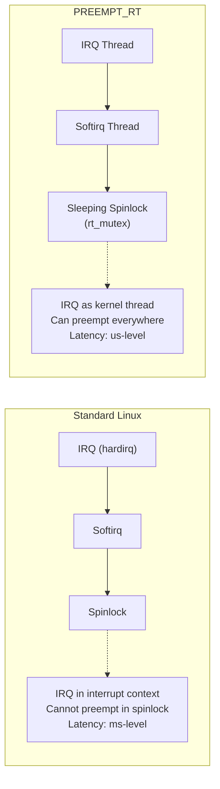

# Bài 7.1: Advanced Real-Time Linux Analysis

## Page 1

# Bài 7.1: Advanced Real-Time Linux Analysis

# Biên soạn: Phạm Văn Vũ

## Page 2

### Mục tiêu Bài học

```text
      • Phân tích chi tiết PREEMPT_RT patch biến Linux thành Hard Real-Time OS.
      • Sử dụng Ftrace (irqsoff, wakeup_rt) để debug latency ở cấp độ microsecond.
      • Phát hiện các nguồn trễ phần cứng (SMI, Cache miss) với `hwlatdetect`.
```

1. PREEMPT_RT Architecture Deep Dive

### 1.1 Từ Soft RT đến Hard RT

Một kernel Linux tiêu chuẩn ("Vanilla Kernel") chỉ cung cấp Soft Real-Time. Mặc dù có scheduler ưu tiên

(SCHED_FIFO), nhưng kernel code (Drivers, Filesystem) thường disable preemption (chèn quyền) trong thời gian dài thông qua spinlock.

PREEMPT_RT thay đổi điều này bằng cách:

```text
      • Chuyển đổi hầu hết Spinlocks thành Mutexes (Sleeping Spinlocks), cho phép một tiến trình ưu tiên
       cao hơn preempt kernel code đang giữ lock.
      • Chuyển IRQ Handlers thành Kernel Threads, cho phép chúng cũng bị priority-based scheduling.
```

*Hình 1: Sự khác biệt trong xử lý ngắt và critical section*
<!-- mermaid-insert:start:bai_7_1_hinh_1 -->

<!-- mermaid-insert:end:bai_7_1_hinh_1 -->

2. Ftrace Latency Analysis

### 2.1 Anatomy of Latency

Độ trễ tổng thể (Total Latency) từ khi sự kiện phần cứng xảy ra đến khi task xử lý nó chạy bao gồm:

## Page 3

Latency = T_hardware + T_interrupt + T_sched + T_context_switch

```text
      • T_hardware: Thời gian CPU mất để nhận IRQ (bị ảnh hưởng bởi SMI, bus contention).
      • T_interrupt: Kernel entry và masked interrupt time.
      • T_sched: Thời gian scheduler chọn task chạy tiếp theo.
```

```text
                                          Latency Trace Analysis
                        Hình 2: Các thành phần của độ trễ đánh thức (Wakeup Latency)
```

### 2.2 Sử dụng `wakeup_rt` Tracer

Để bắt được khoảnh khắc độ trễ cao nhất (worst-case), ta dùng Ftrace được built-in trong kernel.

```text
    # Bật tracer theo dõi độ trễ wakeup của RT tasks
    echo wakeup_rt > /sys/kernel/debug/tracing/current_tracer
    echo 1 > /sys/kernel/debug/tracing/tracing_on
```

```text
    # Chạy test load
    cyclictest -p 90 -m -t1 -n -i 1000 -l 10000
```

```text
    # Xem kết quả
    cat /sys/kernel/debug/tracing/trace | head -n 20
```

Log tracer sẽ chỉ ra chính xác hàm nào trong kernel gây ra việc block scheduling (ví dụ: một driver giữ lock quá lâu).

3. Hardware Latency Detection

### 3.1 System Management Interrupts (SMI)

SMI là "sát thủ" của Real-time. Firmware (BIOS/UEFI) đôi khi chiếm quyền CPU để xử lý nhiệt độ, quản lý nguồn... mà OS không hề hay biết. Trong thời gian này, mọi IRQ đều bị chặn.

### 3.2 Công cụ `hwlatdetect`

Công cụ này chạy một kernel thread vòng lặp kín, so sánh TSC (TimeStamp Counter) để phát hiện các khoảng "mất tích" thời gian.

```text
    # Cài đặt từ gói rt-tests
    sudo apt install rt-tests
```

## Page 4

```text
    # Chạy detect trong 60 giây, ngưỡng cảnh báo 10us
    sudo hwlatdetect --duration=60 --threshold=10
```

Nếu phát hiện SMI latency cao, giải pháp duy nhất là update BIOS hoặc patch driver phần cứng liên quan.

4. Lab: Detecting Hardware Latency

Sử dụng script dưới đây để quét toàn bộ hệ thống tìm kiếm các nguồn latency ẩn (SMI) trong 2 phút.

```text
    #!/bin/bash
    # hwlatdetect.sh
```

```text
    DURATION=120 # 2 minutes
    WINDOW=1000000 # 1s window
```

```text
    echo "Starting Hardware Latency Detector..."
    echo "Please do not touch the system..."
```

```text
    sudo hwlatdetect \
        --duration=$DURATION \
        --window=$WINDOW \
        --width=500000 \
        --threshold=10 \
        --hardlimit=20 \
        --report=hwlat_report.txt
```

```text
    if [ -f hwlat_report.txt ]; then
         cat hwlat_report.txt
         echo "Check hwlat_report.txt for details."
    else
         echo "No latency spikes detected above threshold."
    fi
```

5. Tổng kết

Để đạt được Hard Real-Time, việc chỉ bật `CONFIG_PREEMPT_RT` là chưa đủ. Người kỹ sư hệ thống phải biết cách dùng Ftrace để "săn lùng" từng micro giây trễ do driver tồi hoặc phần cứng gây ra.

HALA Academy | Biên soạn: Phạm Văn Vũ
