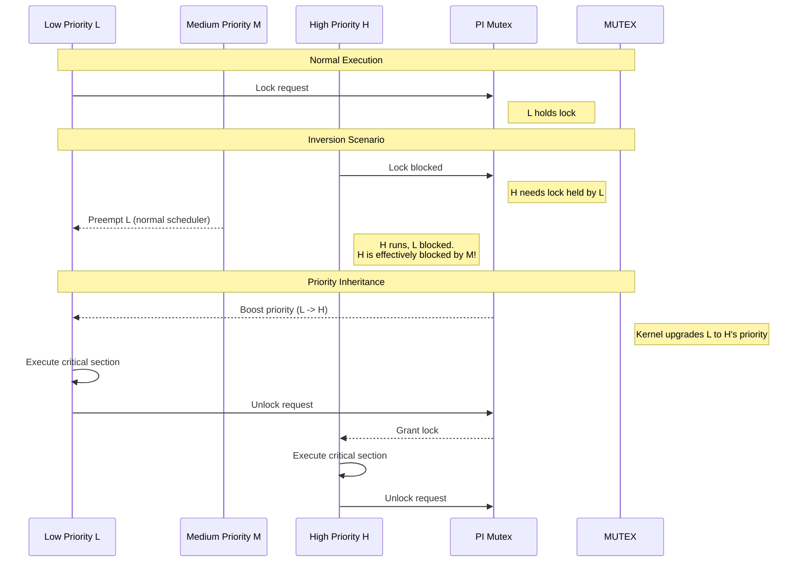

# Bài 7.3: Real-Time Design Patterns

## Page 1

# Bài 7.3: Real-Time Software Design Patterns

# Biên soạn: Phạm Văn Vũ

## Page 2

### Mục tiêu Bài học

```text
      • Áp dụng các mẫu thiết kế (Design Patterns) an toàn cho Real-time.
      • Giải quyết vấn đề Priority Inversion với PI Mutex.
      • Thiết kế cơ chế giao tiếp Lock-free giữa RT thread và Non-RT thread.
```

1. The Priority Inversion Problem

### 1.1 Kịch bản thảm họa (Mars Pathfinder)

"Priority Inversion" xảy ra khi một tác vụ ưu tiên thấp (Low) nắm giữ khóa (Lock) cần thiết cho tác vụ ưu tiên cao (High), nhưng Low lại bị chiếm dụng CPU bởi một tác vụ trung bình (Medium). Kết quả là High phải chờ Medium vô thời hạn!

*Hình 1: Cơ chế Priority Inheritance giải quyết vấn đề*
<!-- mermaid-insert:start:bai_7_3_hinh_1 -->

<!-- mermaid-insert:end:bai_7_3_hinh_1 -->

## Page 3

### 1.2 Giải pháp: Priority Inheritance Mutex

Trong Linux Pthreads, ta kích hoạt tính năng tự động nâng quyền ưu tiên (boost priority) cho task giữ lock.

```text
    pthread_mutexattr_t attr;
    pthread_mutexattr_init(&attr);
    // Kích hoạt Priority Inheritance Protocol
    pthread_mutexattr_setprotocol(&attr, PTHREAD_PRIO_INHERIT);
```

```text
    pthread_mutex_t my_mutex;
    pthread_mutex_init(&my_mutex, &attr);
```

2. Lock-free Communication Pattern

### 2.1 Quy tắc vàng: Không I/O trong RT Loop

Task Real-time (Priority 99) TUYỆT ĐỐI KHÔNG được gọi `printf`, `write to file`, hay `malloc`.

Những hàm này không determinism và có thể gây sleep.

Vậy làm sao để log dữ liệu hay lưu xuống disk? Giải pháp là mô hình Producer-Consumer qua Ring Buffer.

### 2.2 Thiết kế Ring Buffer

```text
         • RT Thread (Producer): Ghi data vào Ring Buffer. Nếu buffer đầy, drop data (chấp nhận mất log
          còn hơn trễ deadline). Không dùng Mutex.
         • Logger Thread (Consumer - Non RT): Chạy background, đọc data từ Ring Buffer và ghi xuống
          disk.
```

```text
    // Pseudocode for Lock-free Ring Buffer push
    bool push(struct ring_buffer *rb, struct data_item item) {
        unsigned int next_head = (rb->head + 1) % SIZE;
        if (next_head == rb->tail) return false; // Full
```

```text
           rb->buffer[rb->head] = item;
           // Memory barrier để đảm bảo data được ghi trước khi update index
           __sync_synchronize();
           rb->head = next_head;
           return true;
    }
```

## Page 4

3. Memory Management

### 3.1 Stack and Heap

```text
      • Stack: Phải disable Stack Overflow checking (nếu có) hoặc pre-fault stack. Dung lượng stack
       thường cố định (ví dụ 8KB/thread).
      • Heap: Tránh `malloc` động. Hãy dùng Memory Pools (cấp phát 1 cục lớn lúc init, sau đó chia
       nhỏ).
```

### 3.2 Page Fault Prevention

Sử dụng `mlockall` để khóa toàn bộ virtual memory vào RAM vật lý, tránh việc Kernel phải load page từ ổ đĩa khi đang chạy.

```text
    if (mlockall(MCL_CURRENT | MCL_FUTURE) == -1) {
        perror("mlockall failed");
        exit(1);
    }
```

5. Lab: Stress Testing with Cyclictest

### Mục tiêu: Đánh giá độ ổn định của hệ thống dưới tải nặng (Stress).

```text
    #!/bin/bash
    # run_cyclictest.sh
```

```text
    # 1. Generate Load (CPU, IO, VM)
    echo "Starting Stress-ng (Background load)..."
    stress-ng --cpu 2 --io 2 --vm 1 --vm-bytes 128M --timeout 60s &
```

```text
    # 2. Run Cyclictest on Isolated CPU 3
    echo "Starting Cyclictest on CPU 3 (Priority 99)..."
    sudo cyclictest \
        --mlockall \
        --smp \
        --priority=99 \
        --interval=200 \
        --distance=0 \
        --affinity=3 \
        --loops=100000 \
        --histogram=100 \
        | tee cyclic_result.txt
```

# 3. Analysis

## Page 5

```text
    MAX_LAT=$(grep "Max Latencies" cyclic_result.txt | awk '{print $NF}')
    echo "Max Latency measured: ${MAX_LAT} us"
```

```text
    if [ "$MAX_LAT" -lt 50 ]; then
         echo "PASS: Hard Real-Time Ready!"
    else
         echo "FAIL: Optimize more!"
    fi
```

6. Tổng kết

Lập trình Real-time đòi hỏi kỷ luật nghiêm ngặt. Việc sử dụng đúng Design Pattern (PI Mutex, Lock-free queues, Memory Pools) quyết định 90% độ ổn định của hệ thống.

HALA Academy | Biên soạn: Phạm Văn Vũ
