# SYSTEM ARCHITECT ARM CORTEX A

# Bài 2.1 - 2.3: Kernel, Initramfs, Buildroot

**Biên soạn:** Phạm Văn Vũ  
**Đơn vị:** HALA Academy  
**Chủ đề:** System Architect ARM Cortex A

> Ghi chú chuyển đổi: toàn bộ nội dung văn bản được chuyển sang Markdown. Các hình ảnh/diagram trong tài liệu được chuyển thành Mermaid diagram hoặc text diagram để có thể đọc, sửa, copy và version-control trực tiếp trong Markdown.

---

# Bài 2.1: Kernel Build & Device Tree

## Mục tiêu Bài học

Sau buổi học này, học viên sẽ có khả năng:

- Hiểu luồng khởi động của Linux Kernel: `head.S -> start_kernel()`.
- Nắm vững cách build kernel cho **Orange Pi Zero 3**.
- Hiểu **Device Tree** và chọn đúng **DTB**.

---

## Phần 1: Luồng Khởi động Kernel

### Hình 1: Luồng khởi động Kernel

```text
                    KERNEL BOOT FLOW: start_kernel() TO USERSPACE
                    =============================================

Participants:
  U-Boot | head.S (Assembly) | start_kernel() (C code) | rest_init() | kernel_init (PID 1) | /sbin/init (Userspace)


+---------+          +-------------------+          +-------------------------+          +-------------+          +---------------------+          +----------------------+
| U-Boot  |          | head.S            |          | start_kernel()          |          | rest_init() |          | kernel_init         |          | /sbin/init           |
|         |          | Assembly          |          | C code                  |          |             |          | PID 1               |          | Userspace            |
+----+----+          +---------+---------+          +------------+------------+          +------+------+          +----------+----------+          +----------+-----------+
     |                         |                                 |                              |                            |                                |
     | booti(jump_to_text)     |                                 |                              |                            |                                |
     |------------------------>|                                 |                              |                            |                                |
     |                         |                                 |                              |                            |                                |
     |                         | __primary_switch()              |                              |                            |                                |
     |                         |------------------+              |                              |                            |                                |
     |                         |                  |              |                              |                            |                                |
     |                         |<-----------------+              |                              |                            |                                |
     |                         |                                 |                              |                            |                                |
     |                         | Enable MMU                      |                              |                            |                                |
     |                         |                                 |                              |                            |                                |
     |                         | Jump to start_kernel()          |                              |                            |                                |
     |                         |-------------------------------->|                              |                            |                                |
     |                         |                                 |                              |                            |                                |
     |                         |                                 | setup_arch()                 |                            |                                |
     |                         |                                 |------------------+           |                            |                                |
     |                         |                                 |                  | Parse DTB |                            |                                |
     |                         |                                 |<-----------------+           |                            |                                |
     |                         |                                 |                              |                            |                                |
     |                         |                                 | mm_init()                    |                            |                                |
     |                         |                                 |------------------+           |                            |                                |
     |                         |                                 |<-----------------+           |                            |                                |
     |                         |                                 |                              |                            |                                |
     |                         |                                 | sched_init()                 |                            |                                |
     |                         |                                 |------------------+           |                            |                                |
     |                         |                                 |<-----------------+           |                            |                                |
     |                         |                                 |                              |                            |                                |
     |                         |                                 | early_irq_init()             |                            |                                |
     |                         |                                 |------------------+           |                            |                                |
     |                         |                                 |<-----------------+           |                            |                                |
     |                         |                                 |                              |                            |                                |
     |                         |                                 | time_init()                  |                            |                                |
     |                         |                                 |------------------+           |                            |                                |
     |                         |                                 |<-----------------+           |                            |                                |
     |                         |                                 |                              |                            |                                |
     |                         |                                 | console_init()               |                            |                                |
     |                         |                                 |------------------+           |                            |                                |
     |                         |                                 |<-----------------+           |                            |                                |
     |                         |                                 |                              |                            |                                |
     |                         |                                 | rest_init()                  |                            |                                |
     |                         |                                 |----------------------------->|                            |                                |
     |                         |                                 |                              |                            |                                |
     |                         |                                 |                              | kernel_thread(kernel_init) |                                |
     |                         |                                 |                              |--------------------------->|                                |
     |                         |                                 |                              |                            | Create PID 1                   |
     |                         |                                 |                              |                            |-------------------+            |
     |                         |                                 |                              |                            |                   |            |
     |                         |                                 |                              |                            |<------------------+            |
     |                         |                                 |                              |                            |                                |
     |                         |                                 |                              |                            | kernel_init_freeable()         |
     |                         |                                 |                              |                            |-------------------+            |
     |                         |                                 |                              |                            |<------------------+            |
     |                         |                                 |                              |                            |                                |
     |                         |                                 |                              |                            | do_basic_setup()               |
     |                         |                                 |                              |                            |-------------------+            |
     |                         |                                 |                              |                            |                   | Driver probing
     |                         |                                 |                              |                            |<------------------+            |
     |                         |                                 |                              |                            |                                |
     |                         |                                 |                              |                            | prepare_namespace()            |
     |                         |                                 |                              |                            |-------------------+            |
     |                         |                                 |                              |                            |                   | Mount rootfs
     |                         |                                 |                              |                            |<------------------+            |
     |                         |                                 |                              |                            |                                |
     |                         |                                 |                              |                            | run_init_process("/sbin/init") |
     |                         |                                 |                              |                            |------------------------------->|
     |                         |                                 |                              |                            |                                |
     |                         |                                 |                              |                            |                                | exec() replaces kernel_init
     |                         |                                 |                              |                            |                                | systemd / busybox init
     |                         |                                 |                              |                            |                                | PID 1 in userspace
     |                         |                                 |                              |                            |                                |
+----+----+          +---------+---------+          +------------+------------+          +------+------+          +----------+----------+          +----------+-----------+
| U-Boot  |          | head.S            |          | start_kernel()          |          | rest_init() |          | kernel_init         |          | /sbin/init           |
|         |          | Assembly          |          | C code                  |          |             |          | PID 1               |          | Userspace            |
+---------+          +-------------------+          +-------------------------+          +-------------+          +---------------------+          +----------------------+
```

### 1.1 Từ U-Boot sang Kernel

U-Boot sử dụng lệnh `booti` hoặc `bootz` để nhảy vào kernel.

Các địa chỉ quan trọng:

| Biến U-Boot | Ý nghĩa |
|---|---|
| `kernel_addr_r` | Địa chỉ load kernel `Image` |
| `fdt_addr_r` | Địa chỉ load Device Tree Blob / DTB |
| `ramdisk_addr_r` | Địa chỉ load initramfs, optional |

Ví dụ boot command:

```bash
load mmc 0:1 ${kernel_addr_r} Image
load mmc 0:1 ${fdt_addr_r} sun50i-h618-orangepi-zero3.dtb
booti ${kernel_addr_r} - ${fdt_addr_r}
```

### 1.2 Chi tiết `start_kernel()`

```c
// init/main.c
asmlinkage __visible void __init start_kernel(void) {
    set_task_stack_end_magic(&init_task);
    setup_arch(&command_line);   // Parse DTB here
    mm_init();                   // Memory init
    sched_init();                // Scheduler init
    early_irq_init();
    init_IRQ();
    time_init();
    console_init();              // earlycon -> proper console
    rest_init();                 // Creates PID 1
}
```

### 1.3 Từ `rest_init()` đến Userspace

| Function | PID | Mô tả |
|---|---:|---|
| `kernel_thread(kernel_init)` | 1 | Init process, exec `/sbin/init` |
| `kernel_thread(kthreadd)` | 2 | Kernel thread daemon |

Luồng rút gọn:

```text
rest_init()
  ├── kernel_thread(kernel_init)   -> PID 1
  │     ├── do_basic_setup()
  │     ├── prepare_namespace()
  │     └── run_init_process("/sbin/init")
  └── kernel_thread(kthreadd)      -> PID 2
```

---

## Phần 2: Device Tree (DTB)

### 2.1 Device Tree là gì?

- **Mục đích:** Mô tả phần cứng cho kernel thay vì hardcode trong source code.
- **Format:** `DTS` source -> `DTC` compiler -> `DTB` binary.
- **Location:** `arch/arm64/boot/dts/allwinner/`

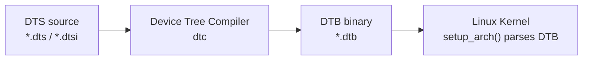

### 2.2 Cấu trúc cơ bản

```dts
// sun50i-h618-orangepi-zero3.dts
/dts-v1/;
#include "sun50i-h616.dtsi"

/ {
    model = "OrangePi Zero3";
    compatible = "xunlong,orangepi-zero3", "allwinner,sun50i-h618";

    aliases {
        serial0 = &uart0;
    };

    chosen {
        stdout-path = "serial0:115200n8";
    };
};

&uart0 {
    pinctrl-names = "default";
    pinctrl-0 = <&uart0_ph_pins>;
    status = "okay";
};

&mmc0 {
    vmmc-supply = <&reg_vcc3v3>;
    status = "okay";
};
```

Ý nghĩa các phần chính:

| Thành phần | Vai trò |
|---|---|
| `model` | Tên board hiển thị cho kernel/log |
| `compatible` | Chuỗi match driver/platform |
| `aliases` | Alias cho device, ví dụ `serial0` |
| `chosen.stdout-path` | Console output mặc định |
| `status = "okay"` | Bật device node |
| `&uart0`, `&mmc0` | Override node đã định nghĩa trong `.dtsi` |

---

## Phần 3: Build Linux Kernel

### 3.1 Chuẩn bị

```bash
# Cài đặt dependencies
sudo apt install -y git build-essential libncurses-dev \
    bison flex libssl-dev libelf-dev bc

# Cross-compiler
aarch64-linux-gnu-gcc --version
```

### 3.2 Clone Kernel Source

Cách 1: Mainline kernel

```bash
git clone --depth=1 -b v6.6 https://git.kernel.org/pub/scm/linux/kernel/git/stable/linux.git
cd linux
```

Cách 2: Sunxi/Megous kernel, thường có nhiều driver hơn cho board Allwinner/Sunxi:

```bash
git clone --depth=1 https://github.com/megous/linux.git -b orange-pi-6.6
```

### 3.3 Configure và Build

```bash
# Sử dụng defconfig
make ARCH=arm64 CROSS_COMPILE=aarch64-linux-gnu- defconfig

# Customize, optional
make ARCH=arm64 CROSS_COMPILE=aarch64-linux-gnu- menuconfig

# Build kernel Image
make ARCH=arm64 CROSS_COMPILE=aarch64-linux-gnu- -j$(nproc) Image

# Build DTBs
make ARCH=arm64 CROSS_COMPILE=aarch64-linux-gnu- -j$(nproc) dtbs
```

### 3.4 Output Files

| File | Path | Mô tả |
|---|---|---|
| `Image` | `arch/arm64/boot/Image` | Kernel binary, khoảng 20 MB |
| `DTB` | `arch/arm64/boot/dts/allwinner/*.dtb` | Device Tree |
| Modules | `*.ko` | Kernel modules |

---

## Phần 4: Bootargs Chi tiết

Ví dụ bootargs:

```text
console=ttyS0,115200 root=/dev/mmcblk0p2 rootfstype=ext4 rw rootwait
```

| Tham số | Giá trị | Mô tả |
|---|---|---|
| `console` | `ttyS0,115200` | Serial console |
| `root` | `/dev/mmcblk0p2` | Root partition |
| `rootfstype` | `ext4` | Filesystem type |
| `rw` | - | Mount rootfs read-write |
| `rootwait` | - | Chờ root device xuất hiện |
| `earlycon` | `uart8250,mmio32,0x05000000` | Early console |

Bootargs đi vào kernel như sau:


---

## Phần 5: Câu hỏi Ôn tập

1. Giải thích luồng từ U-Boot đến `start_kernel()`.
2. Device Tree có vai trò gì? So sánh với cách cũ là hardcode phần cứng trong kernel.
3. Liệt kê các bước build kernel cho ARM64.
4. Giải thích các tham số trong bootargs.
5. Kernel panic `Unable to mount root fs` nghĩa là gì?

---

## Tài liệu Tham khảo

- Kernel Newbies: <https://kernelnewbies.org/>
- Bootlin Kernel Training: <https://bootlin.com/training/kernel/>
- Device Tree Specification: <https://www.devicetree.org/>

---

## Yêu cầu Bài tập

- Kernel `Image` đã build thành công.
- DTB file đúng cho Orange Pi Zero 3.
- Bootlog hiển thị `Starting kernel ...` và kernel messages.

---

# Bài 2.2: Initramfs & Switch_root

## Mục tiêu Bài học

Sau buổi học này, học viên sẽ có khả năng:

- Hiểu vai trò của **initramfs** trong boot process.
- Tạo được initramfs minimal với **Busybox**.
- Nắm vững cơ chế **switch_root**.

---

## Phần 1: Initramfs là gì?

### Hình 1: Luồng boot với Initramfs

```text
                         INITRAMFS FLOW: RAM TO REAL ROOTFS
                         ==================================

+-------------------------+------------------------------------------------------------+
| Kernel                                                                               |
+-------------------------+------------------------------------------------------------+
|                                                                                      |                    
|                ●                                                                     |                    
|                |                                                                     |
|                v                                                                     |                    
|      +-------------------+                                                           |                   
|      | Kernel boots      |                                                           |                    
|      +---------+---------+                                                           |                   
|                |                                                                     |                    
|                v                                                                     |                    
|    +----------------------------+                                                    |
|    | Unpack initramfs to rootfs |                                                    |
|    | ramfs                      |                                                    |
|    +-----------+----------------+                                                    |
|                |                                                                     |
|                v                                                                     |
| +------------------------------+                                                     |
| | run_init_process("/init")    |                                                     |
| +--------------+---------------+                                                     |
|                |                                                                     |
+----------------|---------------------------------------------------------------------+
                 |
+--------------------------------------------------------------------------------------+
| Initramfs                                                                            |
+--------------------------------------------------------------------------------------+
|                 |
|                 v
|          +-----------------------------+
|          | /init script starts (PID 1) |
|          +--------------+--------------+
|                         |
|                         v
|          +-----------------------------+        +------------------------------------------+
|          | Mount virtual filesystems   |------->| mount -t proc proc /proc                 |
|          +--------------+--------------+        | mount -t sysfs sysfs /sys                |
|                         |                       | mount -t devtmpfs devtmpfs /dev          |
|                         |                       +------------------------------------------+
|                         v
|          +-----------------------------+        +----------------------+
|          | Parse /proc/cmdline         |------->| Find root=<device>   |
|          +--------------+--------------+        +----------------------+
|                         |
|                         v
|          +-----------------------------+        +-----------------------------+
|          | Wait for root device        |------->| while [ ! -b $ROOT ]; do    |
|          +--------------+--------------+        |   sleep 0.1                 |
|                         |                       | done                        |
|                         |                       +-----------------------------+
|                         v
|          +-----------------------------+        +--------------------------------+
|          | Mount real rootfs           |------->| mount -t ext4 $ROOT /mnt/root  |
|          +--------------+--------------+        +--------------------------------+
|                         |
|                         v
|                  +-------------------+
|                  | Real init exists? |
|                  +---------+---------+
|                            |
|              +-------------+-------------+
|              |                           |
|             yes                          no
|              |                           |
|              v                           v
+-----------------------------------+   +-----------------------------+
| switch_root /mnt/root /sbin/init  |   | Drop to emergency shell     |
+----------------+------------------+   +--------------+--------------+
                 |                                     |
                 |                                     v
                 |                         +--------------------------+
                 |                         | exec /bin/sh             |
                 |                         +------------+-------------+
                 |                                      |
                 |                                      v
                 |                                      ◎
                 | switch_root performs:
                 |   1. Delete initramfs files
                 |   2. Move /mnt/root to /
                 |   3. exec /sbin/init
                 |
                 v
+-------------------------------------------------------------------------------------+
| Real Rootfs                                                                         |
|-------------------------------------------------------------------------------------|
|                 |                                                                   |
|                 v                                                                   |
|    +-------------------------+                                                      |
|    | /sbin/init (systemd)    |                                                      |
|    +------------+------------+                                                      |
|                 |                                                                   |
|                 v                                                                   |
|    +-------------------------+                                                      |
|    | Start services          |                                                      |
|    +------------+------------+                                                      |
|                 |                                                                   |
|                 v                                                                   |
|    +-------------------------+                                                      |
|    | Login prompt            |                                                      |
|    +------------+------------+                                                      |
|                 |                                                                   |
|                 v                                                                   |
|                 ◎                                                                  |
|                                                                                     |
+-------------------------------------------------------------------------------------+
```

### 1.1 Định nghĩa

- **Initramfs** - initial RAM filesystem: filesystem tạm thời được nạp vào RAM.
- **Mục đích:** Chuẩn bị môi trường trước khi mount rootfs thực.

Luồng ý tưởng:

```text
Kernel boots
  -> unpack initramfs into RAM
  -> execute /init as PID 1
  -> /init prepares system
  -> mount real rootfs
  -> switch_root to real rootfs
  -> exec /sbin/init
```

### 1.2 Initramfs vs Initrd

| Đặc điểm | Initramfs | Initrd (Legacy) |
|---|---|---|
| Format | `cpio` archive | Disk image |
| Mount | Unpack to rootfs | Mount as block device |
| Memory | Uses page cache | Needs block driver |
| Flexibility | Dễ customize | Cố định hơn |

### 1.3 Khi nào cần Initramfs?

- Root filesystem trên LVM, RAID hoặc encrypted disk.
- Cần load driver trước khi mount root.
- Network boot, ví dụ NFS root.
- Complex boot logic, ví dụ A/B partitions.

---

## Phần 2: Cấu trúc Initramfs

### 2.1 Cấu trúc thư mục

```text
initramfs/
├── bin/
│   └── busybox              # Multi-tool binary
├── dev/
│   ├── console              # c 5 1
│   └── null                 # c 1 3
├── etc/
├── lib/
├── mnt/
│   └── root/                # Mount point for real rootfs
├── proc/
├── sys/
├── sbin/
│   └── init -> ../bin/busybox
└── init                     # Init script, executable
```

### 2.2 Script `/init`

```sh
#!/bin/busybox sh

# Remount rootfs read-write
mount -o remount,rw /

# Create essential symlinks
/bin/busybox --install -s /bin
/bin/busybox --install -s /sbin

# Mount virtual filesystems
mount -t proc proc /proc
mount -t sysfs sysfs /sys
mount -t devtmpfs devtmpfs /dev

echo "Welcome to Minimal Initramfs"

# Parse kernel cmdline for root device
ROOT_DEV=""
for param in $(cat /proc/cmdline); do
    case $param in
        root=*) ROOT_DEV="${param#root=}" ;;
    esac
done

# Mount real rootfs and switch
if [ -n "$ROOT_DEV" ]; then
    mount -t ext4 "$ROOT_DEV" /mnt/root
    exec switch_root /mnt/root /sbin/init
fi

# Fallback: Launch shell
exec /bin/sh
```

Script `/init` có 4 nhiệm vụ chính:

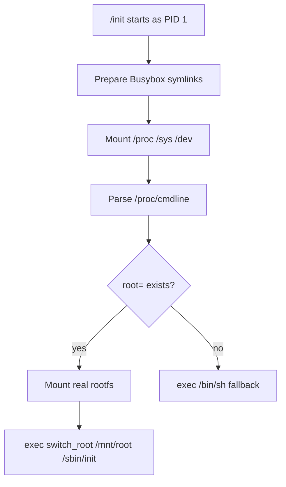

---

## Phần 3: Switch_root Chi tiết

### 3.1 `switch_root` làm gì?

`switch_root` chuyển hệ thống từ rootfs tạm trong RAM sang rootfs thật.

Các bước chính:

1. **Mount move:** Move `/proc`, `/sys`, `/dev` sang new root.
2. **Delete old root:** Xóa tất cả files trong initramfs để giải phóng RAM.
3. **Chroot:** Change root sang filesystem mới.
4. **Exec init:** Replace PID 1 với `/sbin/init` mới.

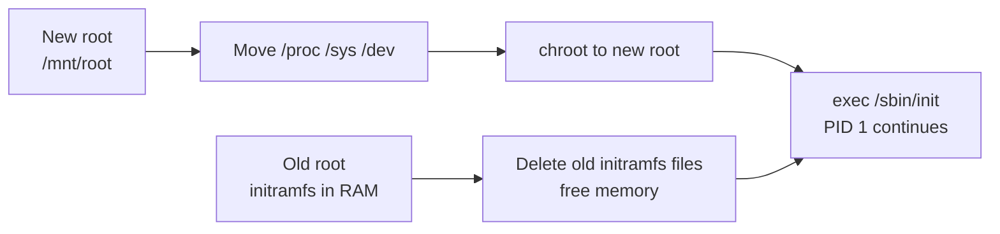

### 3.2 So sánh với `pivot_root`

| Aspect | `switch_root` | `pivot_root` |
|---|---|---|
| Old root | Deleted, free memory | Moved to another dir |
| Memory | Freed | Still accessible |
| Use case | Initramfs -> rootfs | Container, chroot |

---

## Phần 4: Tạo Initramfs với Busybox

### 4.1 Build Busybox Static

```bash
# Download Busybox
wget https://busybox.net/downloads/busybox-1.36.0.tar.bz2
tar xf busybox-1.36.0.tar.bz2
cd busybox-1.36.0

# Configure, enable static build
make ARCH=arm64 CROSS_COMPILE=aarch64-linux-gnu- defconfig
make ARCH=arm64 CROSS_COMPILE=aarch64-linux-gnu- menuconfig

# Settings -> Build static binary, no shared libs

# Build
make ARCH=arm64 CROSS_COMPILE=aarch64-linux-gnu- -j$(nproc)

# Install
make CONFIG_PREFIX=../initramfs install
```

Tại sao cần static Busybox?

```text
Static Busybox
  -> không phụ thuộc shared library trong /lib
  -> chạy được trong initramfs cực nhỏ
  -> giảm lỗi "No such file or directory" do thiếu dynamic linker
```

### 4.2 Pack thành `cpio`

```bash
cd ~/opi_build/initramfs

# Create device nodes
sudo mknod -m 600 dev/console c 5 1
sudo mknod -m 666 dev/null c 1 3

# Create cpio archive
find . | cpio -H newc -o | gzip > ../initramfs.cpio.gz

# Check size, expect 1-3 MB
ls -lh ../initramfs.cpio.gz
```

Package flow:

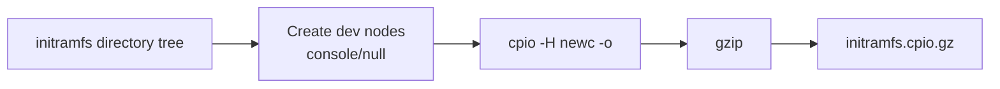

---

## Phần 5: Boot với Initramfs

U-Boot commands:

```bash
load mmc 0:1 ${kernel_addr_r} Image
load mmc 0:1 ${fdt_addr_r} sun50i-h618-orangepi-zero3.dtb
load mmc 0:1 ${ramdisk_addr_r} initramfs.cpio.gz

# Boot với ramdisk
booti ${kernel_addr_r} ${ramdisk_addr_r}:${filesize} ${fdt_addr_r}
```

Expected output:

```text
Kernel boots
  -> runs /init script
  -> drops to shell
     or
  -> switches to real rootfs
```

Boot memory relationship:

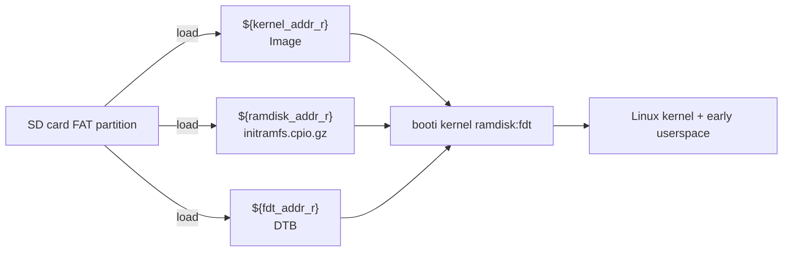

---

## Phần 6: Câu hỏi Ôn tập

1. Initramfs là gì? Khác gì với initrd?
2. Liệt kê các bước trong script `/init`.
3. `switch_root` khác gì `pivot_root`?
4. Tại sao cần build Busybox static?
5. Làm sao để tạo file `initramfs.cpio.gz`?

---

## Tài liệu Tham khảo

- Kernel `ramfs-rootfs-initramfs.txt`
- Busybox Documentation: <https://busybox.net/FAQ.html>
- LWN - Early userspace: <https://lwn.net/Articles/191004/>

---

## Yêu cầu Bài tập

- Busybox static binary đã build.
- `initramfs.cpio.gz` đã tạo.
- Boot vào shell trong initramfs.
- `switch_root` thành công sang real rootfs.

---

# Bài 2.3: Buildroot & Service Graph

## Mục tiêu Bài học

Sau buổi học này, học viên sẽ có khả năng:

- Hiểu workflow của **Buildroot**.
- Tạo rootfs hoàn chỉnh cho **IVI system**.
- Nắm vững thứ tự khởi động services bằng **systemd**.

---

## Phần 1: Buildroot là gì?

### Hình 1: Systemd Service Graph

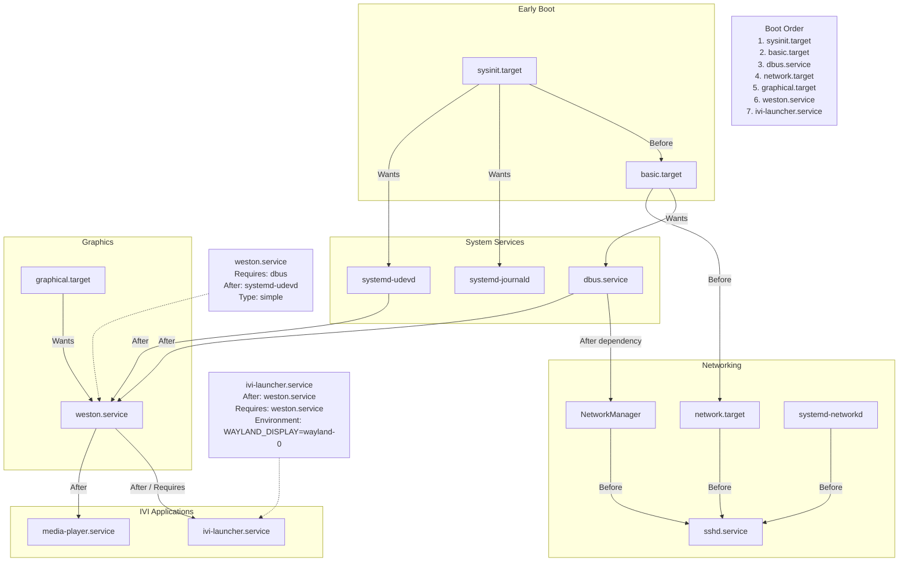

### 1.1 Định nghĩa

- **Buildroot:** Tool tự động hóa việc tạo embedded Linux system.
- **Output:** Cross-toolchain, rootfs, kernel, bootloader theo kiểu all-in-one.

Workflow tổng quát:


### 1.2 So sánh với Yocto

| Đặc điểm | Buildroot | Yocto |
|---|---|---|
| Complexity | Đơn giản | Phức tạp |
| Build time | Nhanh, khoảng 30 phút | Chậm, có thể tính bằng giờ |
| Flexibility | Trung bình | Cao |
| Package format | No package management | `.ipk`, `.deb`, `.rpm` |
| Learning curve | Thấp | Cao |
| Suited for | Small systems | Large, commercial systems |

---

## Phần 2: Cấu hình Buildroot

### 2.1 Target Options

```text
Target options --->
  Target Architecture: AArch64 (little endian)
  Target Architecture Variant: cortex-A53
```

### 2.2 System Configuration

```text
System configuration --->
  System hostname: orangepi-ivi
  System banner: Welcome to IVI System
  Init system: systemd
  /dev management: Dynamic using devtmpfs + eudev
  Root password: đặt password
  Enable root login with password: Yes
```

### 2.3 Packages cho IVI

```text
Target packages --->
  Audio and video applications --->
    [*] gstreamer 1.x
    [*] gst1-plugins-base
    [*] gst1-plugins-good

  Graphic libraries --->
    [*] mesa3d
    [*] wayland
    [*] weston

  Networking applications --->
    [*] dropbear (SSH server)
```

Package grouping:

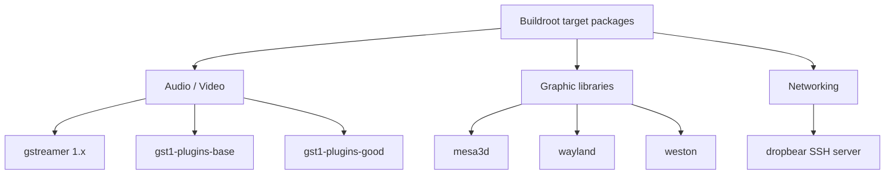

---

## Phần 3: Build Rootfs

### 3.1 Download và Configure

```bash
# Download Buildroot
wget https://buildroot.org/downloads/buildroot-2024.02.tar.gz
tar xf buildroot-2024.02.tar.gz
cd buildroot-2024.02

# Configure
make menuconfig
```

### 3.2 Build

```bash
# Build everything, about 30-60 minutes
make -j$(nproc)

# Output
ls output/images/

# Expected files:
# rootfs.ext4 rootfs.tar sdcard.img
```

### 3.3 Output Files

| File | Mô tả | Sử dụng |
|---|---|---|
| `rootfs.ext4` | Root filesystem | Flash to partition 2 |
| `rootfs.tar` | Tar archive | Extract manually |
| `sdcard.img` | Complete SD image | `dd` trực tiếp |

Output flow:

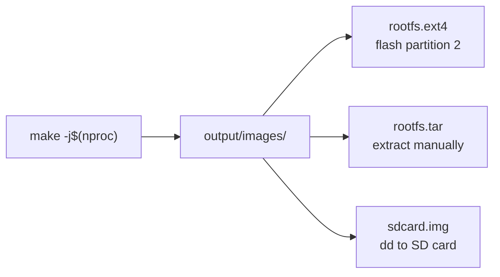

---

## Phần 4: Systemd Service Graph

### 4.1 Startup Order

| Order | Service | Mô tả |
|---:|---|---|
| 1 | `systemd` / PID 1 | Init system |
| 2 | `systemd-journald` | Logging |
| 3 | `systemd-udevd` | Device manager |
| 4 | `dbus` | IPC bus |
| 5 | `NetworkManager` | Network |
| 6 | `weston` | Wayland compositor |
| 7 | `ivi-launcher` | IVI application |

Startup order as dependency chain:

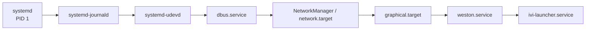

### 4.2 Weston Service File

```ini
# /etc/systemd/system/weston.service
[Unit]
Description=Weston Compositor
After=systemd-udevd.service dbus.service
Wants=dbus.service

[Service]
Type=simple
ExecStart=/usr/bin/weston --tty=1 --log=/var/log/weston.log
Restart=on-failure
Environment=XDG_RUNTIME_DIR=/run/user/0

[Install]
WantedBy=graphical.target
```

Dependency meaning:

| Directive | Ý nghĩa |
|---|---|
| `After=systemd-udevd.service dbus.service` | Weston chỉ start sau udevd và dbus |
| `Wants=dbus.service` | Khi start Weston, systemd cũng cố gắng start dbus |
| `WantedBy=graphical.target` | Weston được enable trong graphical target |
| `Restart=on-failure` | Restart khi service fail |

### 4.3 IVI Launcher Service

```ini
# /etc/systemd/system/ivi-launcher.service
[Unit]
Description=IVI Launcher Application
After=weston.service
Requires=weston.service

[Service]
Type=simple
ExecStart=/usr/bin/ivi-launcher
Environment=WAYLAND_DISPLAY=wayland-0
Restart=always

[Install]
WantedBy=graphical.target
```

Dependency meaning:

| Directive | Ý nghĩa |
|---|---|
| `After=weston.service` | IVI launcher chỉ start sau Weston |
| `Requires=weston.service` | Nếu Weston không start được, IVI launcher cũng fail |
| `Environment=WAYLAND_DISPLAY=wayland-0` | App kết nối tới Wayland display của Weston |
| `Restart=always` | Luôn restart app nếu thoát |

Service relationship:

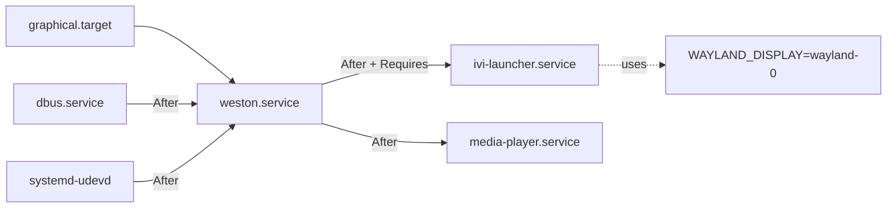

---

## Phần 5: Customization

### 5.1 Overlay Directory

```bash
# Tạo overlay
mkdir -p board/orangepi/zero3/rootfs_overlay

# Thêm custom files
cp my-config board/orangepi/zero3/rootfs_overlay/etc/
```

Trong `menuconfig`:

```text
System configuration --->
  Root filesystem overlay: board/orangepi/zero3/rootfs_overlay
```

Overlay concept:

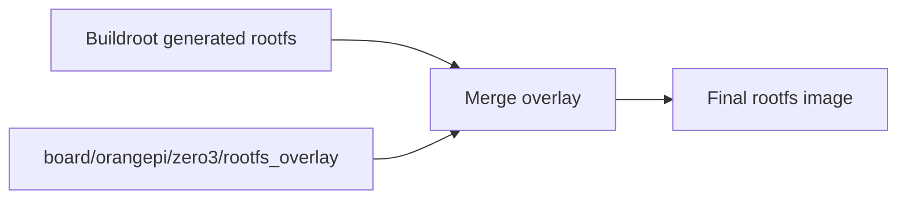

### 5.2 Post-build Script

```bash
#!/bin/bash
# board/orangepi/zero3/post-build.sh

# Enable SSH
ln -sf /lib/systemd/system/sshd.service \
    $TARGET_DIR/etc/systemd/system/multi-user.target.wants/

# Set timezone
ln -sf /usr/share/zoneinfo/Asia/Ho_Chi_Minh \
    $TARGET_DIR/etc/localtime
```

Post-build script flow:

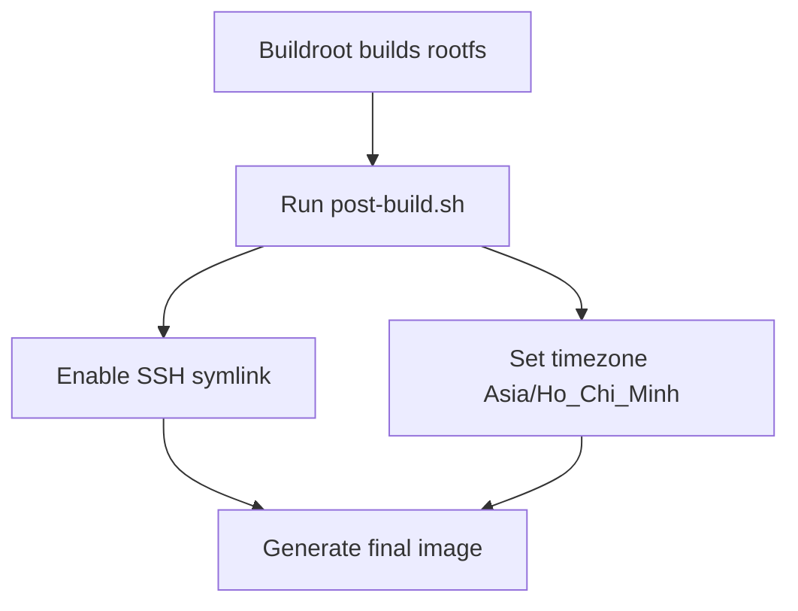

---

## Phần 6: Câu hỏi Ôn tập

1. Buildroot là gì? So sánh với Yocto.
2. Liệt kê các bước để build rootfs với Buildroot.
3. Systemd target nào chạy Weston?
4. Giải thích cách tạo custom service file.
5. Overlay directory dùng để làm gì?

---

## Tài liệu Tham khảo

- Buildroot Manual: <https://buildroot.org/downloads/manual/manual.html>
- Bootlin Buildroot Training: <https://bootlin.com/training/buildroot/>
- Systemd Documentation: <https://systemd.io/>

---

## Yêu cầu Bài tập

- Buildroot config cho Orange Pi Zero 3.
- `rootfs.ext4` hoặc `rootfs.tar` đã build.
- Boot thành công vào login prompt.
- SSH connection working.
- Weston running, nếu có display.

---

# Tổng kết luồng boot từ Kernel đến Userspace

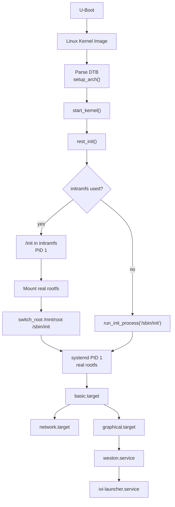

# Quick Command Reference

## Kernel build

```bash
make ARCH=arm64 CROSS_COMPILE=aarch64-linux-gnu- defconfig
make ARCH=arm64 CROSS_COMPILE=aarch64-linux-gnu- -j$(nproc) Image
make ARCH=arm64 CROSS_COMPILE=aarch64-linux-gnu- -j$(nproc) dtbs
```

## Initramfs package

```bash
find . | cpio -H newc -o | gzip > ../initramfs.cpio.gz
```

## U-Boot boot with initramfs

```bash
load mmc 0:1 ${kernel_addr_r} Image
load mmc 0:1 ${fdt_addr_r} sun50i-h618-orangepi-zero3.dtb
load mmc 0:1 ${ramdisk_addr_r} initramfs.cpio.gz
booti ${kernel_addr_r} ${ramdisk_addr_r}:${filesize} ${fdt_addr_r}
```

## Buildroot build

```bash
make menuconfig
make -j$(nproc)
ls output/images/
```
