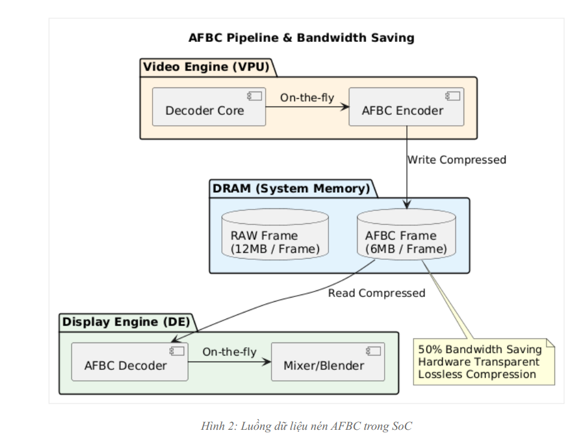

# SYSTEM ARCHITECT ARM CORTEX A

# Bài 6.1 - 6.3: Advanced Video / Multimedia Pipeline

**Biên soạn:** Phạm Văn Vũ  
**Đơn vị:** HALA Academy  
**Chủ đề:** V4L2 Stateless Codec, DMA-BUF Zero-Copy, AFBC, dma_fence, eBPF Profiling, Integration Test

---

# Bài 6.1: Advanced V4L2 Stateless Codec Architecture

## Mục tiêu Bài học

Sau bài học này, học viên sẽ có khả năng:

- Phân tích sâu kiến trúc **V4L2 Stateless Codec** trên Linux Mainline.
- Nắm vững cơ chế **Media Request API** để đồng bộ hóa tham số decode.
- Hiểu rõ cấu trúc **Cedrus Driver** và cách tương tác với phần cứng VPU Allwinner.
- Thực hành debug và phân tích luồng dữ liệu **H.264 decoding** chi tiết.

---

## 1. Tổng quan về Video Codec Hardware (VPU)

### 1.1 Stateful vs Stateless Architecture

Trong thế giới Embedded Linux, có hai loại kiến trúc Video Decoder hardware chính:

| Đặc điểm | Stateful Decoder | Stateless Decoder (H618 VPU) |
|---|---|---|
| Firmware | Có firmware chạy trên VPU, dạng black box. | Không có firmware, VPU là pure logic registers. |
| Parsing | VPU tự parse bitstream, ví dụ SPS/PPS. | Userspace/CPU phải parse và gửi thông số xuống. |
| Complexity | Userspace đơn giản, driver phức tạp. | Userspace phức tạp, cần GStreamer/FFmpeg; driver đơn giản hơn. |
| Ví dụ | Samsung MFC, Amlogic. | Allwinner Cedrus, Rockchip Hantro. |

**Tại sao Stateless phổ biến trên Mainline?**

Stateless driver không phụ thuộc vào firmware blob đóng, giúp code minh bạch hơn và dễ bảo trì trong Linux Kernel upstream.

---

## 2. Kiến trúc V4L2 Request API

### 2.1 Vấn đề của frame-based decoding

Đối với Stateless codec, mỗi frame hoặc slice cần đi kèm với một bộ tham số cấu hình chính xác, ví dụ:

- Scaling Lists.
- Reference Pictures.
- Headers.

Nếu dùng `ioctl(S_CTRL)` thông thường, race condition có thể xảy ra khi userspace gửi frame mới nhanh hơn tốc độ xử lý của hardware.

### 2.2 Giải pháp Media Request

Media Request API giới thiệu khái niệm **Request Objects**. Mỗi Request hoạt động như một transaction container chứa:

- **Output Buffer:** dữ liệu bitstream nén.
- **Capture Buffer Reference:** nơi chứa ảnh giải mã.
- **Controls:** các tham số SPS, PPS, Slice Header.

### Hình 1: Quy trình xử lý Media Request atomic từ Userspace xuống Kernel


```text
Key idea:
  Request FD = atomic bundle of controls + bitstream buffer + output/capture metadata.
  Driver guarantees the VPU uses the correct controls for the correct buffer.
```

### 2.3 Workflow Chi tiết

1. **Request Allocation:** Userspace tạo một Request FD mới từ `/dev/media0`.
2. **Control Binding:** Userspace set các V4L2 Controls, nhưng thay vì apply ngay, chúng được bind vào Request FD.
3. **Buffer Queuing:** Buffer cũng được queue với flag `V4L2_BUF_FLAG_REQUEST_FD`.
4. **Submission:** Khi gọi `MEDIA_REQUEST_IOC_QUEUE`, toàn bộ bundle được đẩy xuống driver một cách atomic.
5. Driver đảm bảo hardware dùng đúng bộ Controls cho đúng Buffer.

---

## 3. Phân tích Cedrus Driver Internals

### 3.1 Register Map & Memory IO

Cedrus driver nằm trong:

```text
drivers/staging/media/sunxi/cedrus
```

Driver map các thanh ghi vật lý của VPU vào kernel space. Một số thanh ghi quan trọng:

```c
#define VE_MODE      0x000   // Chọn chế độ MPEG/H264/HEVC
#define VE_BUF_ADDR  0x800   // Địa chỉ vật lý của Source Buffer (Bitstream)
#define VE_DST_ADDR  0x810   // Địa chỉ vật lý của Destination Buffer (NV12)
#define VE_CTRL      0x820   // Trigger Start bit
```

### 3.2 Slice Decoding Flow

H.264 hỗ trợ **Slice Decoding**, tức là một frame có thể được chia thành nhiều phần nhỏ để decode song song hoặc giảm độ trễ.

Cedrus driver xử lý như sau:

1. Userspace parse NAL Unit, xác định nó là Slice NAL.
2. Gửi Slice Data và Slice Parameters, ví dụ `first_mb_in_slice`, xuống kernel.
3. Cedrus driver program thanh ghi để VPU decode đúng slice đó.
4. Kết quả được ghi đè hoặc accumulate vào Destination Buffer của cả frame.
5. Khi tất cả slices hoàn tất, frame được đánh dấu là `DONE`.

---

## 4. Thực hành: Kiểm tra tính năng VPU

### 4.1 Kiểm tra Kernel Support

```bash
# Kiểm tra module
modprobe sunxi-cedrus
dmesg | grep cedrus

# Ví dụ log kỳ vọng:
# [ 5.123456] cedar_ve: device registered successfully
# [ 5.123456] cedrus 1c0e000.video-codec: device registered as /dev/video0

# Kiểm tra formats hỗ trợ
v4l2-ctl -d /dev/video0 --list-formats-out

# Ví dụ output:
# ioctl: VIDIOC_ENUM_FMT
# Type: Video Output
# [0]: 'H264' (H.264)
# [1]: 'HEVC' (HEVC)
# [2]: 'NM12' (NV12 Tiled)
```

### 4.2 Thiết lập FFmpeg cho Request API

Để FFmpeg sử dụng được V4L2 Request API, cần enable hwaccel `drm` hoặc `v4l2_request`, tùy phiên bản patch.

```bash
# Decode và hiển thị thông tin debug
ffmpeg -loglevel debug -hwaccel drm -i input_hevc.mp4 -f null -
```

Quan sát log để thấy các ioctl `MEDIA_REQUEST_IOC_QUEUE` được gọi liên tục.

---

## 5. Tổng kết & Câu hỏi

Trong bài này, chúng ta đã đi sâu vào cơ chế hoạt động của Stateless Decoder. Sự phức tạp được đẩy về phía phần mềm/userspace giúp phần cứng đơn giản và rẻ tiền hơn, đồng thời cho phép cập nhật thuật toán parsing linh hoạt mà không cần upgrade hardware firmware.

### Câu hỏi thảo luận

1. Nếu Userspace crash khi đang giữ Request FD, kernel sẽ xử lý resource cleanup như thế nào?
2. Tại sao H.264 cần thông tin về Reference Pictures (DPB) để decode một P-Frame, trong khi I-Frame thì không?
3. So sánh ưu nhược điểm của việc dùng `dma-buf` heap cho bitstream buffer so với `userptr`.

---

# Bài 6.2: Advanced Zero-Copy Pipeline & AFBC

## Mục tiêu Bài học

Sau bài học này, học viên sẽ có khả năng:

- Triển khai **Zero-Copy Pipeline** hoàn chỉnh từ VPU Decoder đến Display DRM.
- Tìm hiểu công nghệ nén frame **AFBC** - Arm Frame Buffer Compression - để tối ưu băng thông.
- Sử dụng **dma_fence** để đồng bộ hóa quá trình render bất đồng bộ - Asynchronous Rendering.

---

## 1. Zero-Copy Pipeline with DMA-BUF

### 1.1 Tại sao cần Zero-Copy?

Trong các hệ thống xử lý video **4K@60fps**, băng thông bộ nhớ là tài nguyên rất quý giá.

Một frame 4K NV12 chiếm khoảng **12 MB**. Nếu copy frame từ Kernel Space sang User Space rồi copy lại vào GPU, ta tốn:

```text
BW = Size * FPS * (Read + Write)
   = 12 MB * 60 * 2
   = 1.44 GB/s cho mỗi lần copy
```

Zero-Copy loại bỏ các bước copy này bằng cách chia sẻ pointer/buffer handle, được quản lý bởi DMA-BUF, giữa các device driver.

### Hình 1: Pipeline không copy dữ liệu giữa VPU và Display


```text
Zero-copy Video Pipeline
========================

TRADITIONAL PIPELINE - WITH COPIES
----------------------------------
Cost:
  - Around 560 MB/s bandwidth in the example diagram.
  - Adds around 2 frames latency.
  - CPU/GPU memory bandwidth wasted by copies.

Cost:
  - Around 187 MB/s bandwidth in the example diagram.
  - Minimal latency.
  - Around 66% saving.

Core idea:
  Pixel data stays in RAM.
  Ownership/FD/handle is passed between drivers, not copied.
```

### 1.2 DMA-BUF Workflow

1. Userspace yêu cầu V4L2 driver cấp phát buffer bằng `VIDIOC_REQBUFS`. Driver dùng CMA để cấp vùng nhớ vật lý liên tục.
2. Userspace gọi `VIDIOC_EXPBUF` để lấy Export FD, tức `dma_buf fd`, cho buffer đó.
3. Userspace gửi Export FD này sang DRM driver thông qua `DRM_IOCTL_PRIME_FD_TO_HANDLE`.
4. DRM Driver import buffer và tạo một Framebuffer object bằng `DRM_IOCTL_MODE_ADDFB2`.
5. Dữ liệu pixel nằm yên trên RAM, chỉ quyền sở hữu/handle được chuyển giao.

---

## 2. Arm Frame Buffer Compression (AFBC)

### 2.1 Giới thiệu AFBC

AFBC là giao thức nén không mất dữ liệu - lossless compression - của ARM, được hỗ trợ bởi:

- GPU Mali.
- Video Engine.
- Display Engine.

Mục tiêu là giảm lượng dữ liệu phải đọc/ghi xuống DRAM.

### Hình 2: Luồng dữ liệu nén AFBC trong SoC



```text
AFBC Pipeline & Bandwidth Saving
================================

VIDEO ENGINE - VPU
------------------

Benefits:
  - About 50% bandwidth saving in the example diagram.
  - Hardware transparent to the display pipeline.
  - Lossless compression.
```

### 2.2 Cơ chế hoạt động

- Frame được chia thành các **Superblocks**, ví dụ 16x16 pixels.
- Mỗi Superblock có header chứa metadata và payload nén.
- Nếu khối nén được, ghi dạng nén.
- Nếu khối không nén hiệu quả, ví dụ quá nhiễu, ghi dạng raw.
- Display Engine tự động giải nén on-the-fly khi scanout ra HDMI.

### 2.3 Sử dụng DRM Modifiers

Để userspace xin cấp phát buffer AFBC, dùng DRM Modifier:

```c
#define DRM_FORMAT_MOD_ARM_AFBC(...)

// Khi tạo Framebuffer
struct drm_mode_fb_cmd2 cmd = {
    .width = 1920,
    .height = 1080,
    .pixel_format = DRM_FORMAT_NV12,
    .flags = DRM_MODE_FB_MODIFIERS,
    .modifier = { DRM_FORMAT_MOD_ARM_AFBC(...) },
    .handles = { gem_handle },
};
```

---

## 3. Explicit Synchronization (Direct Rendering)

### 3.1 Implicit vs Explicit Sync

**Implicit Sync:** Kernel tự theo dõi buffer đang được ai dùng. Khi Userspace submit job mới, kernel tự block chờ job cũ xong. Cách này dễ dùng nhưng kém linh hoạt.

**Explicit Sync (dma_fence):** Userspace chịu trách nhiệm quản lý dependencies. VPU trả về một `fence_fd` khi submit decode. Userspace truyền `fence_fd` đó cho Display driver. Display driver sẽ chờ fence được signal bởi VPU hardware rồi mới hiển thị.

### Hình 3: Cơ chế dma_fence giúp CPU không bao giờ bị block


### 3.2 Lợi ích

Sự tách biệt này cho phép CPU rảnh rỗi hoàn toàn để xử lý logic ứng dụng, ví dụ UI và Network, trong khi các accelerator như VPU, GPU, Display hoạt động kiểu pipeline nối đuôi nhau tự động.

---

## 4. Thực hành

### 4.1 Kiểm tra Zero-copy với GStreamer

```bash
# Pipeline decode -> display không qua CPU copy
gst-launch-1.0 filesrc location=video.mp4 ! \
    qtdemux ! h264parse ! \
    v4l2h264dec ! \
    video/x-raw,format=NV12 ! \
    kmssink force-modesetting=true driver-name=sun4i-drm
```

### 4.2 Monitor Bandwidth

Sử dụng `perf` để đo sự kiện Memory Controller, nếu SoC support PMU event cho DRAM:

```bash
perf stat -e arm_dsu_0/bus_access/ -a sleep 5
```

---

## 5. Tổng kết

Kết hợp **V4L2 Request API**, **DMA-BUF Zero-Copy**, **AFBC** và **Explicit Fences** tạo nên một Multimedia Pipeline hiện đại, hiệu suất cao, đạt khả năng phát video 4K mượt mà trên các chip ARM giá rẻ như H618.

---

# Bài 6.3: Advanced Video System Optimization & Profiling

## Mục tiêu Bài học

Sau bài học này, học viên sẽ có khả năng:

- Áp dụng các kỹ thuật **Multithreading** để tối ưu hóa GStreamer pipeline.
- Sử dụng **eBPF** - Extended Berkeley Packet Filter - để đo độ trễ phần cứng với độ chính xác nano giây.
- Thực hiện **Integration Test** toàn diện và đánh giá chất lượng video tự động - Quality Assessment.

---

## 1. Pipeline Optimization Strategies

### Hình 1: Chiến lược tách luồng và tối ưu hóa hàng đợi


```text
Video Pipeline Optimization
===========================

Optimization meaning:
  - IO, demux, parse, and decode are separated into different pipeline stages.
  - queue elements create thread boundaries.
  - Hardware decode and display are monitored and optimized separately.
```

### 1.1 Multithreaded Parsing (Queue Injection)

Một pipeline video điển hình có 3 giai đoạn chính:

1. **IO:** Đọc file hoặc mạng.
2. **Parsing:** Tách NAL Units.
3. **Decoding:** Gửi xuống VPU.

Mặc định, GStreamer có thể chạy chúng trên cùng một thread, dẫn đến hiện tượng nghẽn cổ chai nếu một task tốn nhiều CPU.

**Giải pháp:** Chèn element `queue` để tạo ranh giới thread - thread boundary.

```bash
# Basic pipeline - single threaded parsing & decoding setup
filesrc ! h264parse ! v4l2h264dec ! ...

# Optimized pipeline
filesrc ! queue name=io_q ! h264parse ! queue name=dec_q ! v4l2h264dec ! ...
```

Ý nghĩa:

- `io_q`: Tách việc đọc đĩa ra khỏi việc parse.
- `dec_q`: Tách việc parse ra khỏi việc gọi ioctl xuống VPU.

### 1.2 Buffer Pool Tuning

Số lượng buffer trong pool ảnh hưởng trực tiếp đến độ mượt. Quá ít buffer gây hiện tượng decoder phải chờ display trả buffer về - starvation.

```c
// Trong Userspace Code
req.count = 4;   // Mặc định

// Tăng lên 8 hoặc 16 để có thêm headroom cho jitter
req.count = 12;
ioctl(fd, VIDIOC_REQBUFS, &req);
```

---

## 2. Advanced Profiling với eBPF/BCC

### 2.1 Tại sao dùng eBPF?

Các công cụ như `top` hay `perf` chỉ cho thấy CPU usage trung bình. Để đo chính xác VPU mất bao nhiêu microseconds để decode 1 frame, ta cần trace ngay tại mức driver interrupt handler mà không cần recompile kernel.

### 2.2 Viết script bpftrace đo VPU Latency

Script dưới đây hook vào 2 kernel function của Cedrus driver:

- Lúc bắt đầu chạy: `device_run`.
- Lúc ngắt xảy ra: `irq_handler`.

```c
/* cedrus_latency.bt */

// Hook vào hàm start decoding
kprobe:cedrus_device_run {
    @start[tid] = nsecs;
}

// Hook vào hàm xử lý ngắt - kết thúc decode
kprobe:cedrus_irq {
    $s = @start[tid];
    if ($s != 0) {
        $delta = (nsecs - $s) / 1000; // Đổi sang us
        printf("VPU Decode Time: %d us\n", $delta);
        delete(@start[tid]);

        // Vẽ biểu đồ histogram
        @latency_hist = hist($delta);
    }
}
```

Chạy script trên board:

```bash
bpftrace cedrus_latency.bt

# Output:
# VPU Decode Time: 2500 us
# VPU Decode Time: 2600 us
# ...
```

---

## 3. Automated Video Quality Assessment

### 3.1 PSNR & SSIM

Khi tối ưu hệ thống, ví dụ giảm bitrate hoặc dùng AFBC, cần đảm bảo chất lượng hình ảnh không bị suy giảm nghiêm trọng.

Hai chỉ số vàng:

- **PSNR:** Peak Signal-to-Noise Ratio.
- **SSIM:** Structural Similarity.

### 3.2 Thực hành đo PSNR với FFmpeg

```bash
# So sánh file decode hardware (hw.yuv) với file gốc tham chiếu (ref.yuv)
ffmpeg -s 1920x1080 -pix_fmt nv12 -i hw.yuv \
    -s 1920x1080 -pix_fmt yuv420p -i ref.yuv \
    -lavfi "psnr" -f null -
```

Ngưỡng chấp nhận:

- **PSNR > 40 dB:** chất lượng rất tốt, gần như không phân biệt được bằng mắt thường.
- **PSNR < 30 dB:** hình ảnh bị vỡ hoặc artifacts rõ rệt.

---

## 4. Tổng kết Tuần 6

Chúng ta đã hoàn thiện module Video & Multimedia với các kiến thức từ kiến trúc driver - V4L2 Request API - tối ưu luồng dữ liệu - Zero-Copy, AFBC - đến kỹ thuật đo đạc và gỡ lỗi chuyên sâu - eBPF.

Đây là nền tảng để xây dựng các sản phẩm **IVI - In-Vehicle Infotainment** cao cấp, nơi video performance là yếu tố then chốt.

---

# Phụ lục A: Mental Model Tổng hợp Video Pipeline

```text
End-to-End Multimedia Flow
==========================

Compressed File / Network Stream
        |
        v
+----------------+
| Demux / Parser |
+----------------+
        |
        | H.264 / HEVC bitstream + SPS/PPS/Slice controls
        v
+------------------------+
| V4L2 Request API       |
| - Request FD           |
| - Controls             |
| - Output buffer        |
| - Capture buffer       |
+------------------------+
        |
        v
+------------------------+
| Cedrus VPU Driver      |
| - Program registers    |
| - Start decode         |
| - Handle IRQ done      |
+------------------------+
        |
        | DMA-BUF / fence
        v
+------------------------+
| DRM/KMS Display        |
| - Import dma-buf       |
| - Add framebuffer      |
| - Wait fence           |
| - Scanout              |
+------------------------+
        |
        v
HDMI / Display Panel
```

---

# Phụ lục B: Command Checklist

## VPU / V4L2

```bash
modprobe sunxi-cedrus
dmesg | grep cedrus
v4l2-ctl -d /dev/video0 --list-formats-out
ffmpeg -loglevel debug -hwaccel drm -i input_hevc.mp4 -f null -
```

## Zero-Copy / DRM

```bash
gst-launch-1.0 filesrc location=video.mp4 ! \
    qtdemux ! h264parse ! \
    v4l2h264dec ! \
    video/x-raw,format=NV12 ! \
    kmssink force-modesetting=true driver-name=sun4i-drm
```

## Bandwidth Profiling

```bash
perf stat -e arm_dsu_0/bus_access/ -a sleep 5
```

## eBPF Latency

```bash
bpftrace cedrus_latency.bt
```

## PSNR Quality Check

```bash
ffmpeg -s 1920x1080 -pix_fmt nv12 -i hw.yuv \
    -s 1920x1080 -pix_fmt yuv420p -i ref.yuv \
    -lavfi "psnr" -f null -
```